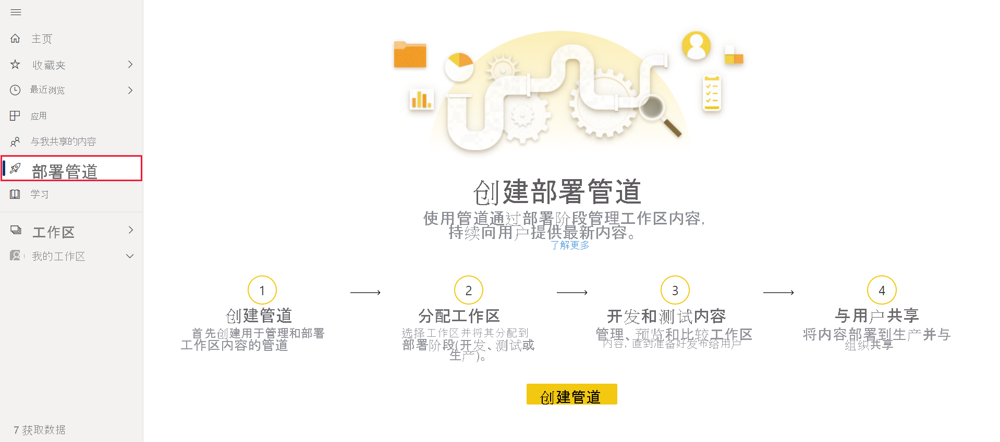
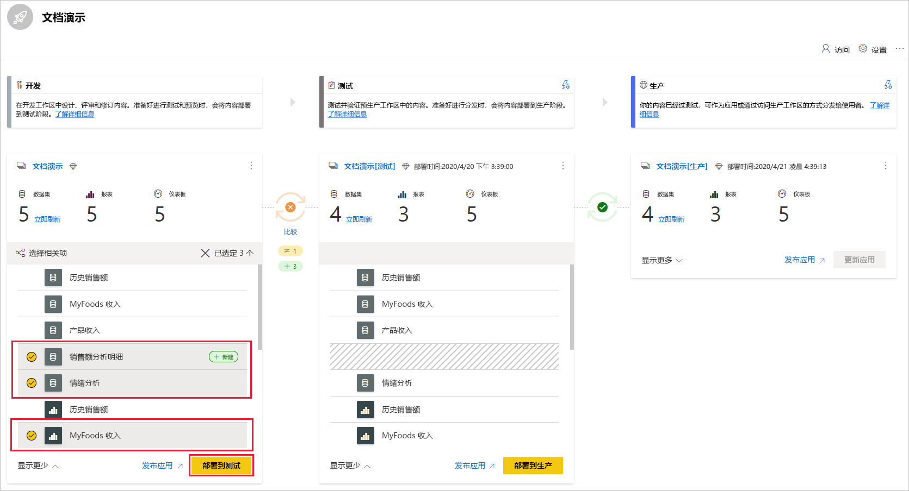
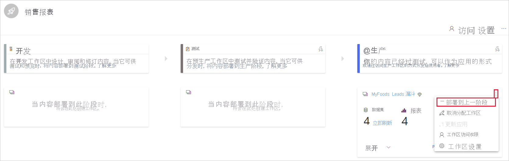
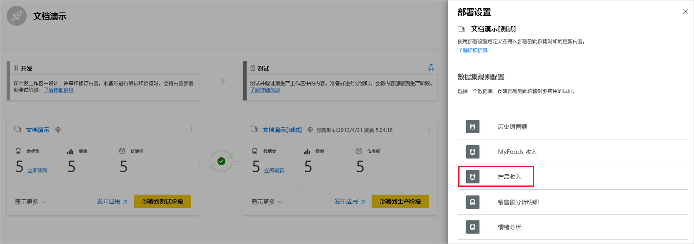
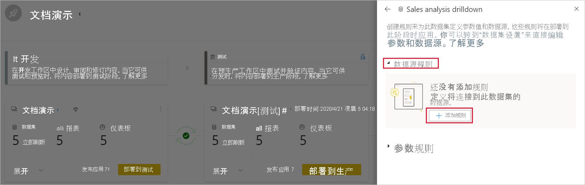
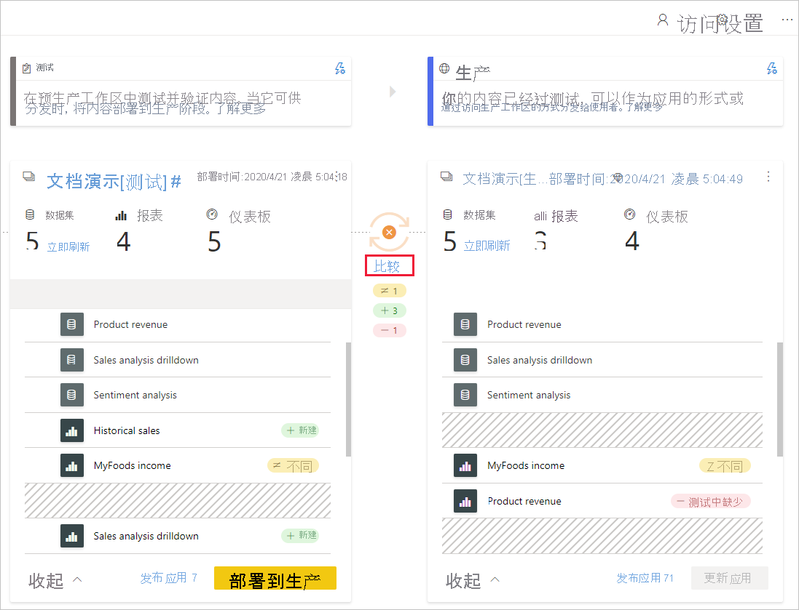

# 开始使用部署管道（预览版）

本文将指导你完成使用部署管道所需的基本设置。

## 访问部署管道

如果满足以下条件，将可以访问部署管道功能：

* 你是 Power BI [Pro 用户](../admin/service-admin-purchasing-power-bi-pro.md)

* 你属于具有高级容量的组织

* 你是[新工作区体验](../collaborate-share/service-create-the-new-workspaces.md)的管理员

>[!NOTE]
> 如果以前创建了管道，或与你共享了管道，你还可以看到“部署管道”按钮。

## 步骤 1 - 创建部署管道

要创建部署管道，请执行以下操作：

1. 在 Power BI 服务中，从导航窗格中选择“部署管道”，然后单击“创建管道”。

2. 在“创建部署管道”对话框中，输入管道的名称和描述，然后单击“创建”。

创建管道后，可以将其与其他用户共享，或将其删除。 与其他人共享管道时，你与其共享管道的用户将获得[对管道的访问权限](deployment-pipelines-process.md#user-with-pipeline-access)。 管道访问使用户能够查看、共享、编辑和删除管道。

## 步骤 2 - 将工作区分配到部署管道

创建管道后，需要将想要管理的内容添加到管道。 向管道添加内容是通过将工作区分配到管道阶段来完成的。 可以将工作区分配到任何阶段。 

可以将一个工作区分配给一个部署管道。 部署管道将创建工作区内容的克隆，以在管道的不同阶段中使用。

按照以下步骤在部署管道中分配工作区：

1. 在新创建的部署管道中，单击“分配工作区”。

2. 在“选择工作区”下拉菜单中，选择要分配给管道的工作区。

3. 选择要分配工作区的阶段。

### 工作区分配限制

* 工作区必须是[新工作区体验](../collaborate-share/service-create-the-new-workspaces.md)。

* 你必须是工作区的管理员。

* 工作区未分配到任何其他管道。

* 工作区必须位于 [高级容量](../admin/service-premium-what-is.md)上。

* 无法将包含 [Power BI 示例](../create-reports/sample-datasets.md)的工作区分配到管道阶段。

>[!NOTE]
>只有可用于部署管道的工作区才会显示在可从中进行选择的工作区列表中。

## 步骤 3 - 部署到空阶段

任何在源工作区中是成员或管理员的 [Pro 用户](../admin/service-admin-purchasing-power-bi-pro.md)都可以将内容部署到空阶段（不包含内容的阶段）。 工作区必须位于容量上才能完成部署。

在将内容部署到空阶段时，会保留项之间的关系。 例如，绑定到源阶段中的数据集的报表将克隆到其数据集，且克隆将以相似的方式绑定在目标工作区中。

完成部署后，刷新此数据集。 有关详细信息，请参阅[将内容部署到空阶段](deployment-pipelines-process.md#deploying-content-to-an-empty-stage)。

### 部署所有内容

选择要从中进行部署的阶段，然后单击“部署”按钮。 部署过程会在目标阶段创建一个重复的工作区。 此工作区包含当前阶段中的所有现有内容。

### 选择性部署

若要仅部署特定项目，请单击“显示更多”链接，然后选择要部署的项目。 单击“部署”按钮时，只会将选择的项目部署到下一阶段。

由于仪表板、报表和数据集是相关的并且具有依赖关系，因此你可以使用选择相关按钮来检查这些项目所依赖的所有项。 例如，如果要将报表部署到下一阶段，则单击“选择相关”按钮将标记该报表所连接到的数据集，以便同时部署两者且报表不会中断。

>[!NOTE]
> * 如果报表或仪表板所依赖的项目在要部署到的阶段中不存在，则无法将其部署到下一阶段。
> * 如果选择在没有数据集的情况下部署报表或仪表板，可能会出现意外的结果。 如果目标阶段中的数据集已发生更改，并且不再与要从中进行部署的阶段中的数据集相同，则可能会发生这种情况。

### 反向部署

你可以选择部署到上一阶段，例如，在将现有工作区分配给生产阶段，然后将其反向部署的场景中，首先部署到测试阶段，然后再部署到开发阶段。

仅当上一阶段内容为空时，才可部署到上一阶段。 当部署到上一阶段时，无法选择特定项目。 将部署此阶段中的所有内容。

## 步骤 4 - 创建数据集规则

在部署管道中工作时，不同的阶段可能会有不同的配置。 例如，每个阶段都可以具有不同的数据库或不同的查询参数。 开发阶段可能会查询数据库中的示例数据，而测试阶段和生产阶段则查询整个数据库。

在管道阶段之间部署内容时，配置数据集规则使你可以允许更改内容，同时保持某些设置不变。

数据集规则是在每个数据集中的数据源和参数上定义的。 它们确定特定数据集的数据源或参数的值。 例如，如果你希望生产阶段的数据集指向生产数据库，则可以为此定义一个规则。 该规则在生产阶段的相应数据集下定义。 定义规则后，从测试部署到生产的内容将继承数据集规则中定义的值，只要规则保持不变且有效，将始终适用。

>[!NOTE]
> 仅当源数据源和目标数据源的类型相同时，数据集规则才有效。

### 创建数据集规则

1. 在要为其创建数据集规则的管道阶段中，单击“部署设置”。

    

2. 在“部署设置”窗格中，选择要为其创建规则的数据集。

    

3. 选择要创建的规则类型，展开列表，然后单击“添加规则”。

     

### 数据集规则类型

有两种可以创建的规则类型：

* 数据源规则 数据源列表取自源管道阶段的数据集。 从数据源列表中，选择要替换的数据源。 使用以下方法之一选择一个值，以便替换源阶段中的值：

    1. 从列表中选择。

    2. 单击“其他”，并手动添加新数据源。 只能更改为同一类型的数据源。

* 参数规则 从参数列表中选择参数；显示当前值。 将值编辑为你希望在每次部署后生效的值。

### 数据集规则限制

* 要创建数据集规则，你必须是数据集的所有者。

* 不能在开发阶段创建数据集规则。

* 移除或删除项时，其规则也会被删除。 这些规则无法还原。

* 如果更改在规则中定义的数据源或参数，或将其从源数据集中删除，则该规则将无效，且部署将失败。

* 无法为类型是“任意”或“二进制”的参数定义参数规则。  有关详细信息，请参阅[数据集更新参数限制](https://docs.microsoft.com/rest/api/power-bi/datasets/updateparameters)。

* 只能为以下数据源定义数据源规则：
    * Azure Analysis Services
    * SQL Server Analysis Services (SSAS)
    * Azure SQL Server
    * SQL Server
    * OData 源
    * Oracle
    * SapHana（仅支持导入模式；不支持直接查询模式）
    * SharePoint
    * Teradata

    对于其他数据源，我们建议[使用参数来配置数据源](deployment-pipelines-best-practices.md#use-parameters-in-your-model)。

## 步骤 5 - 将内容从一个阶段部署到另一个阶段

在管道阶段中包含内容后，可以将其部署到下一阶段。 将内容部署到另一个阶段通常是在管道中执行了某些操作之后完成的。 例如，在开发阶段对内容进行开发更改，或在测试阶段测试内容。 从阶段到阶段移动内容的典型工作流是从开发到测试，然后再从测试到生产。 有关此过程的详细信息，请参阅[将内容部署到现有工作区](deployment-pipelines-process.md#deploy-content-to-an-existing-workspace)部分。

要将内容部署到部署管道中的下一阶段，请单击阶段底部的“部署”按钮。

查看“测试”和“生产”阶段卡时，可以看到上次部署时间。 这指示上次将内容部署到阶段的时间。

部署时间对于确定上次更新阶段的时间十分有用。 如果要跟踪测试和生产部署之间的时间，此方法也会有所帮助。

## 比较阶段

当两个连续阶段都有内容时，将基于内容项元数据对内容进行比较。 这种比较不包括比较各阶段之间的数据或刷新时间。

 

为了快速直观地了解两个连续阶段之间的差异，它们之间会出现比较图标指示器。 比较指示器有两种状态：

* 绿色指示器 – 两个阶段中的每个内容项的元数据都是相同的。

* 橙色指示器 - 如果满足以下条件之一，则会出现：
    * 每个阶段中的某些内容项已更改或更新（具有不同的元数据）。
    * 阶段之间的项目数量有所不同。

如果两个连续阶段不同，则“比较”链接将显示在橙色比较图标的下方。 单击链接可在“比较”视图的两个阶段中打开内容项列表。 “比较”视图可帮助你在每个管道阶段中跟踪项之间的更改或差异。 更改的项目将获得以下标签之一：

* 新 - 源阶段中的新项。 这是目标阶段中不存在的项。 部署之后，此项将克隆到目标阶段。

* 不同 - 同时存在于源阶段和目标阶段的项，是上次部署后更改的版本之一。 部署完成后，源阶段中的项将覆盖目标阶段中的项，无论如何更改都会覆盖。

* 缺少来源 – 此标签指示项出现在目标阶段，而不是源阶段。

    >[!NOTE]
    >部署不会影响“缺少来源”项。

 

## 覆盖内容

在源阶段更改内容后进行部署时，在目标阶段中更改的内容将会被覆盖。 单击“部署”后，你将收到一条警告，列出将被覆盖的项目数量。

你可以详细了解[了解部署过程](deployment-pipelines-process.md)中的[复制到下一阶段的项](deployment-pipelines-process.md#deployed-items)和[未复制的项](deployment-pipelines-process.md#unsupported-items)。

## 后续步骤

>[!div class="nextstepaction"]
>[部署管道简介](deployment-pipelines-overview.md)

>[!div class="nextstepaction"]
>[了解部署管道过程](deployment-pipelines-process.md)

>[!div class="nextstepaction"]
>[解决部署管道问题](deployment-pipelines-troubleshooting.md)

>[!div class="nextstepaction"]
>[部署管道最佳实践](deployment-pipelines-best-practices.md)