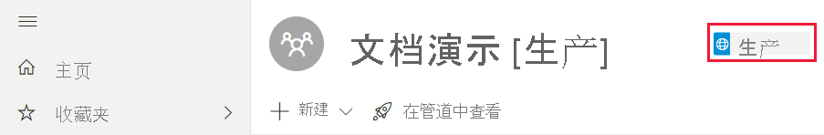

# 解决部署管道问题

使用本文解决部署管道问题。

## 常规

### 什么是 Power BI 中的部署管道

若要了解什么是 Power BI 中的部署管道，请参阅[部署管道概述](deployment-pipelines-overview.md)。

### 如何开始使用部署管道？

根据[入门说明](deployment-pipelines-get-started.md)开始使用部署管道。

### 为什么看不到部署管道按钮？

如果未满足以下条件，则将无法看到部署管道按钮。

* 你是 Power BI [Pro 用户](../admin/service-admin-purchasing-power-bi-pro.md)

* 你属于具有高级容量的组织

* 只能将工作区分配到单个管道

* 你是新工作区的管理员

### 为什么看不到我的工作区中的管道阶段标记

部署管道显示分配给管道的工作区中的管道阶段标记。 开发和测试阶段的标记始终可见。 但是，如果你有权[访问管道](deployment-pipelines-process.md#user-with-pipeline-access)，或者如果你是[工作区管理员](deployment-pipelines-process.md#workspace-admin)，则只会看到生产标记。

> [!div class="mx-imgBorder"]
> 

## 许可

### 使用部署管道需要哪些许可证？

若要使用部署管道，你必须是具有[高级容量](../admin/service-premium-what-is.md)的 [Pro 用户](../admin/service-admin-purchasing-power-bi-pro.md)。 有关详细信息，请参阅[访问部署管道](deployment-pipelines-get-started.md#accessing-deployment-pipelines)。

### 我可以将哪种类型的容量分配到管道中的工作区？

部署管道中的所有工作区都必须位于专用容量内，管道才能正常工作。 但是，可以对管道中的不同工作区使用不同的容量。 也可以对同一管道中的不同工作区使用不同的容量类型。

出于开发和测试目的，可以与每个用户的 Pro Power BI 帐户一起使用 A 或 EM 容量。

对于生产工作区，需要 P 容量。 如果你是通过嵌入式应用程序分发内容的 ISV，则还可以将 A 或 EM 容量用于生产。

## 技术

### 尝试将工作区分配到管道时，为什么看不到我的所有工作区？

若要将工作区分配到管道，必须满足以下条件：

* 工作区是[新工作区体验](../collaborate-share/service-create-the-new-workspaces.md)

* 你是工作区的管理员

* 工作区未分配到任何其他管道

* 工作区位于[高级容量](../admin/service-premium-what-is.md)中

不满足这些条件的工作区将不会显示在你可以从中进行选择的工作区列表中。

### 如何将工作区分配到管道中的所有阶段？

可以为每个管道分配一个工作区。 将工作区分配到管道后，可以将其部署到后续管道阶段。 在首次部署期间，会创建一个新工作区，其中包含源阶段中的项的副本。 将保留复制项的关系。 有关详细信息，请参阅如何[将工作区分配到部署管道](deployment-pipelines-get-started.md#step-2---assign-a-workspace-to-a-deployment-pipeline)。

### 为何我的第一个部署会失败？

由于多种原因，第一个部署可能已失败。 其中一些原因列在下表中。

|Error  |操作  |
|---------|---------|
|你没有[高级容量权限](deployment-pipelines-process.md#creating-a-premium-capacity-workspace)。     |若要获取高级容量权限，请要求容量管理员将工作区添加到容量，或者要求提供容量的分配权限。 工作区位于容量中之后，进行重新部署。        |
|你没有工作区权限。     |若要进行部署，你必须是工作区成员。 要求工作区管理员向你授予适当的权限。         |
|Power BI 管理员禁用了工作区的创建。     |请与 Power BI 管理员联系以获取支持。         |
|你的工作区不是[新工作区体验](../collaborate-share/service-create-the-new-workspaces.md)。     |在新工作区体验中创建内容。 如果经典工作区中包含内容，则可以将其[升级](../collaborate-share/service-upgrade-workspaces.md)到新工作区体验。         |
|使用[选择性部署](deployment-pipelines-get-started.md#selective-deployment)时不会选择内容的数据集。     |执行下列操作之一：   取消选择链接到数据集的内容。 未选择的内容（如报表或仪表板）将不会复制到下一阶段。   选择链接到所选内容的数据集。 你的数据集将被复制到下一阶段。         |

### 我收到一条警告，指出当我尝试部署时，我的工作区中有“不支持的项目”。 如何知道哪些项目不受支持？

有关部署管道不支持的项和项目的完整列表，请参阅以下部分：

* [不支持的项](deployment-pipelines-process.md#unsupported-items)

* [未复制的项属性](deployment-pipelines-process.md#item-properties-that-are-not-copied)

### 为何由于打破了规则而导致部署失败？

如果在配置数据集规则时遇到问题，请访问[数据集规则](deployment-pipelines-get-started.md#step-4---create-dataset-rules)，并确保遵循[数据集规则限制](deployment-pipelines-get-started.md#dataset-rule-limitations)。

如果你的部署之前已成功完成，并且突然失败并打破了规则，则可能是因为正在重新发布数据集。 对源数据集进行了以下更改，导致部署失败：

参数规则

* 删除的参数

* 更改的参数名称

数据源规则

数据集规则缺少值。 如果更改了数据集，则可能发生这种情况。

当以前成功的部署由于链接断开而失败时，将显示一条警告。 可以选择“配置规则”以导航到“部署设置”窗格，在其中标记了失败的数据集。 选择数据集后，将标记打破的规则。

若要成功部署，请修复或删除打破的规则，然后重新部署。

### 如何在管道阶段中更改数据源？

无法在 Power BI 服务中更改数据源连接。

如果要在测试或生产阶段中更改数据源，可以使用[数据集规则](deployment-pipelines-get-started.md#step-4---create-dataset-rules)或 [API](/rest/api/power-bi/datasets/updateparametersingroup)。 数据集规则仅在下一个部署后才会生效。

### 我修复了生产中的 bug，但现在无法选择“部署至前一阶段”按钮。 为何灰显？

只能反向部署到空阶段。 如果测试阶段中包含内容，则将无法从生产反向部署。

创建管道后，使用开发阶段开发内容并使用测试阶段进行审核和测试。 可以修复这些阶段中的 bug，然后将固定环境部署到生产阶段。

>[!NOTE]
>反向部署仅支持[完全部署](deployment-pipelines-get-started.md#deploying-all-content)。 它不支持[选择性部署](deployment-pipelines-get-started.md#selective-deployment)

### 部署管道是否支持多地理位置？

支持多地理位置。 在不同地理位置中的各个阶段之间部署内容可能需要更长时间。

## 权限

### 什么是部署管道权限模型？

[权限](deployment-pipelines-process.md#permissions)部分中介绍了部署管道权限模型。

### 谁可以在各个阶段之间部署内容？

内容可以部署到空阶段或包含内容的阶段。 内容必须位于[高级容量](../admin/service-premium-what-is.md)中。

* 部署到空阶段 - 属于源工作区中的成员或管理员的任何 [Pro 用户](../admin/service-admin-purchasing-power-bi-pro.md)。

* 部署到包含内容的阶段 - 属于源和目标部署阶段中的工作区的成员或管理员的任何 [Pro 用户](../admin/service-admin-purchasing-power-bi-pro.md)。

* 覆盖数据集 - 部署覆盖目标阶段中包含的每个数据集，即使未更改数据集也是如此。 用户必须是部署中指定的所有目标阶段数据集的所有者。

### 配置数据集规则需要哪些权限？

若要配置部署管道中的数据集规则，你必须是数据集的所有者。

### 为什么看不到管道中的工作区？

单独管理管道和工作区权限。 你可能具有管道权限，但没有工作区权限。 有关详细信息，请查看[权限](deployment-pipelines-process.md#permissions)部分。

## 后续步骤

>[!div class="nextstepaction"]
>[部署管道简介](deployment-pipelines-overview.md)

>[!div class="nextstepaction"]
>[开始使用部署管道](deployment-pipelines-get-started.md)

>[!div class="nextstepaction"]
>[了解部署管道过程](deployment-pipelines-process.md)

>[!div class="nextstepaction"]
>[部署管道最佳实践](deployment-pipelines-best-practices.md)