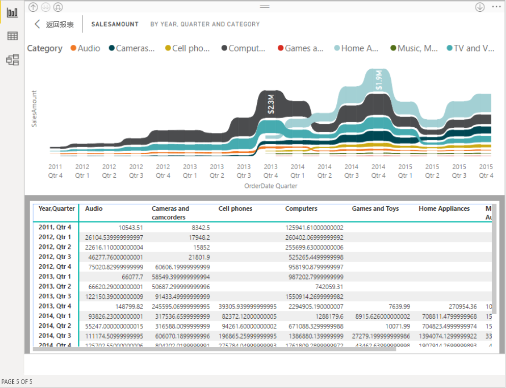

# 通过辅助功能使用 Power BI 报表
Power BI 提供许多内置功能，用于帮助残疾人士更轻松地使用 Power BI 报表并与之进行交互。 这些工具可帮助用户获取到无需使用辅助技术的用户可获取的报表信息。

阅读本文时，需要了解一些术语：

* 焦点是鼠标在页面上的位置  。 焦点通常由对象周围的蓝色边框指示。
* 画布是报表的页面区域  。

以下各节介绍可帮助你使用 Power BI 报表的辅助功能工具。

## 键盘导航

启动 Power BI Desktop 或 Power BI 服务时，只要按下 Tab，工具提示就会出现在右上角。 标题为“配合使用屏幕阅读器与 Power BI 的相关提示”的链接会将你转到本文，为你介绍如何通过辅助功能工具来使用报表  。 单击“跳到主内容”链接后，会转到报表画布  。

按下“?” 会显示一个对话框，其中包含 Power BI 中最常用的键盘快捷方式。 若要查看 Power BI 中可用的键盘快捷方式完整列表，可以导航到对话框底部的链接，通过该链接可转到有关[键盘快捷方式](desktop-accessibility-keyboard-shortcuts.md)的 Power BI 文档。

可以使用 Ctrl+F6 在报表页选项卡或在给定的报表页中的对象之间切换焦点  。 当焦点位于已加载的报表页上时，使用 Tab 将焦点移动到页面上的每个对象，其中包括所有文本框、图像、形状和图表  。 

通常，通过使用 Enter 进行选择或输入，使用 Esc 退出，这是 Power BI 中的常见命令   。

### 视觉对象的键盘导航

许多 Power BI 报表创建者正在生成包含大量数据的报表。 在视觉对象中移动时，如果要切换视觉对象中的每个元素，会很令人烦躁。 视觉对象的键盘导航已设计为具有三个级别的层次结构。 以下几个段落介绍这三个级别。

若要在第一个级别中导航，可在导航到视觉对象时，按 Ctrl+向右键进入该视觉对象  。 进入该视觉对象后，按 Tab 即可循环浏览视觉对象的主要区域  。 可循环浏览的这些主要区域包括数据绘图区、轴类别（如果适用于视觉对象）和图例（如果视觉对象有图例）。

以下 .gif 显示用户如何循环浏览第一个级别的视觉对象：

层次结构的第二个级别是要进入视觉对象的一个主要区域（数据绘图区、x 轴类别、图例）。 使用报表时，可以转到其中一个主要区域，并在视觉对象的该部分中循环浏览数据点或类别。 确定要进一步浏览的区域后，按 Enter 即可循环浏览该特定区域  。

如果要选择某个序列中的所有数据点，可导航到图例，并按 Enter  。 进入图例后，按 Tab 即可浏览图例中的不同类别  。 按 Enter 可选择特定的序列  。

如果要选择特定数据点，请导航到数据绘图区，并按 Enter  。 进入数据绘图区后，按 Tab 即可在数据点之间导航  。 如果视觉对象具有多个序列，可以按向上箭头或向下箭头，跳转到其他系列中的数据点   。

如果要选择某个类别轴中的所有数据点，请导航到轴标签，并按 Enter  。 进入轴标签后，按 Tab 即可在标签名称之间导航  。 按 Enter 选择标签名称  。

如果已导航并进入某一层，可按下 Esc 离开该层  。 以下 .gif 显示用户如何进入和退出各视觉对象级别，如何选择数据点、x 轴类别标签，如何跳转到其他序列，并选择序列中的所有数据点。

如果发现在使用键盘的情况下自己无法导航到某个对象或视觉对象，则可能是因为报表作者已经决定在 Tab 键序列中隐藏该对象。 报表作者通常会在 Tab 键序列中隐藏装饰性对象。 如果发现无法以逻辑方式对报表进行 Tab 键浏览，应与报表作者联系。 报表作者可以设置对象和视觉对象的 Tab 键顺序。

### 切片器的键盘导航

切片器还内置了辅助功能。 选择切片器时，若要调整切片器的值，使用 Ctrl+向右键可移动切片器内的各种控件  。 例如，当你最初按 Ctrl+向右键时，焦点位于橡皮擦上  。 然后，按空格键等同于单击橡皮擦按钮，这将擦除切片器上的所有值  。

按 Tab 可在切片器中的控件间移动  。位于橡皮擦上时，按 Tab 移动到下拉按钮  。 再按一次 Tab 则移动到第一个切片器值（如果切片器有多个值，如一个范围）  。

### 正在切换页面

当焦点位于报表页选项卡上时，使用 Tab 或箭头键将焦点从一个报表页移到下一个报表页。 无论当前是否被选中，屏幕阅读器都会读出报表页的标题。 若要加载当前焦点所在的报表页，使用 Enter 键或空格键   。

### 访问视觉对象标头
在视觉对象之间导航时，可以按 Alt+Shift+F10 将焦点移到视觉对象标头  。 视觉对象标头包含各种选项，包括排序、导出图表后数据以及焦点模式。 在视觉对象标头中显示的图标取决于报表作者决定显示的选项。

## 屏幕阅读器

查看报表时，最好让扫描模式保持为关闭状态。 应将 Power BI 更多地视为应用程序，而不是文档，以便使用自定义导航对其进行设置，使其更易于导航。 配合使用 Power BI Desktop 和屏幕阅读器时，还应确保先打开屏幕阅读器，然后再打开 Power BI Desktop。

围绕对象进行导航时，屏幕阅读器将朗读对象类型及对象标头（若有）。 如果报表作者提供了该对象的描述（替换文字），则屏幕阅读器还会朗读它。

### 显示数据
按 Alt+Shift+F11 可以访问“显示数据”窗口   。 此窗口使用户能够使用通常在屏幕阅读器中使用的相同键盘快捷方式来了解 HTML 表中的视觉对象所使用的数据。

“显示数据”功能是一种仅可在屏幕阅读器中通过此键盘快捷方式访问的 HTML 表  。 如果通过视觉对象标头中的选项来打开“显示数据”，会显示一个不与屏幕阅读器兼容的表   。  通过键盘快捷方式使用“显示数据”时，请启用扫描模式，以便利用屏幕阅读器提供的所有热键  。

若要退出“显示数据”视图并返回到报表，请按 Esc   。

## 高对比度模式

Power BI 服务尝试检测为 Windows 选择的高对比度设置。 该检测的有效性和准确性取决于显示 Power BI 服务的浏览器。 如果要在 Power BI 服务中手动设置主题，可选择“视图”>“高对比度颜色”，然后选择要应用于报表的主题  。

## 后续步骤

Power BI 辅助功能的文章集合如下所示：

* [Power BI 中的辅助功能概览](desktop-accessibility-overview.md) 
* [创建可访问 Power BI 报表](desktop-accessibility-creating-reports.md) 
* [使用辅助功能工具创建 Power BI 报表](desktop-accessibility-creating-tools.md)
* [适用于 Power BI 报表的辅助功能键盘快捷方式](desktop-accessibility-keyboard-shortcuts.md)
* [报表辅助功能清单](desktop-accessibility-creating-reports.md#report-accessibility-checklist)
