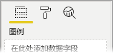
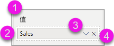
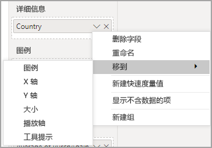
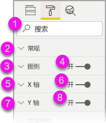
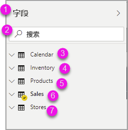
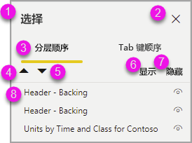
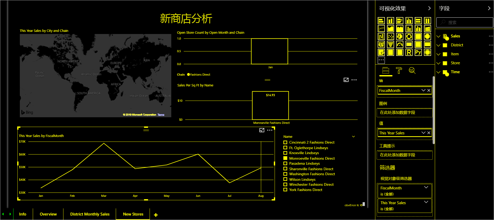

# 使用辅助功能工具在 Power BI 中创建报表

对于使用辅助功能工具创建报表的报表创建者，Power BI 提供了许多可在此过程中提供帮助的内置功能。

本文介绍 Power BI Desktop 中可供报表创建者使用的多种辅助功能工具。

## 应用级导航
在 Power BI Desktop 中导航时，可以按 Ctrl+F6，将焦点移到应用的主要区域  。 将焦点移动到 Power BI Desktop 主要区域的步骤按以下顺序执行：

1. 画布上的对象
2. “页面”选项卡
3. 窗格（对于任何打开的窗格，从左到右，每个分别操作）
4. 视图导航器
5. 页脚
6. 登录
7. 黄色警告/错误/更新栏

在大多数情况下，使用 Enter 进行选择或进入一个区域，然后使用 Esc 退出，这是 Power BI 中的常见操作   。

## 功能区导航

按下 Alt，可查看功能区当前视图中提供的每个命令上方名为“键提示”的小框   。 然后，可以按悬停在要使用的命令上的“键提示”中显示的字母  。 

例如，在下图中，已按下 Alt 键来显示键提示，其中包含适用于可用的可访问命令的字母  。 然后按 M，可打开功能区上的“建模”选项卡   。

根据按下的字母，可能会显示其他键提示。 例如，如果“主页”选项卡处于活动状态，并且你按下 W，会显示“视图”选项卡以及该“视图”功能区选项卡中的组的键提示     。可持续不断地按键提示中显示的字母，直到按下要使用的特定命令的字母为止。 若要移动到上一组键提示，请按 Esc  。若要取消正在执行的操作并隐藏键提示，请按 Alt 键  。

## 视觉对象窗格导航

若要在“可视化效果”窗格中导航，须先按 Ctrl+F6 让焦点到达窗格，以确保焦点位于该窗格上   。 用户在“可视化效果”窗格中导航时，焦点首先位于标头上。 从顶部开始，Tab 键顺序如下图中所示：

1. 标头标题
2. 展开/折叠克拉
3. 第一个视觉对象图标

转到视觉对象时，可以使用箭头键导航到特定视觉对象，然后按 Enter 选择该视觉对象  。 如果使用屏幕阅读器，它会在创建了新图表时提供语音提示并告知图表是哪种类型，或者在你将特定类型的图表更改为另一种类型的图表时提供语音提示。 

在该窗格的“视觉对象”部分之后，焦点切换到窗格透视，如下图所示。

焦点位于窗格透视时，Tab 操作仅会应用到所选窗格的图标上。 若要切换到其他窗格，请使用箭头键。

## 字段框

焦点位于窗格透视时，如前一部分中所述，再次按 Tab 可将焦点移动到“字段框”  。 

在“字段框”中，焦点按以下顺序移动  ：

* 每个框的标题（首先）
* 每个框中的给定字段（其次）
* 用于打开“字段”菜单的下拉列表按钮（此后）
* 删除按钮（最后）

下图显示了此焦点移动顺序。

屏幕阅读器会读出框名称及其工具提示。 对于框中的每个字段，屏幕阅读器读出字段名称及其工具提示。 如果框为空，则系统将焦点移到整个空框。 屏幕阅读器应读取框名称和工具提示，并表明其为空。

字段菜单处于打开状态时，可以使用 Tab 或 Shift+Tab 或向上 / 向下箭头键来进行移动     。 屏幕阅读器将读出选项名称。

如果要将字段从字段框中的一个存储桶移动到另一个存储桶，可以使用键盘，并使用字段框菜单中的“移动到”选项，如下图所示  。

## “格式设置”窗格

“格式设置”窗格的焦点移动顺序依照卡顺序，从顶部向下移动  。 焦点在卡片名称之间移动，名称后面是“开启/关闭”切换按钮（如果存在）  。 焦点位于卡名称上时，屏幕阅读器会读出卡的名称，以及卡是展开的还是折叠的。 按 Enter 即可展开或折叠卡  。 Enter 键也可用于切换“开启”或“关闭”切换按钮    。

如果卡处于打开状态，则在转到下一张卡片之前，按 Tab 可浏览卡中的控件  。 对于卡中的控件，屏幕阅读器会读出标题、当前值和控件类型。  

## 字段列表导航

可以按 Tab 在“字段”列表中导航   。 与“格式设置”窗格类似，如果表处于折叠状态，则焦点按以下顺序循环移动：

1. “字段”列表标头 
2. 搜索栏
3. 每个表名

若要将字段框中的所有表展开，请按 Alt+Shift+9   。 若要折叠所有表，请按 Alt+Shift+1  。 若要展开单个表，请按向右箭头键  。 若要折叠单个表，请按向左箭头键  。 与“格式设置”窗格类似，如果表处于展开状态，则在含要显示的字段的字段列表中按 Tab 并进行导航。 屏幕阅读器会读出已展开还是已折叠某个表。

可以通过导航到所需字段并按 Enter 来勾选字段  。   屏幕阅读器会读出焦点所在的字段，以及字段处于已选中还是未选中状态。

鼠标用户通常将字段拖放到画布，或拖放到所需的相关筛选器存储桶中。 若要使用键盘，可以向筛选器存储桶中添加字段，方法是按 Shift+F10 进入某个字段的上下文菜单，使用箭头键导航到“添加到筛选器”，然后对要向其添加字段的筛选器类型按 Enter    。

## 选择窗格导航
“选择”窗格的焦点移动顺序如下  ：

1. 标头标题
2. “退出”按钮
3. 层/Tab 键顺序切换器
4. “在层中向上移动”按钮
5. “在层中向下移动”按钮
6. “显示”按钮
7. “隐藏”按钮
8. 对象

可以通过 Tab 键按焦点顺序移动并按 Enter 选择感兴趣的元素  。  

转到层/Tab 键顺序切换器后，可使用向左箭头键和向右箭头键在层顺序和 Tab 键顺序之间切换。

转到“选择”窗格中的对象时，按 F6 激活“选择”窗格    。 激活“选择”窗格后，可以使用向上/向下箭头键导航到“选择”窗格中的不同对象   。
导航到感兴趣的对象后，可执行以下操作：

* 按 Ctrl+Shift+S 可隐藏/显示对象 
* 按 Ctrl+Shift+F 可按层顺序向上移动对象 
* 按 Ctrl+Shift+B 可按层顺序向下移动对象 
* 按 Ctrl+空格键可多选对象 

## Power BI Desktop 对话框

Power BI Desktop 中的所有对话框都可通过键盘导航访问，也可通过屏幕阅读器操作。

Power BI Desktop 中的对话框包括以下各项：

* “快速度量值”对话框
* “条件格式设置与数据条”对话框
* “问答资源管理器”对话框
* “入门指南”对话框
* “文件”菜单和“关于”对话框
* 警告栏
* “文件还原”对话框
* “哭脸”对话框

## 高对比度支持

使用 Windows 中的高对比度模式时，所选设置和调色板也会应用到 Power BI Desktop 的报表中。

Power BI Desktop 自动检测 Windows 中使用的高对比度主题，并将这些设置应用到报表。 报表发布到 Power BI 服务或其他位置时，这些高对比度颜色也会跟随报表。

## 后续步骤

Power BI 辅助功能的文章集合如下所示：

* [Power BI 中的辅助功能概览](desktop-accessibility-overview.md) 
* [创建可访问 Power BI 报表](desktop-accessibility-creating-reports.md) 
* [通过辅助功能工具使用 Power BI 报表](desktop-accessibility-consuming-tools.md)
* [适用于 Power BI 报表的辅助功能键盘快捷方式](desktop-accessibility-keyboard-shortcuts.md)
* [报表辅助功能清单](desktop-accessibility-creating-reports.md#report-accessibility-checklist)

