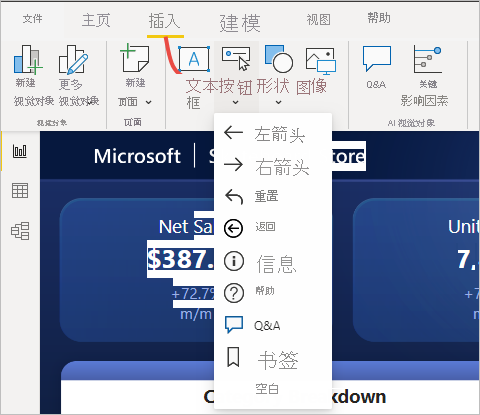
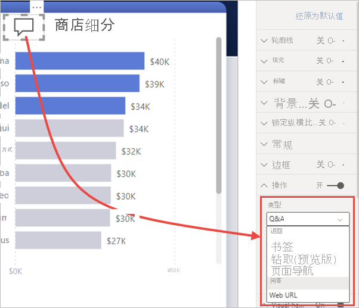
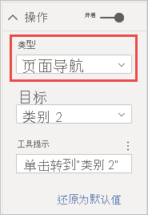

# 使用 Power BI 中的按钮
使用 Power BI 中的“按钮”，可创建类似于应用的报表，从而创建极具吸引力的环境，以便用户可悬停鼠标在 Power BI 内容上、单击它并进一步与之交互  。 可在 Power BI Desktop 和 Power BI 服务中向报表添加按钮   。 在 Power BI 服务中共享报表时，它们为用户提供类似于应用的体验。

## 在报表中创建按钮

### 在 Power BI Desktop 中创建按钮

要在 Power BI Desktop 中创建按钮，请在“插入”功能区上选择“按钮”，一个下拉菜单随即显示，可在其中的一系列选项中选择所需按钮，如下图所示    。 

### 在 Power BI 服务中创建按钮

要在 Power BI 服务中创建按钮，请在“编辑”视图中打开报表  。 选择顶部菜单栏中的“按钮”，一个下拉菜单随即显示，可在其中的一系列选项中选择所需按钮，如下图所示  。 

## 自定义按钮

无论是在 Power BI Desktop 中还是 Power BI 服务中创建按钮，其余过程都是相同的。 在报表画布上选择按钮时，“可视化效果”窗格提供众多途径助你自定义按钮来满足需要  。 例如，通过切换“可视化效果”窗格的“按钮文本”卡片中的滑块，可打开或关闭按钮文本   。 还可更改按钮图标、按钮填充、标题、用户在报表中选择按钮时所执行的操作以及其他属性。

## 空闲、悬停或选中时设置按钮属性

Power BI 中的按钮有三种状态：默认状态（未悬停或选中时的显示方式）、悬停状态或选中状态（通常指“被单击”）  。 “可视化效果”窗格中的许多卡可以根据这三种状态单独修改，从而可灵活地自定义按钮  。

“可视化效果”窗格中的以下卡允许你根据按钮的三种状态调整按钮的格式或行为  ：

* 按钮文本
* 图标
* 轮廓
* 填充

要为每种状态选择按钮的显示方式，请展开其中一张卡，然后选择卡顶部的下拉列表。 在下图中，可看到已展开的“图标”卡片，其中的下拉列表处于选中状态，显示出三种状态  。

## 选择按钮的操作

可选择用户在 Power BI 中选择按钮时所采取的操作。 可从“可视化效果”窗格中的“操作”卡访问按钮操作的选项   。

下面是按钮操作的选项：

- “返回”可让用户返回到报表的上一页  。 此项非常适合钻取页面。
- “书签”可显示与为当前报表定义的书签关联的报表页  。 详细了解 [Power BI 中的书签](desktop-bookmarks.md)。 
- “钻取(预览)”可让用户导航到已按照所选内容筛选的钻取页，而无需使用书签  。 详细了解[报表中的钻取按钮](desktop-drill-through-buttons.md)。
- “页面导航”可让用户导航到报表中的其他页面，也无需使用书签  。 有关详细信息，请参阅本文中的[创建页面导航](#create-page-navigation)。
- “问答”可打开一个“问答资源管理器”窗口   。 

某些按钮已自动选择默认操作。 例如，“问答”按钮类型会自动选择“问答”作为默认操作   。 通过查看[此博客文章](https://powerbi.microsoft.com/blog/power-bi-desktop-april-2018-feature-summary/#Q&AExplorer)，了解有关“问答资源管理器”的更多信息  。

通过单击想使用的按钮同时按 Ctrl，试用或测试为报表创建的按钮  。 

### 创建页面导航

“操作”类型为“页面导航”时，无需保存或管理任何书签即可快速生成整个导航体验   。

要设置页面导航按钮，请创建一个操作类型为“页面导航”的按钮，然后选择“目标”页   。

可以快速生成自定义导航窗格。 如果要更改导航窗格中显示的页面，不必编辑和管理书签。

此外，还可以有条件地设置工具提示的格式，就像对其他按钮类型执行的操作一样。

## 后续步骤
若要详细了解与按钮类似或与其交互的功能，请参阅以下文章：

* [在 Power BI 报表中使用钻取](desktop-drillthrough.md)
* [在 Power BI 中使用书签共享见解和创建情景](desktop-bookmarks.md)

