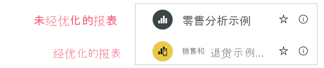
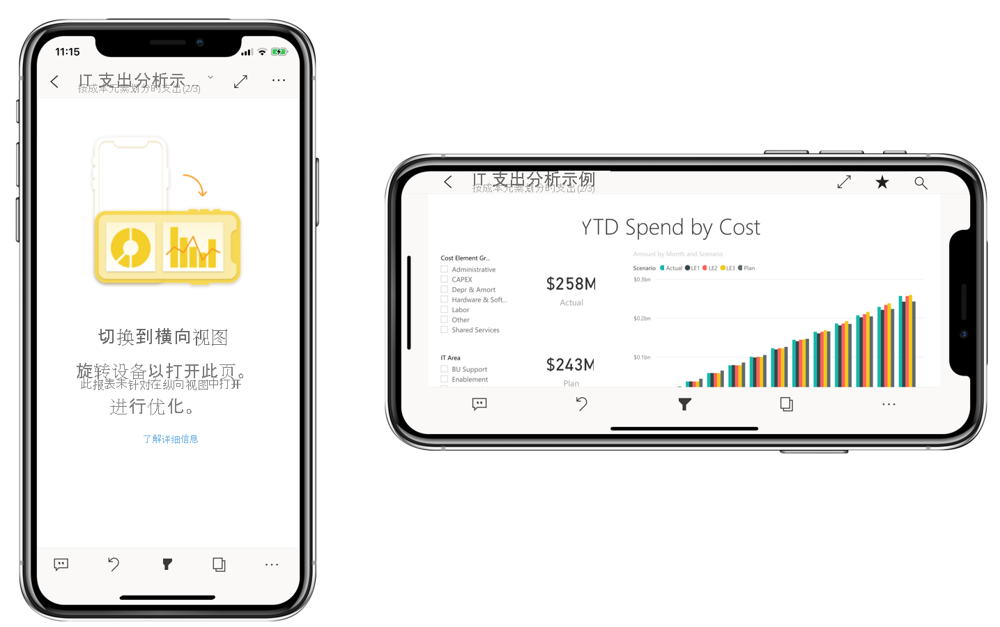

# 优化移动应用的 Power BI 报表
移动用户可以横向查看任何 Power BI 报表页。 但是，报表作者可以创建针对移动设备优化并纵向显示的其他视图。 Power BI Desktop 和 Power BI 服务中都提供了此设计选项，通过该选项，作者可以选择和重新排列对漫游的移动用户来说有意义的视觉对象。

。

Power BI 提供了许多功能，可帮助你创建报表的移动优化版本：
* 移动布局视图，可以在其中通过将视觉对象拖放到手机模拟器画布上来创建移动优化报表。
* 视觉对象和切片器，可进行优化以便在小型移动屏幕上使用。

借助这些功能，可以设计和生成引人注目的交互式移动优化报表。

## 创建报表页的移动优化纵向版本

第一步是在常规 Web 视图中设计和创建报表。 创建报表后，可以针对手机和平板电脑对其进行优化。

若要创建移动优化视图，请打开移动布局视图：
   * 在 Power BI Desktop 中，选择“视图”功能区，然后选择“移动布局” 。
   * 在 Power BI 服务中，选择“更多选项(...)”>“编辑报表”>“移动布局”。

   你会看到一个形状类似手机的可滚动画布，以及可列出原始报表页上的所有视觉对象的“可视化效果”窗格。

   。

* “可视化效果”窗格中的每个视觉对象都将显示其名称，以便于识别。
* 每个视觉对象也有一个可见性指示器。 视觉对象的可见性指示器会根据视觉对象在 Web 报表视图当前状态中的可见性状态而发生变化。 使用书签时，可见性指示器非常有用。

## 将视觉对象添加到移动布局画布
若要将视觉对象添加到移动布局中，请将它从“可视化效果”窗格拖动到手机画布中。 将视觉对象拖动到画布中时，它会对齐到网格。 或者，可以在“可视化效果”窗格中双击视觉对象，视觉对象随即添加到画布中。

可以将部分或全部 Web 报表页视觉对象添加到移动优化报表页。 每个视觉效果只能添加一次，无需包括所有视觉对象。

>[!NOTE]
> 可以将隐藏的视觉对象拖放到画布上。 它们将被放入，但不会显示，除非它们的可见性状态在当前 Web 报表视图中发生更改。

视觉对象可以叠放在一起，以便使用书签创建交互式报表，或通过在图像上叠放视觉对象来生成引人注目的报表。

将视觉对象置于画布上后，可以通过拖动显示在选中的视觉对象边缘周围的句柄来调整其大小。 若要在调整大小时保持视觉对象的纵横比，请在拖动大小调整句柄时按 Shift 键。

下图演示了如何将视觉对象从“可视化效果”窗格拖放到画布上，以及如何调整其中一些视觉对象的大小并进行叠放。

   

手机报表网格可在不同型号的手机间缩放，因此，报表在小屏幕和大屏幕手机上的效果都很好。

## 从移动布局画布中删除视觉对象
若要从移动布局中删除视觉对象，请单击手机画布上的视觉对象右上角的 X，或将其选中，然后按“删除” 。

通过单击“可视化效果”窗格中的橡皮擦，可以从画布中删除所有可视化效果。

从移动布局画布中删除视觉对象只是将它们从画布中删除。 视觉对象仍显示在“可视化效果”窗格中，原始报表不受影响。

## 配置要在移动优化报表中使用的视觉对象和切片器

### 视觉对象

默认情况下，许多视觉对象（尤其是图表类型视觉对象）都有响应。  这意味着它们大幅度更改以显示最大数量的数据和见解的视觉对象，与屏幕大小无关。

在视觉对象缩放时，Power BI 会优先确保显示数据。 例如，它可以自动删除填充，并将图例移至视觉对象顶部，这样即便视觉对象变小，也仍可提供信息。

 
如果由于某种原因而需要关闭响应，则可以在视觉对象格式设置的“常规”部分中执行此操作。

### 切片器

切片器提供在画布上筛选报表数据的功能。 在常规报表创作模式下设计切片器时，可以修改某些切片器设置以使其在移动优化报表中更易于使用：
* 可以决定是否允许报表读者仅选择一个或多个项。
* 可以使切片器垂直、水平或响应（响应式切片器必须为水平）。

如果将切片器设置为响应式，则在改变它大小和形状时，它显示更多或更少的选项。 它可以是调高、调短、调宽或调窄。 如果将其调整得足够小，它将变为报表页上的一个筛选器图标。

 
详细了解有关[创建响应式切片器](power-bi-slicer-filter-responsive.md)的信息。

## 发布移动优化报表
若要发布报表的移动优化版本，请[将主报表从 Power BI Desktop 发布到 Power BI 服务](desktop-upload-desktop-files.md)。 这会同时发布移动优化版本。

## 在手机或平板电脑上查看优化和未优化的报表

在 Power BI 移动应用中，移动优化报表由特殊图标进行指示。

在手机上，应用会自动检测报表是否为移动优化报表。
* 如果存在移动优化报表，则应用会在移动优化模式下自动打开报表。
* 如果不存在移动优化报表，则报表会以未优化的横向视图打开。

无论报表优化与否，横向抓住手机时都会在包含原始报表布局的未优化视图中打开报表。

如果仅优化某些页面，则当读者进入未优化的页面时，系统将提示他们切换到横向视图。 旋转手机或平板电脑后可以在横向模式下查看页面。 [详细了解如何与更适合纵向模式显示的 Power BI 报表进行交互](../consumer/mobile/mobile-apps-view-phone-report.md)。

## 创建移动优化布局时的注意事项
* 对于多页报表，可以优化全部或部分页面。
* 如果已定义报表页的背景色，则移动优化报表将具有相同的背景色。
* 无法仅为移动优化报表修改格式设置。 主布局和移动布局之间的格式一致。 例如，字体大小是相同的。
* 若要更改视觉对象（例如更改其格式、数据集、筛选器或任何其他属性），请返回到 Web 报表创作模式。

## 后续步骤
* [在 Power BI 中创建仪表板电话视图](service-create-dashboard-mobile-phone-view.md)。
* [查看针对你的电话进行优化的 Power BI 报表](../consumer/mobile/mobile-apps-view-phone-report.md)。
* [有关创建报表和仪表板的 Power BI 文档](https://docs.microsoft.com/power-bi/create-reports/)。
* 更多问题？ [尝试咨询 Power BI 社区](https://community.powerbi.com/)。