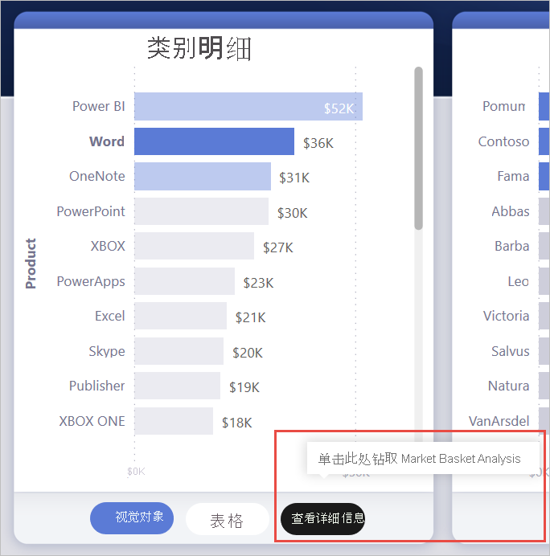
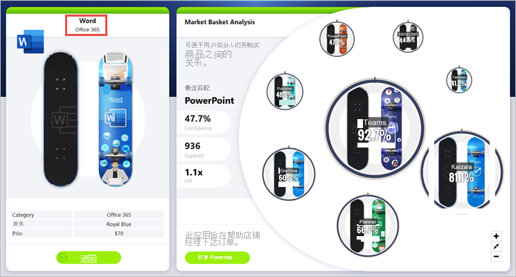
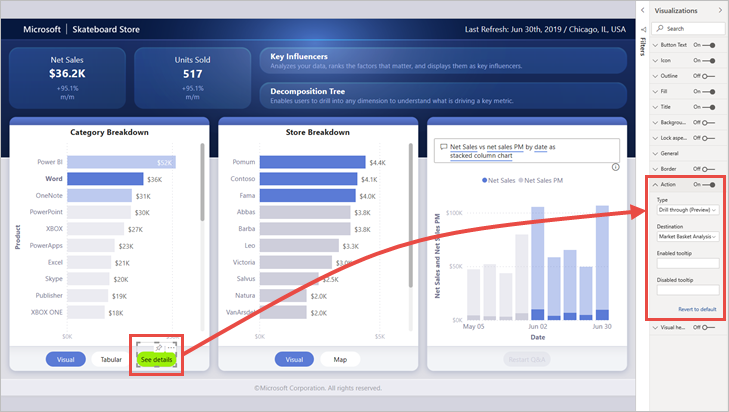
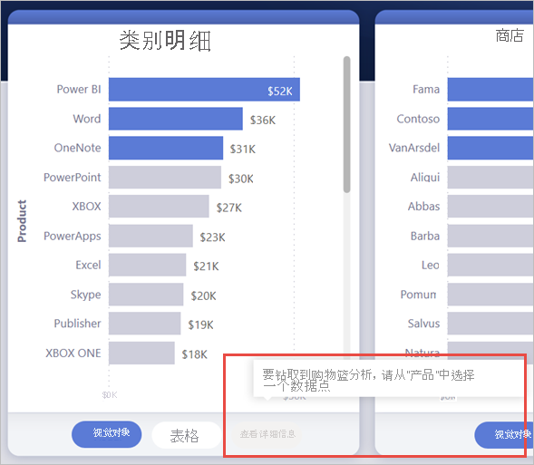
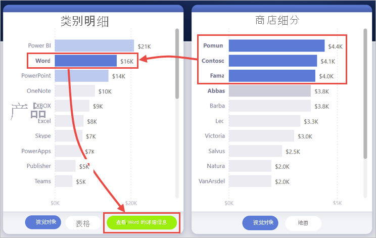
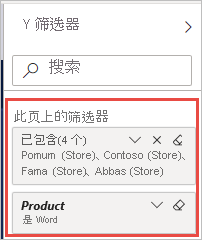
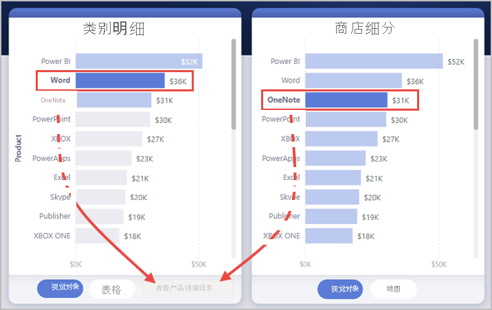
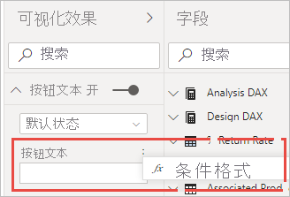
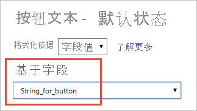
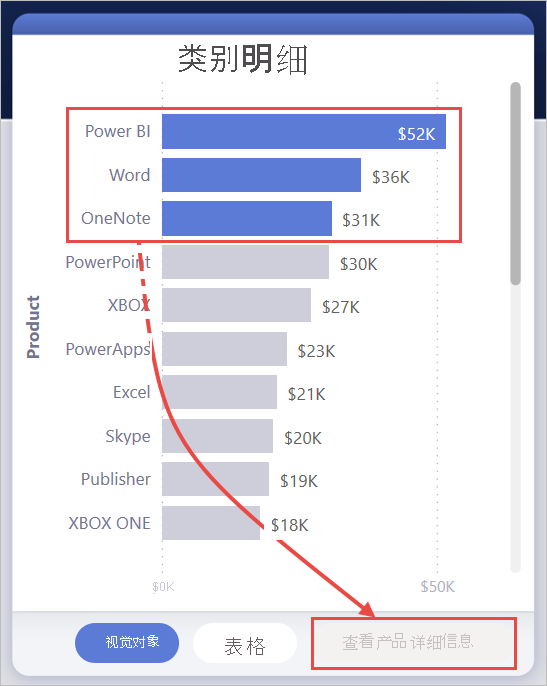

# <a name="create-a-drill-through-button-in-power-bi"></a>在 Power BI 中创建钻取按钮

你可以在 Power BI 中创建一个钻取按钮，该按钮用于钻取到包含筛选到特定上下文的详细信息的页面。

在报表中钻取的一种方法是，右键单击视觉对象。 如果希望钻取操作更为明显，可以创建钻取按钮。 此按钮可以提高报表中重要钻取方案的可发现性。 可以有条件地确定按钮的外观和行为方式。 例如，如果满足某些条件，则可以在按钮上显示不同的文本。 有关详细信息，请继续阅读。 

在此示例中，选择图表中的 Word 栏后即会启用“查看详细信息”按钮。



选择“查看详细信息”按钮后，会钻取到“市场篮分析”页面。 从左侧的视觉对象中可以看到，钻取页面现在的筛选条件为 Word。



## <a name="set-up-a-drill-through-button"></a>设置钻取按钮

要设置钻取按钮，首先需要在报表中[设置一个有效的钻取页面](desktop-drillthrough.md)。 然后，需要创建一个操作类型为“钻取”按钮，然后选择钻取页面作为“目标” 。

由于钻取按钮有两种状态（“已启用”和“已禁用”），可看到两个工具提示选项。



如果将工具提示框留空，Power BI 会自动生成工具提示。 这些工具提示基于目标和钻取字段。

下面是禁用按钮时自动生成的工具提示的示例：

“要钻取到‘市场篮分析’[目标页面]，请从‘产品’[钻取字段]中选择一个数据点。”



下面是启用按钮时自动生成的工具提示的示例：

“单击以钻取到‘市场篮分析’[目标页面]。”


但是，如果要提供自定义工具提示，始终都可输入静态字符串。 你还可以应用[条件格式到工具提示](#set-formatting-for-tooltips-conditionally)。

## <a name="pass-filter-context"></a>传递筛选器上下文

按钮的工作方式与常规钻取类似：可以通过交叉筛选包含钻取字段的视觉对象在其他字段中传递筛选器。 例如，使用 Ctrl  +  单击和交叉筛选，可以将 Store 中的多个筛选器传递到钻取页面，因为所选内容对包含“产品”（即钻取字段）的视觉对象进行了交叉筛选 ：



选择钻取按钮后，可看到 Store 和产品中的筛选器同时传递到目标页面中：



### <a name="ambiguous-filter-context"></a>不明确的筛选器上下文

由于钻取按钮没有绑定到单个视觉对象，因此，如果选择不明确，则会禁用此按钮。

在此示例中，按钮处于禁用状态，因为两个视觉对象在“产品”中都包含一个选择。 关于可以从哪个视觉对象将钻取操作绑定到哪个数据点存在歧义：



## <a name="customize-formatting-for-disabled-buttons"></a>为禁用按钮自定义格式
可以为钻取按钮的禁用状态自定义格式选项。


:::image type="content" source="media/desktop-drill-through-buttons/drill-through-customize-disabled-button.png" alt-text="自定义禁用按钮格式":::
 
这些格式选项包括：
- 按钮文本控件：文本、颜色、填充、对齐、大小和字体系列

    :::image type="content" source="media/desktop-drill-through-buttons/drill-through-disabled-button-text.png" alt-text="为禁用按钮文本设置格式":::

- 按钮填充控件：颜色、透明度和新的填充图像（在下一节中将对此进行详细介绍）

    :::image type="content" source="media/desktop-drill-through-buttons/drill-through-disabled-button-fill.png" alt-text="已禁用按钮填充":::

- 图标控件：形状、填充、对齐、线条颜色、透明度和粗细

    :::image type="content" source="media/desktop-drill-through-buttons/drill-through-disabled-button-icon.png" alt-text="已禁用按钮图标":::

- 边框控件：颜色、透明度、粗细、圆角

     :::image type="content" source="media/desktop-drill-through-buttons/drill-through-disabled-button-outline.png" alt-text="已禁用按钮边框":::

## <a name="set-formatting-for-button-text-conditionally"></a>有条件地为按钮文本设置格式
可以使用条件格式根据选择的字段值更改按钮文本。 为此，需要创建一个度量值，根据 DAX 函数 SELECTEDVALUE 输出所需字符串。

下面是一个示例度量值，如果没有选择一个“产品”值，此度量值输出“查看产品详细信息”；否则，它输出“查看 [选定产品] 的详细信息”：

```dax
String_for_button = If(SELECTEDVALUE('Product'[Product], 0) == 0, "See product details", "See details for " & SELECTEDVALUE('Product'[Product]))
```

创建此度量值后，请为按钮文本选择“条件格式”选项：



然后，选择为按钮文本创建的度量值：



选择单个产品时，按钮文本显示：

“查看 Word 的详细信息”


如果未选择任何产品或选择了多个产品，则该按钮将被禁用。 按钮文本显示：

“查看产品详细信息”



## <a name="set-formatting-for-tooltips-conditionally"></a>有条件地设置工具提示的格式

启用或禁用“钻取”按钮时，可以有条件地为其设置工具提示。 如果使用条件格式动态设置钻取目标，则可能希望按钮状态的工具提示更加丰富，这取决于最终用户的选择。 下面是一些示例：

- 你可以使用自定义度量值将禁用状态工具提示设置为根据具体情况进行规范。 例如，如果你希望用户选择单个产品和单个商店，然后才能钻取到“市场分析”页面，则可以使用以下逻辑创建度量值：

    如果用户未选择单个产品或单个商店，则该度量值将返回：“选择单个产品，然后按住 Ctrl 并单击选择单个商店。”

    如果用户已选择单个产品，但未选择单个商店，则该度量值将返回：“按住 Ctrl 并单击还可以选择单个商店。”

- 同样，你可以将已启用的状态工具提示设置为特定于用户的选择。 例如，如果希望用户知道钻取页将筛选出的产品和商店，则可以创建返回以下内容的度量值：

    “单击以钻取到[按页面名称钻取]，以查看有关[店铺名称]店铺销售[产品名称]的详细信息。”


## <a name="set-the-drill-through-destination-conditionally"></a>有条件地设置钻取目标

根据度量值的输出内容，可以使用条件格式设置钻取目标。

在某些情况下，你可能希望按钮钻取目标是有条件的：

- 只需在满足多个条件时，才想要实现钻取到页面。 否则，按钮将处于禁用状态。

    例如，你希望用户选择单个产品和单个商店，然后才能钻取到“市场”信息页。 否则，按钮将处于禁用状态。

    :::image type="content" source="media/desktop-drill-through-buttons/drill-through-select-product-store.png" alt-text="选择产品和商店":::
 
- 希望按钮基于用户选择支持多个钻取目标。

    例如，假设有多个供用户钻取的目标（“市场”详细信息和“商店”详细信息）。 可以让用户选择一个要钻取到的特定目标，然后为此钻取目标启用该按钮。

    :::image type="content" source="media/desktop-drill-through-buttons/drill-through-select-product-destination.png" alt-text="选择产品和目标":::
 
- 可能还会遇到有趣的混合方案的案例，要同时支持多个钻取目标和要禁用该按钮的特定条件。 阅读有关这三个选项的详细信息。

### <a name="disable-the-button-until-multiple-conditions-are-met"></a>禁用该按钮，直到满足多个条件

让我们看一看第一种情况，即，你想要保持按钮禁用状态直至满足其他条件。 你需要创建一个基本 DAX 度量值，除非满足条件，否则该度量值会输出一个空字符串 (“”)。 满足条件后，它将输出“钻取目标”页的名称。

下面是一个示例 DAX 度量值，需要先选择一个商店，然后用户才能在产品上钻取到“商店”详细信息页：

```dax
Destination logic = If(SELECTEDVALUE(Store[Store], “”)==””, “”, “Store details”)
```

创建此度量值后，请为按钮选择“目标”旁边的“条件格式”(fx) 按钮：

:::image type="content" source="media/desktop-drill-through-buttons/drill-through-select-formula.png" alt-text="选择条件格式按钮":::
 
在最后一步中，选择你创建的 DAX 度量值作为目标的字段值：

:::image type="content" source="media/desktop-drill-through-buttons/drill-through-based-formula.png" alt-text="基于字段的目标"::: 

现在你会发现，即使选择了单个产品，此按钮也处于禁用状态，因为度量值还要求你选择单个商店：

:::image type="content" source="media/desktop-drill-through-buttons/drill-through-button-disabled.png" alt-text="“钻取”按钮已禁用":::

### <a name="support-multiple-destinations"></a>支持多个目标
 
对于想要支持多个目标的另一种常见情况，从创建包含钻取目标名称的单列表开始：

:::image type="content" source="media/desktop-drill-through-buttons/drill-through-create-table.png" alt-text="创建表":::

Power BI 使用完全匹配的字符串来设置钻取目标，因此请仔细检查输入的值与钻取页名称是否完全一致。

创建表后，将其作为单项选择切片器添加到页面：

:::image type="content" source="media/desktop-drill-through-buttons/drill-through-slicer.png" alt-text="钻取切片器":::
 
如果需要更多垂直空间，请将切片器转换为下拉列表。 删除切片器标头并在其旁边添加一个带有标题的文本框：

:::image type="content" source="media/desktop-drill-through-buttons/drill-through-drop-down-slicer.png" alt-text="无标头的钻取切片器":::
 
或者，将列表切片器从垂直方向更改为水平方向：

:::image type="content" source="media/desktop-drill-through-buttons/drill-through-horizontal-slicer.png" alt-text="水平切片器":::

对于钻取操作的目标输入，请为按钮选择“目标”旁边的条件格式 (fx) 按钮：

:::image type="content" source="media/desktop-drill-through-buttons/drill-through-select-formula.png" alt-text="选择条件格式按钮":::
 
选择所创建列的名称，在此示例中，选择一个目标：

:::image type="content" source="media/desktop-drill-through-buttons/drill-through-select-destination.png" alt-text="选择一个目标":::
 
现在，你会看到“钻取”按钮仅在你同时选择了一个产品和一个目标时才启用：

:::image type="content" source="media/desktop-drill-through-buttons/drill-through-select-product-destination.png" alt-text="选择产品和目标":::
 
### <a name="hybrid-of-the-two-scenarios"></a>两种方案的混合

如果对混合这两种方案感兴趣，则可以创建和引用 DAX 度量值，为目标选择添加其他逻辑。

下面是一个示例 DAX 度量值，需要先选择一个商店，然后用户才能在“产品”上钻取到任何钻取页：

```dax
Destination logic = If(SELECTEDVALUE(Store[Store], “”)==””, “”, SELECTEDVALUE(‘Table'[Select a destination]))
```

然后，选择创建的 DAX 度量值作为目标的字段值。
在此示例中，用户将需要选择“产品”、“商店”和目标页面，然后才启用钻取按钮：

:::image type="content" source="media/desktop-drill-through-buttons/drill-through-product-store-destination.png" alt-text="选择产品、商店和目标":::

## <a name="limitations"></a>限制

- 此按钮不允许多个目标使用单个按钮。
- 此按钮仅支持在同一报表中进行钻取。换句话说，它不支持交叉报表钻取。
- 按钮的禁用状态格式与报表主题中的颜色类别相关。 详细了解[颜色类别](desktop-report-themes.md#setting-structural-colors)。
- 钻取操作适用于所有内置视觉对象以及从 AppSource 导入的某些视觉对象。 但并不保证此操作适用于从 AppSource 导入的所有视觉对象。

## <a name="next-steps"></a>后续步骤
若要详细了解与按钮类似或与其交互的功能，请参阅以下文章：

* [创建按钮](desktop-buttons.md)
* [在 Power BI 报表中使用钻取](desktop-drillthrough.md)
* [在 Power BI 中使用书签共享见解和创建情景](desktop-bookmarks.md)

