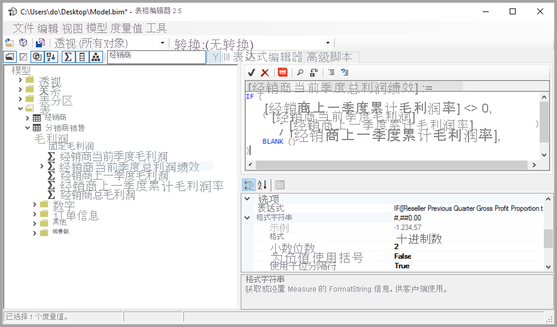

# <a name="using-external-tools-in-power-bi-desktop-preview"></a>在 Power BI Desktop 中使用外部工具（预览版）

从 2020 年 7 月版 Power BI Desktop 开始，你可以使用外部工具为 Power BI Desktop 提供额外的功能和价值。 对外部工具的支持使你能够利用大量用于 BI 专业人员的 Analysis Services 社区工具，例如 DAX 查询/表达式优化和创作，以及应用程序生命周期管理 (ALM)。

Power BI Desktop 的“外部工具”功能区包含安装在计算机上并在 Power BI Desktop 中注册的外部工具按钮。 从 Power BI Desktop 启动的外部工具会自动连接到作为 Power BI Desktop 一部分运行的 Analysis Services 引擎，从而为用户提供无缝体验。


下方列出了这些功能强大的外部工具，以及指向其安装位置的链接。 每个外部工具均由其各自的工具创作者提供支持：

* [表格编辑器](https://tabulareditor.com/)
* [DAX Studio](https://daxstudio.org)
* [ALM 工具包](http://alm-toolkit.com)


以下各节介绍外部工具支持的操作、Power BI Desktop 中包含的特色工具列表，以及如何注册其他工具的说明。

> [!NOTE]
> 外部工具不可用于 Power BI Desktop 的 Power BI 报表服务器版本。

## <a name="supported-write-operations"></a>支持的写入操作

外部工具可以连接到 Power BI Desktop 数据集（Analysis Services 模型），以编辑以下对象。 不支持编辑 Power BI Desktop 模板 (PBIT) 文件。

* [度量值](/analysis-services/tabular-models/measures-ssas-tabular)：用于计算
* [计算组](/analysis-services/tabular-models/calculation-groups)：用于计算复杂模型的可重用性
* [透视](/analysis-services/tabular-models/perspectives-ssas-tabular)：用于定义数据集元数据的特定业务域重点视图

使用外部工具管理元数据转换可能是可行的，但此预览版目前不支持。 如果当前用户的区域设置为转换的区域设置，则在使用 Power BI Desktop 的当前版本时，无法正确地在字段列表中编辑对象。 

可对所有[表格对象模型](/analysis-services/tom/introduction-to-the-tabular-object-model-tom-in-analysis-services-amo)数据集元数据进行只读访问，但[表格对象模型](/analysis-services/tom/introduction-to-the-tabular-object-model-tom-in-analysis-services-amo)文章中所述的列表未涵盖的对象尚不支持在 Power BI Desktop Analysis Services 实例中进行编辑。


## <a name="featured-external-tools"></a>特色外部工具

以下开源社区工具适用于 Power BI Desktop。 它们由各自的工具创作者提供支持。 每个工具对应的安装程序在安装时将其注册到 Power BI Desktop：

* 表格编辑器
* DAX Studio
* ALM 工具包

让我们依次来看看这些工具。

### <a name="tabular-editor"></a>表格编辑器

可以通过以下链接安装[表格编辑器](https://tabulareditor.com/)：[表格编辑器网站](https://tabulareditor.com/)

使用表格编辑器，BI 专业人员可以使用直观的轻型编辑器轻松生成、维护和管理表格模型。 层次结构视图显示表格模型中的所有对象，这些对象是使用显示文件夹整理的，它们支持多选属性编辑和 DAX 语法突出显示。



表格编辑器的源代码可在以下 GitHub 存储库中找到：[GitHub 上的表格编辑器](https://github.com/otykier/TabularEditor)

表格编辑器的主要工具作者是 [Daniel Otykier](https://www.linkedin.com/in/daniel-otykier-2231876)。


### <a name="dax-studio"></a>DAX Studio

可以通过以下链接安装 [DAX Studio](https://daxstudio.org)：[DAX Studio 网站](https://daxstudio.org)

DAX Studio 是一个用于 DAX 创作、诊断、性能优化和分析的完整工具。 其功能包括对象浏览、集成跟踪、包含详细统计信息的查询执行情况分解、DAX 语法突出显示和格式设置。 下图显示了 Dax Studio 屏幕。 


DAX Studio 的源代码可在以下 GitHub 存储库中找到：[GitHub 上的 DAX Studio](https://github.com/DaxStudio/DaxStudio)

DAX Studio 的主要工具作者是 [Darren Gosbell](https://www.linkedin.com/in/darrengosbell)。

### <a name="alm-toolkit"></a>ALM 工具包

可以通过以下链接安装 [ALM Toolkit](http://alm-toolkit.com)：[ALM Toolkit 网站](http://alm-toolkit.com)

ALM Toolkit 是针对 Power BI 数据集的架构比较工具，用于应用程序生命周期管理 (ALM) 方案。 可以使用它跨环境执行简单部署，并保留增量刷新历史数据。 使用 ALM Toolkit，你可以区分和合并元数据文件、分支和存储库。 还可以在数据集之间重用共同定义。


ALM Toolkit 的源代码可在以下 GitHub 存储库中找到：[GitHub 上的 ALM Toolkit](https://github.com/microsoft/analysis-services)

ALM Toolkit 的主要工具作者是 [Christian Wade](https://www.linkedin.com/in/christianwade1)。


## <a name="how-to-register-external-tools"></a>如何注册外部工具

若要将其他外部工具注册到 Power BI Desktop，请创建包含以下内容的 JSON 文件：

```json
{
    "name": "<tool name>",
    "description": "<tool description>",
    "path": "<tool executable path>",
    "arguments": "<optional command line arguments>",
    "iconData": "image/png;base64,<encoded png icon data>"
}
```

以下列表介绍了 JSON 文件中的元素列表：
 
* **name：** 提供工具的名称，该名称将显示为 Power BI Desktop 中“外部工具”功能区中的按钮标题。
* description：（可选）提供说明，它将在 Power BI Desktop 内的“外部工具”功能区按钮上显示为工具提示。
* path：提供指向可执行文件的完全限定路径。
* arguments：（可选）提供启动工具可执行文件时应使用的命令行参数字符串。 可以使用以下任意占位符：
    * %server%：替换为导入的/DirectQuery 数据模型的 Analysis Services 表格的本地实例的服务器名称和端口号。
    * %database%：替换为导入/DirectQuery 数据模型的 Analysis Services 表格本地实例中承载的模型的数据库名称。
* iconData：提供图像数据，该数据将呈现为 Power BI Desktop 中“外部工具”功能区中的按钮图标。 应根据不带“data:”前缀的数据 URI 语法来设置字符串格式。
 
将该文件命名为 `"<tool name>.pbitool.json"` 并置于以下文件夹中：

* `%commonprogramfiles%\Microsoft Shared\Power BI Desktop\External Tools`

对于 64 位环境，请将这些文件置于以下文件夹中：

* Program Files (x86)\Common Files\Microsoft Shared\Power BI Desktop\External Tools

在启动时，Power BI Desktop 加载 .pbitool.json 扩展的指定位置中的文件。

## <a name="disabling-external-tools-using-the-registry"></a>使用注册表禁用外部工具

可以使用“组策略”或通过编辑注册表来禁用外部工具，这与禁用“自定义视觉对象”的过程类似 。

* 注册表项：Software\Policies\Microsoft\Power BI Desktop\\

* 注册表值：EnableExternalTools

十进制值 1 允许在 Power BI 中使用外部工具，这是默认值。

十进制值 0 禁止在 Power BI 中使用外部工具。


## <a name="next-steps"></a>后续步骤

你可能还会对以下文章感兴趣：

* [在 Power BI 报表中使用跨报表钻取](desktop-cross-report-drill-through.md)
* [在 Power BI Desktop 中使用切片器](../visuals/power-bi-visualization-slicers.md)