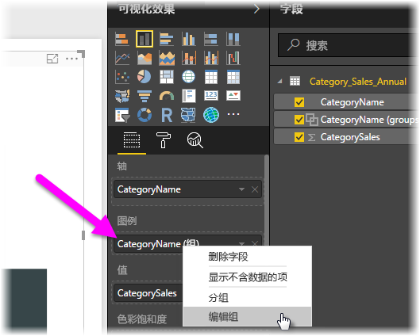

# 在 Power BI Desktop 中使用分组和装箱
在创建视觉对象后，Power BI Desktop 会根据基础数据中的值，将数据分入各区块（或组）。 这种归类的效果通常不错，但你有时可能会想要优化这些区块的显示方式。 例如，你可能想要在一个更宽泛的类别（ 一个组  ）中设置三个产品类别。 或者，你可能希望将销售额数据按 1,000,000 美元大小进行装箱，而不是 923,983 美元大小的区块。

在 Power BI Desktop 中，你可以对数据点进行 *分组*，以便更清楚地查看、分析和浏览视觉对象中的数据和趋势。 还可以定义“装箱大小”，将值归入大小相同的组，更有助于你执行合理的数据可视化  。 此操作通常称为“装箱”  。

## 使用分组
若要使用分组，请在按住 Ctrl 的同时单击选择多个元素，从而选择视觉对象上的两个或多个元素。 然后右键单击多个选择元素之一，然后从上下文菜单中选择“组”  。

创建的组会被添加到视觉对象的“图例”存储桶中  。 组也会显示在“字段”列表中  。

一旦拥有组，便能轻松编辑该组的成员。 右键单击“图例”存储桶或“字段”列表中的字段，然后选择“编辑组”    。

在“组”对话框中可以新建组，也可以修改现有组  。 也可以“重命名”任何组  。 双击“组和成员”框中的组标题，然后输入新名称  。

可以通过组执行各种操作。 可以将“未分组值”  列表中的项添加到一个新组或现有组中。 若要新建组，请从“未分组值”框中选择两个或多个项（按住 Ctrl 的同时单击），然后选择该框下方的“组”按钮   。

可以将未分组值添加到现有组，只需选择未分组值，选择现有组以向其添加值，然后选择“组”按钮   。 若要删除组中的项，请在“组和成员”框中选择相应项，然后选择“取消分组”   。 还可以将未分组的类别移到“其他”组中，或保留其未分组的状态  。

> [!NOTE]
> 也可以为“字段”中的任意字段创建组，而无需选择现有视觉对象中的多个项  。 只需右键单击相应字段，然后从随即显示的菜单中选择“新建组”  即可。

## 使用装箱
可以在 Power BI Desktop  中对数字和时间类型字段设置装箱大小。 借助装箱，可以合理精简 Power BI Desktop 显示的数据。

若要应用装箱大小，请右键单击“字段”，然后选择“新建组”   。

在“组”对话框中，设置所需的“装箱大小”   。

选择“ **确定** ”后，你会发现“ **字段** ”窗格中显示一个新字段，且后跟“ **（装箱）** ”一词。 然后，可以将该字段拖到画布上，以在视觉对象中使用此装箱大小。

若要了解 *装箱* 的运作方式，请观看此 [视频](https://www.youtube.com/watch?v=BRvdZSfO0DY)。

一切就是这么简单！使用 *分组* 和 *装箱* 可以确保报表中的视觉对象按你所需的方式显示数据。
