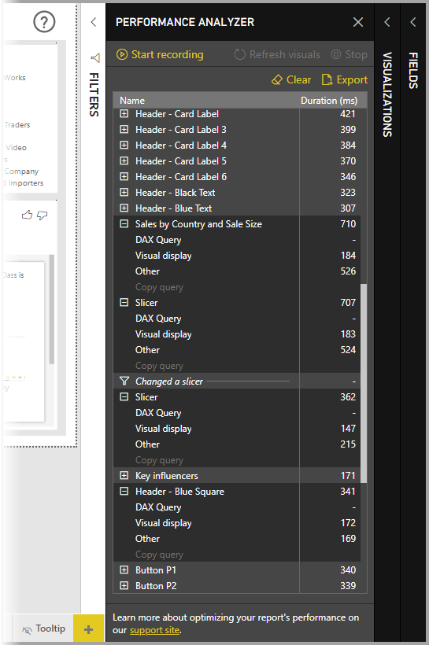

# 使用性能分析器检查报表元素性能

在 Power BI Desktop 中，可以了解视觉对象和 DAX 公式等报表元素的性能  。 使用性能分析器可以查看和记录日志，用于衡量每个报表元素响应用户交互的能力，以及为提供这种能力而需占用资源最多（最少）的方面  。

对于用户交互所启动的所有视觉对象，性能分析器将检查并显示其更新或刷新所需时间，并提供信息让你查看、向下钻取或导出结果。 性能分析器可帮助识别影响报表性能的视觉对象，并确定造成影响的原因。

## 显示性能分析器窗格

在 Power BI Desktop 中，选择“视图”功能区   。 在“视图”功能区的“显示”区域中，可以选择“性能分析器”旁的复选框以显示“性能分析器”窗格    。

选择后，性能分析器窗格将显示在报表画布右侧。

## 使用性能分析器

对于导致运行查询的任何用户交互，性能分析器将衡量更新其所启动报表元素所需的处理时间（包括创建或更新视觉对象所需的时间）。 例如，调整切片器需要修改切片器视觉对象、将查询发送到数据模型，以及必须根据新设置更新的相关视觉对象。 

若要使用性能分析器开始记录，选择“开始记录”即可 

“性能分析器”窗格将按 Power BI 加载视觉对象的顺序显示并记录你在报表中执行的任何操作。 例如，用户可能报告称你的某个报表刷新时间过长。 或者调整滑块后要过很久才会显示报表中的某些视觉对象。 性能分析器可以指出导致上述情况的视觉对象，并确定处理该视觉对象的哪些方面所需时间最长。 

开始记录后，“开始记录”按钮灰显（无效，因为已经开始记录），“停止”按钮可用   。 

性能分析器会实时收集并显示性能测量信息。 因此，你每次单击视觉对象、移动切片器或以其他方式进行交互时，性能分析器都会在其窗格中立即显示性能结果。

如果窗格无法同时显示全部信息，将显示滚动条以便浏览其他信息。

每个交互操作在窗格中都有一个分区标识符，它描述了启动日志项的操作。 在下图中，交互操作是用户更改切片器。

每个视觉对象的日志信息都包含完成以下类别的任务所花费的时间：

* **DAX 查询** - 如果需要 DAX 查询，这是视觉对象发送查询到 Analysis Services 返回结果的时间。
* **视觉对象显示** - 在屏幕上绘制视觉对象所需的时间，其中包括检索任何 Web 图像或地理编码所需的时间。 
* **其他** - 视觉对象准备查询、等待其他视觉对象完成或执行其他后台处理所需的时间。

“持续时间(毫秒)”  值指示每个操作的开始  与结束  时间戳之间的差异。 大多数画布和视觉对象操作在单个用户界面线程（由多个操作共享）中按顺序执行。 报告的持续时间包括在其他操作完成期间排队等待的时间。 GitHub 上的[性能分析器示例](https://github.com/microsoft/powerbi-desktop-samples/tree/main/Performance%20Analyzer)及其关联[文档](https://github.com/microsoft/powerbi-desktop-samples/blob/main/Performance%20Analyzer/Power%20BI%20Performance%20Analyzer%20Export%20File%20Format.docx)提供有关视觉对象如何查询数据以及如何呈现的详细信息。

与要用性能分析器测量的报表元素进行交互后，可以选择“停止”按钮  。 当你选择“停止”后，性能信息将继续显示在窗格中供你分析  。

若要清除“性能分析器”窗格中的信息，请选择“清除”  。 选择“清除”后，将清除所有信息，不会保存它们  。 请参阅下一节，了解如何在日志中保存信息。 

## 刷新视觉对象

可以在“性能分析器”窗格中选择“刷新视觉对象”，以刷新报表当前页面上的所有视觉对象，从而使性能分析器收集关于这些视觉对象的信息  。

还可以刷新单个视觉对象。 性能分析器记录时，你可以选择每个视觉对象右上角的“刷新此视觉对象”，以刷新该视觉对象并捕获其性能信息  。

## 保存性能信息

选择“导出”按钮，可以保存性能分析器创建的报表相关信息  。 选择“导出”会创建 json 文件，其中包含来自“性能分析器”窗格的信息  。 

## 后续步骤
有关 Power BI Desktop  以及如何入门的详细信息，请查看以下文章。

* [什么是 Power BI Desktop？](../fundamentals/desktop-what-is-desktop.md)
* [Power BI Desktop 的查询概述](../transform-model/desktop-query-overview.md)
* [Power BI Desktop 中的数据源](../connect-data/desktop-data-sources.md)
* [连接到 Power BI Desktop 中的数据](../connect-data/desktop-connect-to-data.md)
* [使用 Power BI Desktop 调整和合并数据](../connect-data/desktop-shape-and-combine-data.md)
* [Power BI Desktop 中的常见查询任务](../transform-model/desktop-common-query-tasks.md)   

有关性能分析器示例的详细信息，请查看以下资源。

* [性能分析器示例](https://github.com/microsoft/powerbi-desktop-samples/tree/main/Performance%20Analyzer)
* [性能分析器示例文档](https://github.com/microsoft/powerbi-desktop-samples/blob/main/Performance%20Analyzer/Power%20BI%20Performance%20Analyzer%20Export%20File%20Format.docx)
