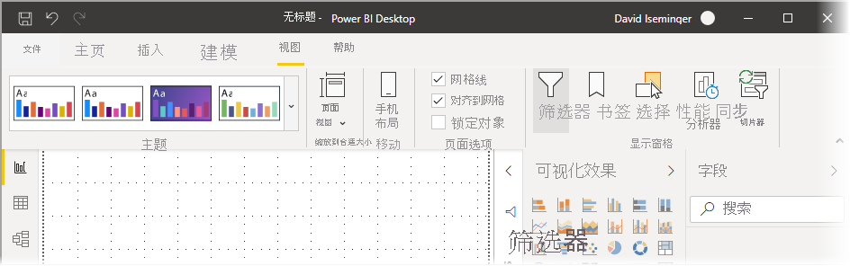
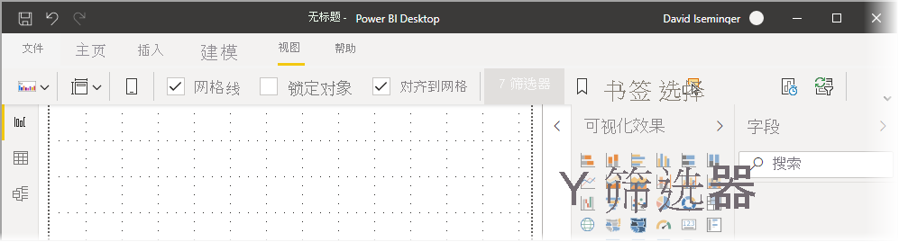
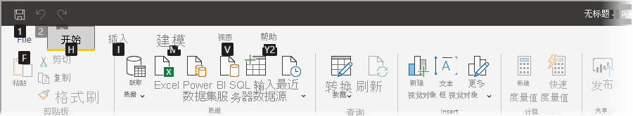
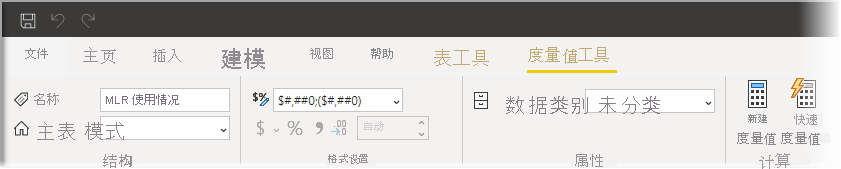

# 在 Power BI Desktop 中使用更新后的功能区

Power BI Desktop 修改了其功能区，以便更好地使其外观和体验与其他 Microsoft 产品（如 Microsoft Office）相一致。

## 如何启用更新的功能区

从 Power BI Desktop 2020 年 5 月发行版开始，更新后的功能区已正式发布。 从 2020 年 3 月更新开始，默认情况下更新后的功能区处于启用状态。 

## 更新后功能区的功能

更新功能区旨在使客户在 Power BI Desktop 以及其他 Microsoft 产品中的体验更加轻松、熟悉。 

其优点可以分为以下几类：

* **改进的外观和编排** - 新 Power BI Desktop 功能区中的图标和功能与 Office 应用程序中的功能区项的外观和编排一致。

    

* **直观的主题库** -“视图”功能区中的“主题库”具有与 PowerPoint 主题库相似的外观。 因此，功能区中的图像会显示应用于报表时主题的变化（如颜色组合和字体变化）。 

    

* **基于视图动态显示功能区内容** - 在 Power BI Desktop 的现有功能区中，无法使用的图标或命令只是灰显，这并不是最佳体验。 更新后的功能区可以动态显示和排列图标，方便你始终了解上下文中有哪些选项可供使用。

* **折叠后的单行功能区可节省空间** - 新功能区的另一个优点是能够将功能区折叠到一行中，并基于上下文动态地显示功能区项。 

    

* **用于导航和选择按钮的键提示** - 要帮助导航到功能区，可以按“Alt+Windows 键”激活键提示。 激活后，可以按键盘上显示的键进行导航。

    

* **自定义格式字符串** - 除了在“属性”窗格中设置自定义格式字符串以外，还可以在功能区中对其进行设置。 选择要自定义的度量值或列，根据选择将显示“度量值工具”或“列工具”上下文选项卡 。 在该选项卡的格式部分，可以直接在下拉框中键入自定义格式字符串。

    

* **辅助功能** - 标题栏、功能区和文件菜单都具有易访问性辅助功能。 按 Ctrl+F6 导航到功能区部分。 在该区域，可以使用 Tab 在顶栏和底栏之间移动，并使用箭头键在元素之间移动。

除了这些看得见的更改之外，新功能区还允许我们对 Power BI Desktop 及其功能区进行后续更新，如下所示：

* 在功能区中创建更灵活、更直观的控件，如视觉对象库
* 将黑色和暗灰色 Office 主题添加到 Power BI Desktop 
* 改进辅助功能

## 后续步骤
你可以使用 Power BI Desktop 连接到各种数据。 有关数据源的详细信息，请参阅下列资源：

* [什么是 Power BI Desktop？](../fundamentals/desktop-what-is-desktop.md)
* [Power BI Desktop 中的数据源](../connect-data/desktop-data-sources.md)
* [使用 Power BI Desktop 调整和合并数据](../connect-data/desktop-shape-and-combine-data.md)
* [通过 Power BI Desktop 连接到 Excel 工作簿](../connect-data/desktop-connect-excel.md)   
* [直接将数据输入到 Power BI Desktop 中](../connect-data/desktop-enter-data-directly-into-desktop.md)   
