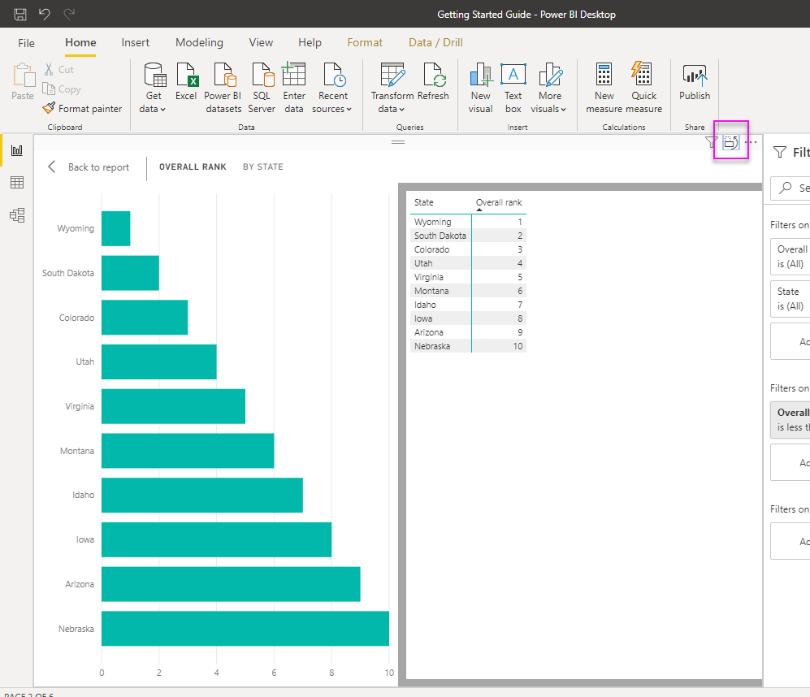

# 使用 Power BI Desktop 中的视觉对象表和数据点表
在 Power BI Desktop 中，可以深入了解可视化效果的详细信息，并能查看选定视觉对象的基础数据或单个数据记录的文本表示形式。 这些功能有时亦称为“单击后了解详细信息”、“深入了解”或“深入了解详细信息”。

可以使用“视觉对象表”以表的形式查看视觉对象中的数据，也可以使用“数据点表”查看用于计算单一数据点的数据表。 

>[!IMPORTANT]
>“视觉对象表”和“数据点表”仅支持以下可视化效果类型：
>  - 条形图
>  - 柱形图
>  - 环形图
>  - 着色地图
>  - 漏斗图
>  - 地图
>  - 饼图
>  - 树状图

## 使用 Power BI Desktop 中的视觉对象表

“视觉对象表”显示基础可视化效果数据。 在选择视觉对象后，“视觉对象表”出现在功能区的“显示”部分中的“数据/钻取”选项卡内。

此外，还可以通过右键单击可视化效果，然后从显示的菜单中选择“显示数据”；或者通过选择可视化效果右上角的“更多选项”(…)，然后选择“以表的形式显示”来查看数据  。

&nbsp;&nbsp;

> [!NOTE]
> 必须将鼠标悬停在视觉对象中的数据点上方，才能在右键单击后看到菜单。

当选择“视觉对象表”或“数据点表”时，Power BI Desktop 画布将显示视觉对象和数据的文本表示形式。 在“水平视图”中，视觉对象显示在画布的上半部分，数据显示在下半部分。 

可以通过选择画布右上角的图标，在“水平视图”和“垂直视图”之间切换。

若要返回报表，请选择画布左上角的“< 返回报表”。

## 使用 Power BI Desktop 中的数据点表

还可以重点关注可视化效果中的一个数据记录，然后深入了解此记录的数据。 若要使用“数据点表”，选择一个可视化效果，然后选择功能区“可视化工具”部分“数据/钻取”选项卡中的“数据点表”，然后选择一个数据点或可视化效果行。 

> [!NOTE]
> 如果功能区中的“数据点表”按钮处于禁用状态并灰显，则意味着所选可视化效果不支持“数据点表”。

此外可以右键单击数据元素，并从显示的菜单中选择“数据点表”。

当选择某个数据元素的“数据点表”，Power BI Desktop 画布会显示与所选元素相关联的所有数据。 

若要返回报表，请选择画布左上角的“< 返回报表”。

> [!NOTE]
>“数据点表”具有以下限制：
> - 无法更改“数据点表”视图中的数据并将其保存回报表。
> - 如果视觉对象使用（多维）度量值组中的计算度量值，则不能使用“数据点表”。
> - 连接到实时多维 (MD) 模型时无法使用“数据点表”。

## 后续步骤
**Power BI Desktop** 提供各种报表格式和数据管理功能。 请参阅下列资源，其中列举了部分示例：

* [在 Power BI Desktop 中使用分组和装箱](desktop-grouping-and-binning.md)
* [在 Power BI Desktop 报表中使用网格线、与网格对齐、z 顺序、对齐和分布](desktop-gridlines-snap-to-grid.md)

