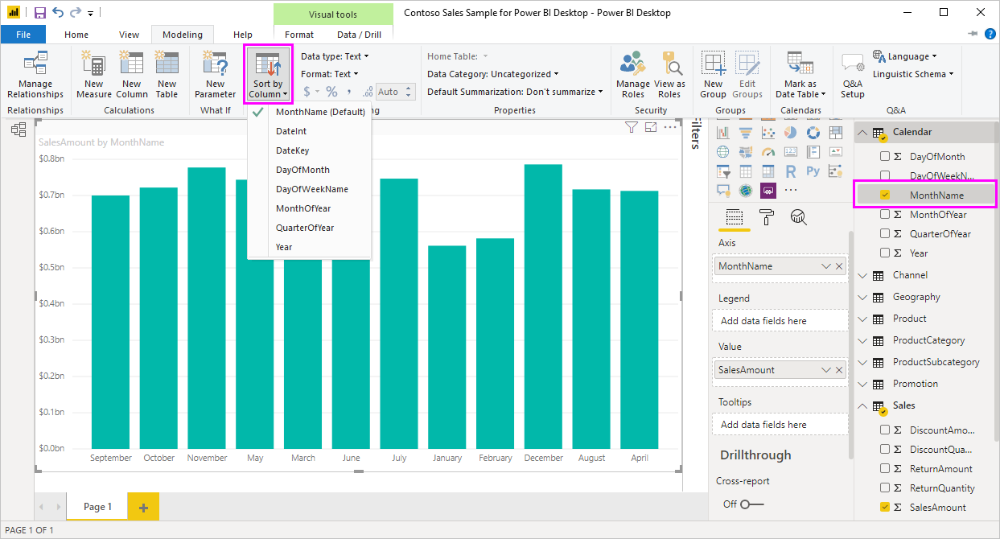

# 在 Power BI Desktop 中按列排序
在 Power BI Desktop 和 Power BI 服务中，你可以更改视觉对象的外观，方法是按不同的数据字段对其进行排序。 通过更改视觉对象的排序方式，可以突出显示想要表达的信息，并确保视觉对象反映相关趋势（或重点）。

无论使用数值数据（如销售数据）还是文本数据（如州名），都可对可视化效果进行排序，并将其设置为所需的外观。 Power BI 对排序提供了很大的灵活性，并提供了快速菜单供你使用。 要对任何视觉对象进行排序，请选择其“更多操作”(…) 菜单，选择“排序方式”，然后选择要按其排序的字段   。

## 排序示例
让我们使用具有更多深入分析的例子，并了解该示例在 Power BI Desktop 中的工作方式。

以下可视化效果按制造商名称显示成本、数量和金额。 未进行任何进一步排序之前，可视化效果显示如下：

视觉对象当前按 SalesQuantity 列进行排序  。 我们可以通过将升序栏的颜色与图例进行匹配来确定排序列，但有一种更好的方法：通过选择省略号 (…) 访问“更多选项”菜单  。

排序选项如下所示：

* 当前排序字段为 SalesQuantity，由 SalesQuantity 以粗体显示，且前面具有黄色的栏   。 

* 当前排序方向为升序，因为“升序排序”为粗体，其前面有黄色的栏  。

接下来的两部分将介绍排序字段和排序方向。

## 选择要用于排序的列
你已注意到“更多选项”菜单中“SalesQuantity”前的黄色栏，它指示视觉对象按 SalesQuantity 列排序    。 按另一列进行排序非常简单：选择省略号 (…) 以显示“更多选项”菜单，选择“排序方式”，然后选择其他列   。

在下图中，我们选择 DiscountAmount 作为排序依据列  。 此列显示为视觉对象中的一行，而不是其中的某栏。 

请注意视觉对象的更改方式。 现在，这些值按最高 DiscountAmount 值 Fabrikam Inc. 到最低值 Northwind Traders 排序  。 

但如果想要按升序（而非降序）进行排序，该怎么办呢？ 下一部分展示了此操作是多么的简单。

## 选择排序顺序
仔细查看上图中的“更多选项”菜单，可以看到“降序排序”以粗体显示，其前面有黄色的栏   。

选择“降序排序”时，表示视觉对象正在依据所选列按最大值到最小值的顺序进行排序  。 想要进行更改？ 没问题，只需选择“升序排序”，所选列的排序顺序就会变为从最小值到最大值  。

下面是相同的视觉对象，只是更改了 DiscountAmount 的顺序  。 请注意，现在，Northwind Traders 是列出的第一个制造商，而 Fabrikam Inc. 是最后一个，与之前排序相反。

可按视觉对象中的任意列进行排序；我们可以很容易地选择“SalesQuantity”，将其作为排序依据列，以便首先显示销售额最高的制造商，同时在视觉对象中仍保留适用于该制造商的其他列  。 下面来看看具有这些设置的视觉对象：

## 使用“排序依据列”按钮进行排序
对数据进行排序的另一个方法是通过使用“建模”功能区中的“排序依据列”按钮   。

此排序方法要求你首先从“字段”窗格中选择要排序的列（字段），然后选择“建模” **“排序依据列”对视觉对象进行排序**   >   。 如果未选择列，则“按列排序”按钮处于非活动状态  。

下面介绍一个常见示例。 你拥有来自一年中每个月的数据，并想按时间顺序对其进行排列。 以下步骤演示了操作过程：

1. 请注意，如果选择了视觉对象但没有选择“字段”窗格中的列，“排序依据列”按钮将处于非活动状态（灰色）   。
   
   

2. 在选择所需的排序依据列时，“**字段**”窗格中的“**排序依据列**”按钮将变为活动状态。
   
   
3. 选择视觉对象后，可选择“MonthOfYear”，而不是默认值“MonthName”，这样，视觉对象就会按所需顺序（按月份）进行排序   。
   
   

<!---
This functionality is no longer active. Jan 2020

## Getting back to default column for sorting
You can sort by any column you'd like, but there may be times when you want the visual to return to its default sorting column. No problem. For a visual that has a sort column selected, open the **More options** menu and select that column again, and the visualization returns to its default sort column.

For example, here's our previous chart:

When we go back to the menu and select **SalesQuantity** again, the visual defaults to being ordered alphabetically by **Manufacturer**, as shown in the following image.

With so many options for sorting your visuals, creating just the chart or image you want is easy.
--->

## 后续步骤

你可能还会对以下文章感兴趣：

* [在 Power BI Desktop 中使用跨报表钻取](desktop-cross-report-drill-through.md)
* [Power BI 中的切片器](../visuals/power-bi-visualization-slicers.md)
