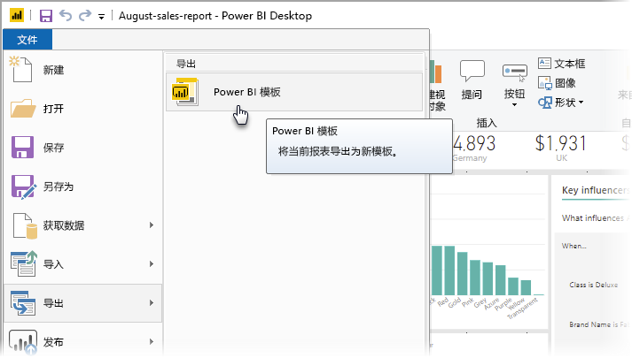
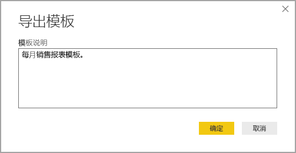
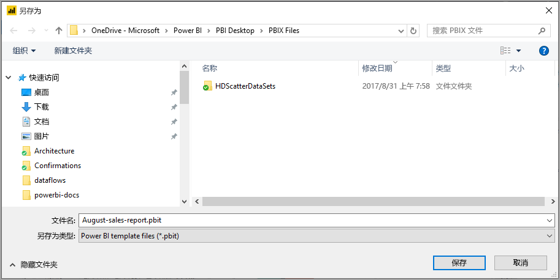
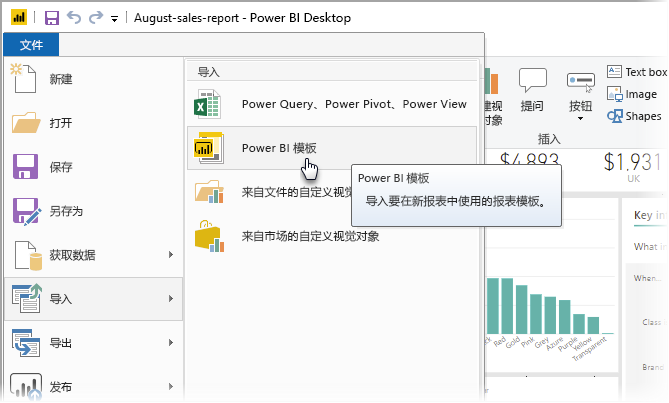
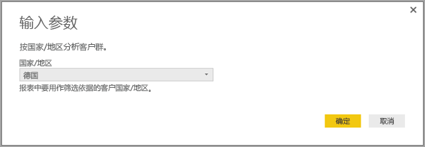
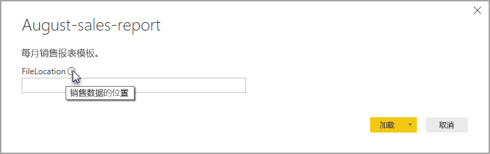

# 为 Power BI Desktop 创建报表模板

借助 Power BI Desktop，你可以创建在整个组织中共享见解的醒目报表  。 借助 Power BI Desktop 模板，可以通过创建基于现有模板的报表模板来简化工作，你或组织中的其他用户可以将其用作新建报表布局、数据模型和查询的起点  。 Power BI Desktop 中的模板有助于你快速启动和标准化报表的创建  。

## 创建模板

Power BI 报表模板包含生成它们的报表中的以下信息：

* 报表页、视觉对象和其他视觉对象元素 
* 数据模型定义，包括架构、关系、度量值和其他模型定义项目 
* 所有查询定义，例如查询、查询参数和其他查询元素 

模板中不包含报表数据  。 

报表模板使用文件扩展名 .PBIT（与使用 .PBIX 扩展名的 Power BI Desktop 报表比较）。 

若要创建报表模板，请从菜单中选择“文件 > 导出 > Power BI 模板”，这将打开以下窗口，其中提示你提供模板的描述  。 在此示例中，模板的描述是“月销售量报表模板”。 

选择“确定”，系统将提示你输入存储 .PBIT 模板文件的文件位置  。

Power BI 报表模板就这样在指定的文件位置创建，其扩展名为 .PBIT。

> [!NOTE]
> 因为模板不包含任何数据，只是报表定义本身，因此 Power BI 报表模板文件通常比 Power BI Desktop 报表少得多。 

## 使用模板

若要使用 Power BI 报表模板，只需在 Power BI Desktop 中将其打开，即可开始使用。 可以通过两种方式打开 Power BI 报表模板：

* 双击任意 .PBIT 文件，即可自动启动 Power BI Desktop 并加载模板
* 在 Power BI Desktop 中选择“文件 > 导入 > Power BI 模板” 

打开报表模板时，对话框显示模板所基于的报表中定义的任何参数的值。 例如，如果报表根据国家/地区分析客户并且拥有用于指定客户群的国家/地区参数，则系统会出现一个提示，你可以从定义参数时指定的值列表中选择国家/地区值   。 

提供任何所需参数后，系统会提示输入与报表关联的基础数据的位置。 然后，当前报表创建者可以根据其凭据连接到数据。

指定了参数和数据后，将创建一个报表，其中包含所有页面、视觉对象、数据模型项目和查询，这些元素是模板所基于的报表的一部分。 

大功告成。 在 Power BI Desktop 中创建和使用报表模板非常简单，使你可以轻松地重现引人注目的布局和报表的方方面面，并与他人共享。

## 后续步骤
你可能还希望了解**查询参数**：
* [在 Power BI Desktop 中使用查询参数？](https://docs.microsoft.com/power-query/power-query-query-parameters)

此外，还可使用 Power BI Desktop 执行多种操作。 有关其功能的详细信息，请参阅下列资源：

* [什么是 Power BI Desktop？](../fundamentals/desktop-what-is-desktop.md)
* [Power BI Desktop 的查询概述](../transform-model/desktop-query-overview.md)
* [Power BI Desktop 中的数据类型](../connect-data/desktop-data-types.md)
* [使用 Power BI Desktop 调整和合并数据](../connect-data/desktop-shape-and-combine-data.md)
* [Power BI Desktop 中的常见查询任务](../transform-model/desktop-common-query-tasks.md)    
