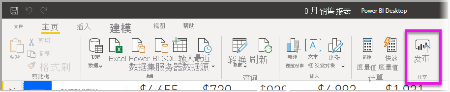
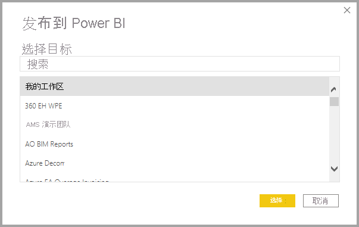

# 从 Power BI Desktop 发布数据集和报表
将 Power BI Desktop 文件发布到 Power BI 服务后，将模型中的数据发布到 Power BI 工作区。 这同样适用于在“报表”视图中创建的所有报表。 你将看到一个同名的新数据集以及工作区导航器中的若干报表。

从 Power BI Desktop 发布文件等效于在 Power BI 中使用**获取数据**连接到并上载 Power BI Desktop 文件。

> [!NOTE]
> 在 Power BI 中对报表所做的任何更改都不会保存回原始 Power BI Desktop 文件。 这包括在报表中添加、删除或更改可视化效果。

## 发布 Power BI Desktop 数据集和报表
1. 在 Power BI Desktop 中，选择“文件”\>“发布”\>“发布到 Power BI”或选择功能区上的“发布”   。  

   

2. 登录到 Power BI。
3. 选择目标位置。

   

发布完成后，你会收到报表链接。 选择链接可在 Power BI 站点中打开报表。

## 重新发布或替换从 Power BI Desktop 中发布的数据集
发布 Power BI Desktop 文件后，数据集和你在 Power BI Desktop 中创建的所有报表都会上传到 Power BI 站点。 重新发布 Power BI Desktop 文件后，Power BI 站点中的数据集会替换为 Power BI Desktop 文件中已更新的数据集。

此流程非常简单，但需要注意以下几点：

* Power BI 中有两个或多个与 Power BI Desktop 文件同名的数据集时可能导致发布操作失败。 请确保你在 Power BI 中只具有一个同名的数据集。 也可以重命名文件然后进行发布，这将创建一个与文件同名的新数据集。
* 如果重命名或删除列或度量值，则 Power BI 中任何含有该字段的可视化都可能会被破坏。 
* Power BI 将忽略对现有列某些格式的更改。 例如，如果将列的格式从 0.25% 更改为 25%。
* 假设你有一个为 Power BI 中的现有数据集配置的刷新计划。 当你将新数据源添加到文件中，然后重新发布时，必须在下一次计划的刷新前登录这些数据源。
* 重新发布从 Power BI Desktop 发布的数据集并定义刷新计划时，重新发布后即会开始数据集刷新。
* 对数据集进行更改然后重新发布时，会显示一条消息，说明可能受更改影响的工作区、报表和仪表板数量，并会要求你确认是否将当前已发布的数据集替换为你修改过的数据集。 该消息还提供了指向 Power BI 服务中完整数据集影响分析的链接，你可以在其中了解更多信息并采取措施来降低更改的风险。

   

   [详细了解数据集影响分析](../collaborate-share/service-dataset-impact-analysis.md)。

> [!NOTE]
> Power BI 报表中的某些数据连接可能包含指向数据的链接，而不是包含导入到 Power BI 服务的数据集中的数据。 例如，在发生更新或交互时，DirectQuery 连接将链接到数据，而不是导入数据本身。 如果报表中链接的数据源位于本地，则你可能需要网关才能从 Power BI 访问它们。 有关详细信息，请参阅[什么是本地数据网关？](../connect-data/service-gateway-onprem.md)。
> 