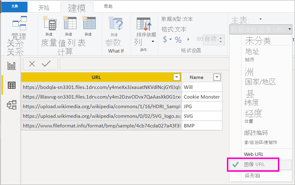

# 在报表中的表、矩阵或切片器中显示图像

改进报表的一个好方法是向报表添加图像。 页面上的静态图像适用于某些用途。 但有时你想要与报表中数据相关的图像。 本主题将介绍如何在标、矩阵、切片器或多行卡片中显示图像。 

## 将图像添加到报表

1. 创建包含图像 URL 的列。 有关要求的信息，请参阅本文后面的[注意事项](#considerations)。

1. 选择此列。 在“建模”功能区上，为“数据类别”选择“图像 URL”。   

    

1. 将此列添加到表、矩阵、切片器或多行卡片。

    

## 注意事项

- 图像必须是以下文件格式之一：.bmp、.jpg、.jpeg、.gif、.png 或 .svg
- URL 必须可以匿名访问，未位于需要登录的站点上，如 SharePoint。 但是，如果图像托管在 SharePoint 或 OneDrive 上，你能够获取直接指向它们的嵌入代码。 

## 后续步骤

[页面布局和格式设置](/learn/modules/visuals-in-power-bi/12-formatting)

[Power BI 服务中设计器的基本概念](../fundamentals/service-basic-concepts.md)

更多问题？ [尝试参与 Power BI 社区](https://community.powerbi.com/)
