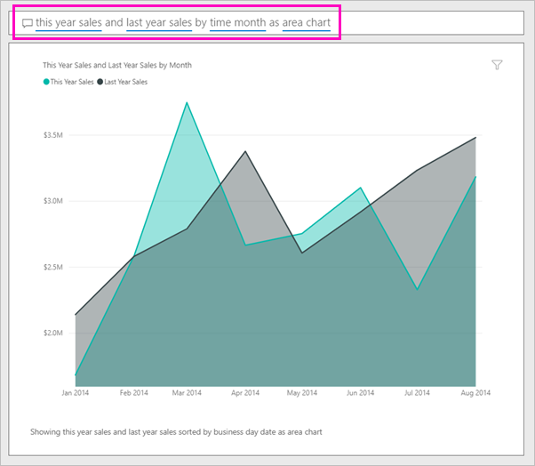

# 通过 Power BI 问答创建视觉对象

有时从你的数据中获得答案的最快方法是使用自然语言提问。  本文将介绍如何通过 2 种不同的方法来创建同一可视化效果：第一种方法是使用问答提问，第二种方法是在报表中生成可视化效果。 虽然本文将使用 Power BI 服务在报表中构建视觉对象，但具体过程几乎与使用 Power BI Desktop 完全相同。

必须使用可以编辑的报表，才能跟着介绍一起操作。因此，本文将使用可用于 Power BI 的示例之一。

## 通过问答创建视觉对象

我们将如何使用问答着手创建此折线图？

1. 在 Power BI 工作区中，选择“获取数据” **“示例”** “零售分析示例”\>“连接”  \>   >   。

1. 打开“零售分析示例”仪表板，然后将光标置于“提出有关你数据的问题”问答框中  。

    

2. 在问答框中，键入类似如下的问题：
   
    本年度销售额和上年度销售额（按月显示为面积图） 
   
    当你键入问题时，Q&A 选择最佳的可视化效果显示你的回答；并且可视化效果会随着问题的修改而动态更改。 此外，问答还会通过建议、自动完成和拼写更正等功能来帮助你设置问题的格式。 “问答”建议略微更正措辞：“本年度销售额和上年度销售额（按月份显示为面积图）”  。  

    

4. 选择要接受建议的句子。 
   
   键入你的问题之后，所得到的图表正是我们在仪表板中看到的同一图表。
   
   

4. 要将图表固定到仪表板中，请选择固定图标  。

## 在报表编辑器中创建视觉对象

1. 重新导航到“零售分析示例”仪表板。
   
2. 仪表板包含“上年度销售额和本年度销售额”的同一面积图磁贴。  选择此磁贴。 请勿选择使用“问答”创建的磁贴。 选择它会打开“问答”。 初始面积图磁贴是在报表中创建的，因此将在包含此可视化效果的页中打开报表。

    

1. 在编辑视图中打开报表，方法是选择 **编辑报表**。  如果你不是报表的所有者，则无法在编辑视图中打开报表。
   
    
4. 选择此面积图，然后在 **字段** 窗格中检查设置。  报表创建者通过选择这 3 个值（“销售额”表中的“上年度销售额”和“本年度销售额 > 数目”，以及“时间”表中的“财月”），并且在“坐标轴”和“值”框中组织它们来生成此图表        。
   
    

    你会看到它们最终生成相同的视觉对象。 以这种方式创建并不复杂。 但使用“问答”创建会更简单！

## 后续步骤

- [在仪表板和报表中使用问答](power-bi-tutorial-q-and-a.md)  
- [面向使用者的问答](../consumer/end-user-q-and-a.md)
- [让你的数据在 Power BI 中很好地与“问答”协作](service-prepare-data-for-q-and-a.md)

更多问题？ [尝试参与 Power BI 社区](https://community.powerbi.com/)
