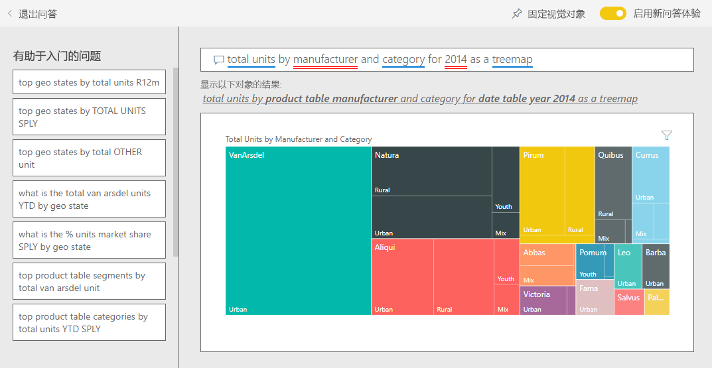

# Power BI 销售与市场营销示例：参观

销售与市场营销示例包含一家名为 VanArsdel Ltd 的虚构制造公司的仪表板和报表。VanArsdel 首席市场官 (CMO) 创建了此仪表板，主要关注业界及公司的市场份额、产品量、销售额和人气。

VanArsdel 有许多竞争对手，但仍是业内的市场领导者。 CMO 想要增加市场份额，探索发展的商机。 然而由于未知原因，VanArsdel 的市场份额在 6 月已开始大幅滑落。

此示例是一系列示例的一部分，展示了如何将 Power BI 与面向业务的数据、报表和仪表板结合使用。 它是使用 [obviEnce](http://www.obvience.com/) 依据真实数据（已经过匿名处理）进行创建的。 数据可采用以下几种格式：内容包、.pbix Power BI Desktop 文件或 Excel 工作簿。 请参阅[用于 Power BI 的示例](sample-datasets.md)。 

本教程探讨了 Power BI 服务中的“销售和市场营销示例”内容包。 由于报表体验在 Power BI Desktop 和服务中非常相似，因此也可以使用 Power BI Desktop 中的示例 .pbix 文件跟着本教程一起操作。 

不需要 Power BI 许可证即可在 Power BI Desktop 中查看示例。 如果没有 Power BI Pro 许可证，可以将该示例保存到 Power BI 服务中的“我的工作区”。 

## 获取示例

必须先将示例下载为[内容包](#get-the-content-pack-for-this-sample)、[.pbix 文件](#get-the-pbix-file-for-this-sample)或 [Excel 工作簿](#get-the-excel-workbook-for-this-sample)，然后才能使用它。

### 获取内容包形式的此示例

1. 打开并登录 Power BI 服务 (app.powerbi.com)，然后打开要在其中保存此示例的工作区。

   如果没有 Power BI Pro 许可证，可以将该示例保存到“我的工作区”。

2. 选择左下角的“获取数据”  。
   
   
3. 在随即显示的“获取数据”  页上，选择“示例”  。
   
4. 依次选择“销售和市场营销示例”和“连接”   。   
  
   
   
5. 此时，Power BI 导入内容包，然后向当前工作区添加新的仪表板、报表和数据集。
   
   
  
### 获取 .pbix 文件形式的此示例

也可以将销售和市场营销示例下载为 [.pbix 文件](https://download.microsoft.com/download/9/7/6/9767913A-29DB-40CF-8944-9AC2BC940C53/Sales%20and%20Marketing%20Sample%20PBIX.pbix)，这是专为 Power BI Desktop 量身定制的文件格式。

### 获取 Excel 工作簿形式的此示例

若要查看此示例的数据源，还可以将它下载为 [Excel 工作簿](https://go.microsoft.com/fwlink/?LinkId=529785)。 该工作簿包含你可以查看和修改的 Power View 工作表。 若要查看原始数据，请启用“数据分析”加载项，再依次选择“Power Pivot”>“管理”  。 若要启用 Power View 和 Power Pivot 加载项，请参阅[在 Excel 中浏览 Excel 示例](sample-datasets.md#explore-excel-samples-inside-excel)，以了解详细信息。

## 仪表板告诉我们什么？
让我们开始浏览仪表板，并查看 CMO 选择固定的磁贴。 我们可以看到我们的市场份额、销售和人气的相关信息。 数据按地区、时间和竞争对手细分。

* 左侧列中的数字磁贴显示去年行业销售量 (50,000)、市场份额 (32.86%)、销售量 (16,000)、人气指数 (68)、人气落差 (4) 以及销售单位总量（100 万）。
* 顶部的折线图（单位市场份额百分比与 12 个月的单位市场份额百分比）显示我们的市场份额如何随时间波动  。 请注意六月的大幅下降。 我们之前已上升一段时间的循环 12 个月 (R12M) 份额现已开始停滞。
* 我们最大的竞争对手是 Aliqui，如中间柱形图磁贴中所示（年初至今的总单位数差异百分比）  。
* 我们大多数的业务都在东部和中部地区。
* 底部折线图（2014 年总单位数）显示我们在 6 月份的下滑不是季节性情况；因为没有任何竞争对手显示相同的趋势  。
* 右侧的“整体单位数”和“年初至今的单位数”磁贴按细分市场和按地区/制造商显示销售量   。 我们行业最大的细分市场是生产力和便利性   。

## 使用问答更深入地钻研

使用问答功能，可以发现数据中的其他详细信息。

### 哪些细分市场可带动销售？ 它们符合行业趋势吗？
1. 选择“按细分市场划分的整体单位数”磁贴以打开问答并使用查询“总单位数（按细分市场）”来填充它   。
2. 在现有查询的末尾添加：for VanArsdel  。 问答可解释该问题，并显示一个包含答案的已更新图表。 请注意，我们的产品量主要来自便利性和适度性细分市场   。

   
3. 我们在适度性和便利性两个类别的份额非常高；这些是我们具有竞争力的细分市场   。
4. 在顶部导航窗格中选择“销售和市场营销示例”返回到仪表板  。

### 按类别（与地区）划分的销售单位总量市场份额如何？
1. 请注意“年初至今按制造商和地区划分的单位总量”磁贴  。 按类别划分的销售单位总量市场份额是多少？

   
2. 选择仪表板顶部的问题框，键入问题“按制造商和类别划分的 2014 年单位总量树状图”  。 请注意当你键入问题时，可视化效果更新的方式。

   
3. 若要比较其中的发现，可将图表固定到仪表板。 请注意这样一个有趣的事实：2014 年，VanArsdel 仅出售“都市”类别的产品  。
4. 返回到仪表板。

## 销售和市场营销示例报表

仪表板是报表的入口点。 如果磁贴是根据基础报表创建的，选择该磁贴即可打开报表。

在我们的仪表板上，“单位市场份额百分比与 12 个月的单位市场份额百分比”中的“R12M 单位市场份额百分比”线条显示我们的市场份额不再随着时间推移而增加   。 甚至稍有减少。 那么，为什么市场份额在 6 月会大幅下滑？ 

销售和市场营销示例的报表有四页。
 
### “VanArsdel - 市场份额”页
报表的第一页关注的是 VanArsdel 的市场份额。

1. 在仪表板上，选择“单位市场份额百分比与 12 个月的单位市场份额百分比”图表以打开销售和市场营销示例报表的“VanArsdel - 市场份额”页   。

   

2. 请看报表底部的“按月份划分的 VanArsdel 单位总量”柱形图  。 黑色的列代表 VanArsdel（我们的产品），绿色的列代表我们的竞争对手。 2014 年 6 月 VanArsdel 的下滑情况并未发生在竞争对手身上。

3. 我们将右侧的“按细分市场划分的类别总量”  条形图筛选为显示 VanArsdel 的前两大细分市场。 看一下该筛选器的创建方式：  

   a. 选择“按细分市场划分的类别总量”图表  。

   b. 选择右侧的“筛选器”窗格以将其展开  。  

   c. 在“视觉级筛选器”下方，已将“细分市场”筛选为只包含“便利性”和“适度性”细分市场     。  

   d. 通过以下方式修改筛选器：选择“细分市场”以将其展开，然后选中“生产力”以添加该细分市场   。  

4. 在“按月份划分的 VanArsdel 单位总量”图表中，选择图例中的“是”，以按 VanArsdel 交叉筛选页面   。 在“按细分市场划分的类别总量”  图表中，我们不在“生产力”  细分市场中竞争。

5. 再次选择“是”，以删除筛选器  。

6. 查看“单位市场份额百分比与按月划分的 R12M 单位市场份额百分比”折线图  。 它显示我们的每月市场份额和循环 12 个月的市场份额。 循环月的数据可缓和每个月的波动并显示长期趋势。 在“按细分市场划分的类别总量”条形图中，选择“便利性”，然后选择“适度性”，以查看每个细分市场的市场份额波动情况    。 请注意，“适度性”细分市场显示的市场份额波动更大  。

我们仍在查明市场份额在 6 月下滑的原因。 接下来，让我们来查看报表的“情绪分析”  页。

### “人气分析”页
报表的第三页关注使用者的情绪。

推文、Facebook、博客和文章都会影响使用者情绪，这从页面左侧的两个折线图中可以反映出来。 左上方的“VanArsdel - 人气（按月份）”图表显示我们的产品人气在 2 月以前还算高  。 从 2 月开始到 6 月，就开始大幅下滑至低点。 是什么原因导致这种人气下滑的情况？ 

让我们来查看外部来源。 2 月，有几篇文章和博客将 VanArsdel 的客户服务评为业内最差。 这种负面媒体报导对客户人气和销售产生直接关联。 VanArsdel 努力改善客户服务，客户与业界皆有目共睹。 7 月份，正面的人气开始攀升，然后达到 60 年代以来的高峰。 报表第一页和第二页上的“按月份划分的单位总量”图表中反映出情绪的微升  。 或许这可以说明我们的市场份额在 6 月下滑的部分原因？

情绪落差可作为另一个要探索的区域。 哪些地区的情绪落差最高，管理层如何利用它，以及如何将其复制到其他地区？

### “年初至今类别趋势分析”页
报表的第二页关注年初至今的类别趋势。

请注意下列详细信息：
* VanArsdel 是在此类别中最大的公司，而主要竞争对手为 Natura、Aliqui 和 Pirium。 我们非常关注竞争对手的动态。
* Aliqui 业绩开始增加，但相较于我们的产品量仍然很低。
* 树状图的绿色表示 VanArsdel。 在东部区域，客户更偏向我们的竞争对手，但在中心区域，我们做得很好。 我们在东部区域的市场份额最低。
* 地理位置对销售单位数量也有影响。 东部区域是大多数制造商的地盘，但 VanArsdel 在中部地区的势力也不小。
* 右下方的“年初至今总单位数差额百分比（按月份和制造商）”图表中显示差额为正，这是一个好的迹象  。 我们今年的业绩比去年好，但我们的竞争对手 Aliqui 也是如此。

### “增长机会”页
报表第四页着重于竞争产品分析。

请注意下列详细信息：
* 左下方的“总单位数(按细分市场)”  图表显示 VanArsdel 表现最好的两个细分市场以外的所有类别细分市场。 依次选择每个细分市场以识别仍可拓展 VanArsdel 业绩的潜力区域。 
* 请注意“极限”和“生产力”细分市场的增长速度比其他细分市场更快   。 然而，我们不参与这些细分市场的竞争；如果我们想要切入这些细分市场，可以使用我们的数据来查看哪些地区有哪些细分市场比较热门。 我们可以进一步调查问题，例如哪些地区发展速度较快，以及在该细分市场中谁会是我们的最大竞争对手。
* 还记得我们在 6 月份的市场份额下滑吗？ 6 月是“生产力”  细分市场的旺季，这是我们完全未参与竞争的细分市场。 此详细信息有助于说明我们在 6 月份市场份额下滑的原因。

通过按 VanArsdel、细分市场、月份和地区筛选可视化效果，我们可以发现 VanArsdel 的发展商机。

## 后续步骤：连接到数据
可以在此环境中安全操作，因为能够选择不保存更改。 不过，如果确实保存了更改，可随时选择“获取数据”  来获取此示例的新副本。

本教程讨论了 Power BI 仪表板、问答和报表如何能够帮助深入了解人力资源数据。 现在轮到你了；立即连接到你自己的数据。 借助 Power BI，可以连接到各种数据源。 若要了解详细信息，请参阅 [Power BI 服务入门](../fundamentals/service-get-started.md)。
