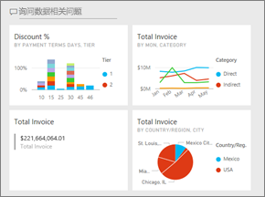
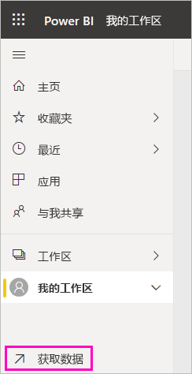
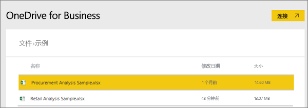
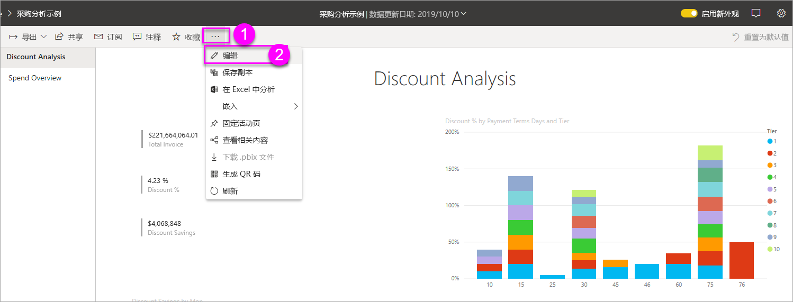
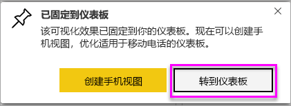
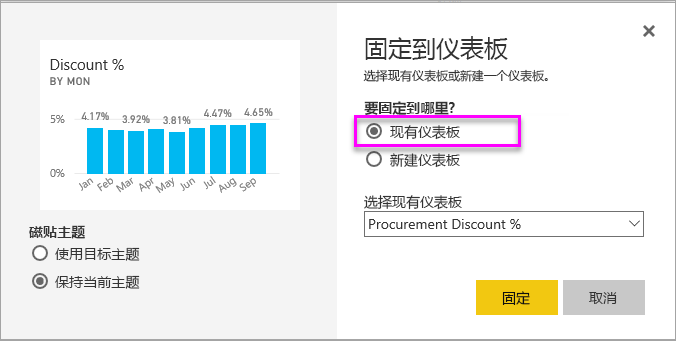
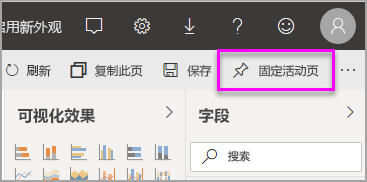
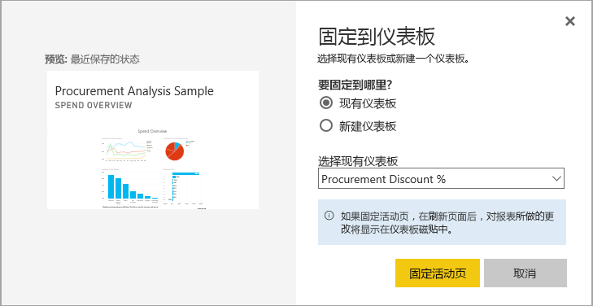
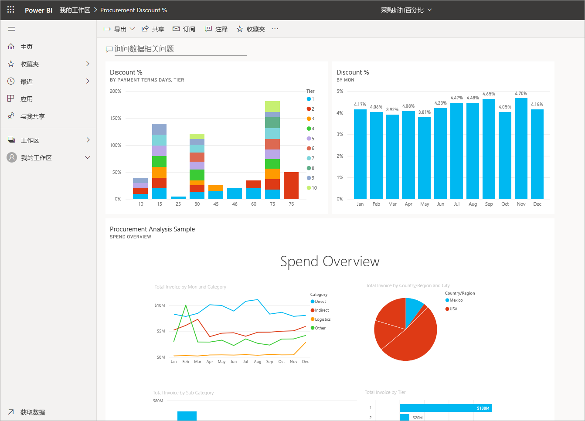

# 从报表创建 Power BI 仪表板
你已经阅读了 [Power BI 中的仪表板简介](service-dashboards.md)，并且现在想要创建你自己的仪表板。 创建仪表板有多种不同的方法。 例如，可以从报表、从头开始、从数据集或通过复制现有仪表板来创建仪表板。  

我们先创建一个快速简单的仪表板，从已构建的报表固定可视化效果。 

完成本文之后，你会很好地了解以下内容：
- 仪表板与报表之间的关系
- 如何在报表编辑器中打开编辑视图
- 如何固定磁贴 
- 如何在仪表板与报表之间导航 
 

> [!NOTE] 
> 仪表板是 Power BI 服务的一项功能，而不是 Power BI Desktop 的功能。 虽然不会在 Power BI 移动应用上创建仪表板，但可以[查看和共享](../consumer/mobile/mobile-apps-view-dashboard.md)仪表板。
>
> 

## 视频：通过从报表中固定视觉效果和图像创建新仪表板
观看 Amanda 通过从报表中固定可视化效果来创建新仪表板。 然后，使用采购分析示例，按照下一部分[使用报表导入数据集](#import-a-dataset-with-a-report)中的步骤亲自尝试。
    

<iframe width="560" height="315" src="https://www.youtube.com/embed/lJKgWnvl6bQ" frameborder="0" allowfullscreen></iframe>

## 使用报表导入数据集
在此分步流程中，我们导入一个 Power BI 示例数据集，并使用它来创建我们的新仪表板。 我们使用的示例是包含两个 PowerView 工作表的 Excel 工作簿。 当 Power BI 导入工作簿时，它会向你的工作区添加一个数据集和一个报表。 该报表是从 PowerView 工作表自动创建的。

1. 下载[采购分析示例](https://go.microsoft.com/fwlink/?LinkId=529784) Excel 文件。 我们建议你将其保存在你的 OneDrive for Business 中。
2. 在浏览器中打开 Power BI 服务 (app.powerbi.com)。
3. 从导航窗格中，选择“我的工作区”，然后选择“获取数据”   。

    
5. 在“文件”  下，选择“获取”  。

   
6. 导航到你保存采购分析示例 Excel 文件的位置。 选择它，然后选择“连接”  。

   
7. 对于此练习，请选择“导入”  。

    
8. 出现成功消息时，选择“x”  取消它。

   

> [!TIP]
> 知道吗？ 可以通过选择顶部带有三条线的图标来缩小导航窗格。 这为报表本身提供更多空间。

### 打开报表并将磁贴固定到仪表板
1. 在同一工作区中，选择“报表”  选项卡，然后选择“采购分析示例”  以打开报表。

     报表会在“阅读”视图中打开。 请注意，它在左侧有两个选项卡：“折扣分析”  和“支出概况”  。 每个选项卡表示报表的一页。

2. 选择“更多选项(...)”   > “编辑报表”  ，在编辑视图中打开报表。

    
3. 将鼠标悬停在可视化效果上方以显示可用的选项。 若要将可视化效果添加到仪表板，请选择固定图标 。

    
4. 由于我们正在创建新仪表板，请选择“新建仪表板”  选项，并为其指定名称。

    
5. 当你选择“固定”  时，Power BI 将在当前工作区中创建新仪表板。 在“已固定到仪表板”  消息出现之后，选择“转到仪表板”  。 如果系统提示你保存报表，请选择“保存”  。

    

    Power BI 会打开新仪表板。 它包含一个磁贴：刚固定的可视化效果。

   
7. 选择该磁贴以返回到报表。 将更多磁贴固定到新仪表板。 显示“固定到仪表板”  窗口时，请选择“现有仪表板”  。  

   

## 将整个报表页固定到仪表板
可[将整个报表页固定为*动态磁贴*](service-dashboard-pin-live-tile-from-report.md)（而不是一次固定一个视觉对象）。 我们开始操作吧。

1. 在报表编辑器中，选择“支出概况”  选项卡以打开报表的第二页。

   

2. 我们希望报表中的所有视觉对象都位于仪表板上。 在菜单栏右上角，选择“固定活动页面”  。 在仪表板上，活动页面磁贴将在每次刷新页面时更新。

   

3. 显示“固定到仪表板”  窗口时，请选择“现有仪表板”  。

   

4. “成功”消息出现之后，选择“转到仪表板”  。 可以在此处看到从报表固定的磁贴。 在以下示例中，我们已从报表的第一页固定了两个磁贴，并从报表的第二页固定了一个动态磁贴。

   

## 后续步骤
恭喜你创建了第一个仪表板！ 现在你拥有了一个仪表板，通过它你可以执行更多操作。 遵循以下建议的文章之一，或开始自行浏览: 

* [调整大小和移动磁贴](service-dashboard-edit-tile.md)
* [关于仪表板磁贴的所有内容](service-dashboard-tiles.md)
* [通过创建应用共享仪表板](../collaborate-share/service-create-workspaces.md)
* [Power BI - 基本概念](../fundamentals/service-basic-concepts.md)
* [设计出色仪表板的提示](service-dashboards-design-tips.md)

更多问题？ [尝试参与 Power BI 社区](https://community.powerbi.com/)。
