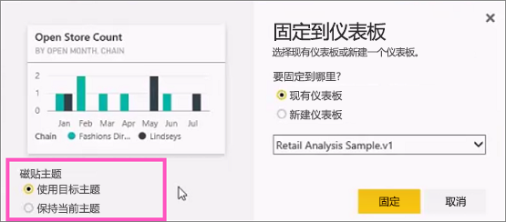
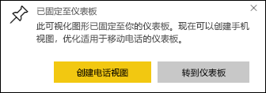

# 从报表将磁贴固定到 Power BI 仪表板

一种添加[仪表板磁贴](../consumer/end-user-tiles.md)的方法是在 [Power BI 报表](../consumer/end-user-reports.md)内进行。 选择其中一个磁贴时，它会在报表中打开。

可以将整个报表页固定到仪表板（称为固定动态磁贴）。 这称为动态磁贴，因为可以与仪表板上的磁贴进行交互。 与单独的可视化效果磁贴不同，在报表中进行的更改会自动与仪表板同步。 有关详细信息，请参阅[固定整个报表页](#pin-an-entire-report-page)。

不能固定与你共享的报表中的磁贴，也不能固定 Power BI Desktop 中的磁贴。 

> [!TIP]
> 由于某些可视化效果使用背景图像，因此如果背景图像太大，则固定可能不起作用。 请尝试减小图像大小或压缩图像。  
> 
> 

## 从报表固定磁贴
Watch Amanda 通过从 Power BI 报表固定视觉对象和图像创建仪表板。
    

<iframe width="560" height="315" src="https://www.youtube.com/embed/lJKgWnvl6bQ" frameborder="0" allowfullscreen></iframe>

现在使用其中一个 Power BI 示例报表创建你自己的仪表板。

1. 在报表中，将鼠标悬停在你想要固定的可视化效果上方，然后选择固定图标。 。 Power BI 将会打开 **固定到仪表板** 屏幕。
   
     
2. 选择是将磁贴固定到现有仪表板还是固定到新仪表板。
   
   * 现有仪表板：从下拉列表中选择仪表板的名称。 已与你共享的仪表板不会出现在下拉列表中。
   * 新仪表板：输入新仪表板的名称。
3. 在某些情况下，你正在固定的项可能已经应用了主题。 例如，从 Excel 工作簿固定的视觉对象。 如果是这样，选择要应用到该磁贴的主题。
4. 选择“固定”。
   
   会显示一条成功消息（右上角附近），告知你可视化效果已作为磁贴添加到你的仪表板中。
   
   
5. 从导航窗格中选择具有新磁贴的仪表板。 [编辑磁贴显示和行为](service-dashboard-edit-tile.md)，或选择磁贴以返回到报表。

## 固定整个报表页
另一种方法是将整个报表页固定到仪表板，这是一次固定多个可视化效果的一种简单方法。 固定整个页时，磁贴是动态磁贴。 即，你可以在仪表板上与它们进行交互。 在报表编辑器中对任何可视化效果所做的更改（如添加筛选器或更改图表中使用的字段）也都会反映在仪表板磁贴中。  

有关详细信息，请参阅[固定整个报表页](service-dashboard-pin-live-tile-from-report.md)。

## 限制
将某些报表格式设置选项或主题固定到仪表板时，它们不会应用于视觉对象。
- 在固定磁贴中将忽略边框、阴影和背景设置。
- 对于卡片视觉对象，用于值的文本使用 DIN 字体系列和黑色文本显示在仪表板中。 你可[创建自定义仪表板主题](service-dashboard-themes.md)，更改仪表板上所有磁贴的文本颜色。
- 无法应用条件格式设置。
- 视觉对象将调整其大小以适合磁贴大小。 此操作可能会导致布局不同，就好像视觉对象已在报表上调整大小一样。

## 后续步骤
- [面向 Power BI 服务使用者的仪表板](../consumer/end-user-dashboards.md)
- [Power BI 中的仪表板磁贴](../consumer/end-user-tiles.md)
- [Power BI 中的报表](../consumer/end-user-reports.md)
- [Power BI 中的数据刷新](../connect-data/refresh-data.md)
- [Power BI 服务中设计器的基本概念](../fundamentals/service-basic-concepts.md)

更多问题？ [尝试参与 Power BI 社区](https://community.powerbi.com/)
