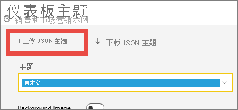
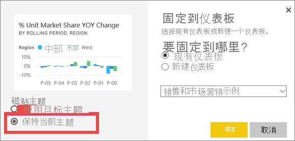
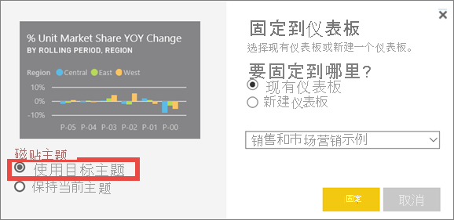

# <a name="use-dashboard-themes-in-the-power-bi-service"></a>在 Power BI 服务中使用仪表板主题
借助“仪表板主题”，可以将颜色主题应用于整个仪表板，如企业品牌颜色、流行色或可能要应用的其他任何颜色主题。 在你应用仪表板主题后，仪表板上的所有视觉对象都会使用选定主题中的颜色。 但有一些例外情况，如本文的[注意事项和限制](#considerations-and-limitations)部分中所述。


更改仪表板上报表视觉对象的颜色，不会影响关联报表中的视觉对象。 此外，固定来自[已应用报表主题](desktop-report-themes.md)的报表的磁贴时，可以选择保留当前主题或使用仪表板主题。


## <a name="prerequisites"></a>先决条件
* 要继续学习，请打开[销售和市场营销示例仪表板](sample-datasets.md)。


## <a name="how-dashboard-themes-work"></a>仪表板主题的工作原理
若要开始使用，请打开你创建的仪表板或打开可编辑的仪表板。 选择“编辑” > “仪表板主题” 。 


在显示的仪表板窗格中，选择某个预构建的主题。  在下面的示例中，我们选择了“深色”。


## <a name="create-a-custom-theme"></a>创建自定义主题

Power BI 仪表板的默认主题是“浅色”。 如果想要自定义颜色或创建自己的主题，请在下拉列表中选择“自定义”。 


使用自定义选项创建自己的仪表板主题。 如果要添加背景图像，建议图像分辨率至少为 1920x1080。 若要使用某个图像作为背景，请将该图像上传到公共网站、复制 URL，并将其粘贴到“图像 URL”字段。 

## <a name="use-a-json-theme"></a>使用 JSON 主题
创建自定义主题的另一种方法是上传这样的 JSON 文件：它包含要用于仪表板的所有颜色的设置。 在 Power BI Desktop 中，报表创建者使用 JSON 文件[为报表创建主题](desktop-report-themes.md)。 可为仪表板上传这些 JSON 文件，也可在 Power BI 社区的[主题库页](https://community.powerbi.com/t5/Themes-Gallery/bd-p/ThemesGallery)中查找并上传 JSON 文件。 


还可将自定义主题另存为 JSON 文件，然后将其与其他仪表板创建者共享。 

### <a name="use-a-theme-from-the-theme-gallery"></a>使用主题库中的主题

就像内置和自定义选项一样，上传主题后，将自动对仪表板上的所有磁贴应用颜色。 

1. 将鼠标悬停在某个主题上，然后选择“查看报表”。

    

2. 向下滚动并查找 JSON 文件的链接。  选择下载图标并保存文件。

    

3. 返回 Power BI 服务，在自定义仪表板主题窗口中，选择“上传 JSON 主题”。

    

4. 导航到保存 JSON 主题文件的位置并选择“打开”。

5. 在仪表板主题页上，选择“保存”。 将向仪表板应用新主题。

    

## <a name="reports-and-dashboards-with-different-themes"></a>具有不同主题的报表和仪表板

如果报表使用的主题和仪表板主题不同，大多数情况下，你可以控制视觉对象是保留当前报表主题还是使用仪表板主题。 但仪表板中的卡片视觉对象会使用 DIN 字体系列和黑色文本。 可通过创建自定义仪表板主题来更改仪表板上所有磁贴的文本颜色，包括卡片。

- 将磁贴固定到仪表板时，若要保留报表主题，请选择“保留当前主题”。 仪表板上的视觉对象将保留报表主题（包括透明度设置）。

    仅当你在 Power BI Desktop 中创建了报表、[添加了报表主题](desktop-report-themes.md)，并将报表发布到 Power BI 服务时，才会看到“磁贴主题”选项。

    

- 请尝试重新固定磁贴并选择“使用仪表板主题”。

    

## <a name="dashboard-theme-json-file-format"></a>仪表板主题 JSON 文件格式

在最基本的层面上，主题 JSON 文件只有一个必需行：“名称”。

```json
{
    "name": "Custom Theme"
}
```

除“name”以外，所有其他字段都是可选的。 这意味着你只需添加专门想要设置主题文件格式的属性，其他属性继续使用 Power BI 的默认值。

仪表板的 JSON 文件主题包括：

- name：主题名称（唯一的必填字段）。
- 前景色和背景色：仪表板的颜色。
- dataColors：用于图表中的数据的十六进制列表。 可根据需要包含尽可能少的颜色或任意数量的颜色。
- tiles：仪表板的背景和颜色配置。
- visualStyles：视觉对象的精细格式设置。

下面是默认浅色主题的 JSON 主题示例：

```json
{

"name":"Light",

"foreground":"#000000",

"background":"#EAEAEA",

"dataColors":["#01B8AA","#374649","#FD625E","#F2C80F","#5F6B6D","#8AD4EB","#FE9666","#A66999"],

"tiles":{"background":"#FFFFFF","color":"#000000"},

"visualStyles":{"*":{"*":{"*":[{"color":{"solid":{"color":"#000000"}}}]}}}

}
```

## <a name="considerations-and-limitations"></a>注意事项和限制

* 不能对已固定的实时报表页、iframe 磁贴、SSRS 磁贴、或图像应用仪表板主题。
* 可以在移动设备上查看仪表板主题，但只能在 Power BI 服务中创建仪表板主题。
* 仪表板自定义主题仅适用于从报表中固定的磁贴。

## <a name="next-steps"></a>后续步骤

- [将主题应用到报表](desktop-report-themes.md)
