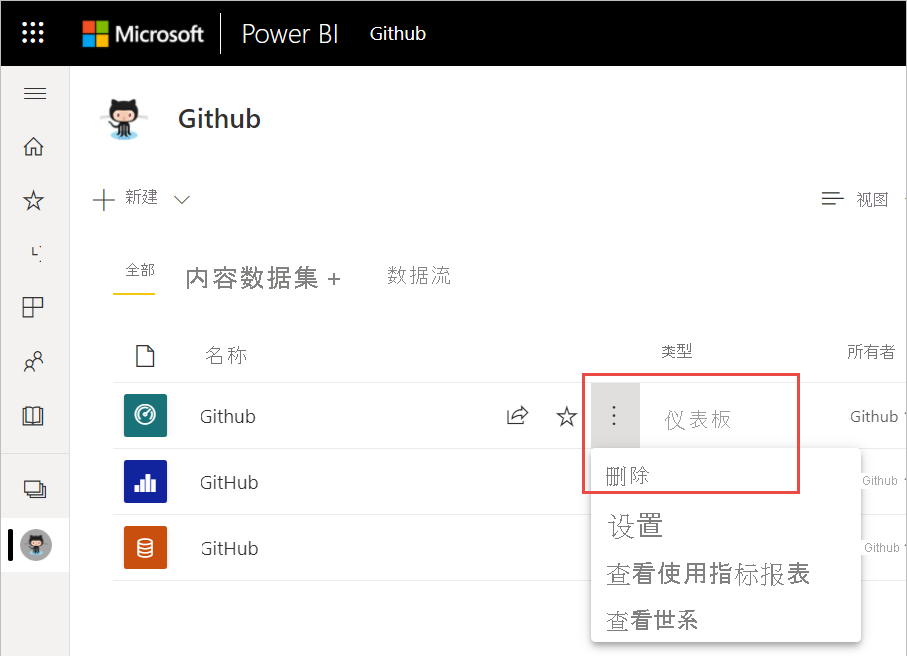
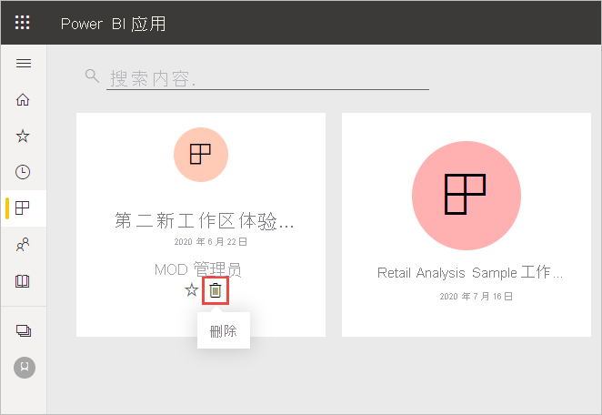
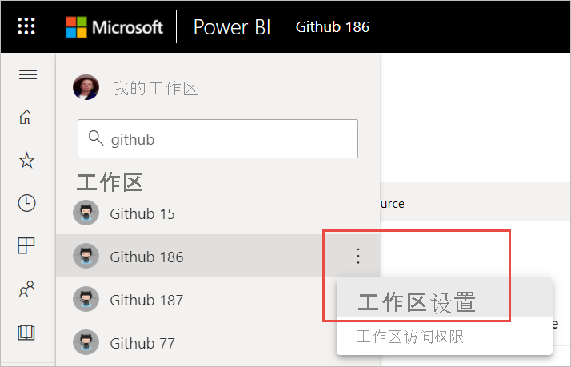
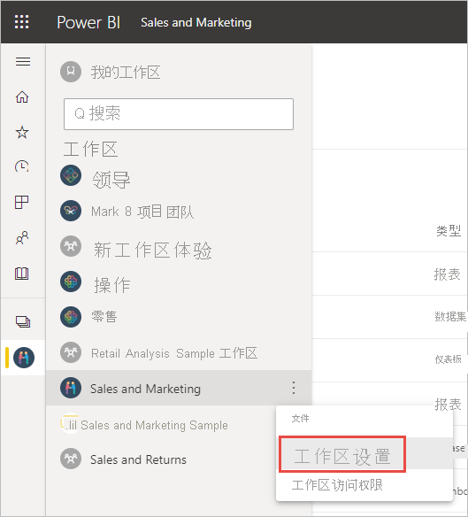
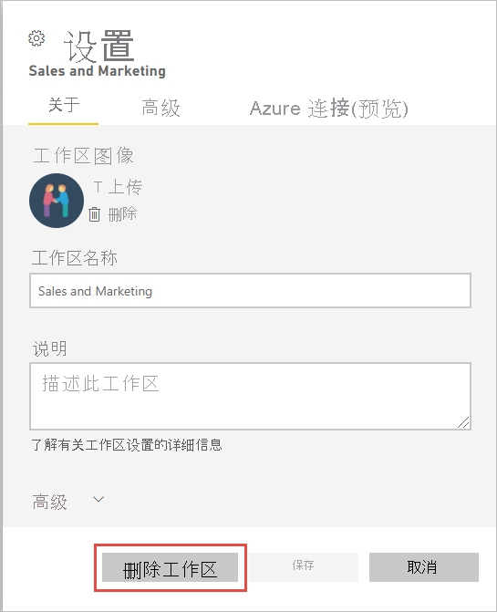

# 从 Power BI 服务中删除几乎所有内容
本文介绍如何从 Power BI 服务中删除仪表板、报表、工作簿、数据集、应用、可视化效果或工作区。 你可以从 Power BI 服务中删除几乎所有内容，但有一些例外情况。 

## 删除仪表板、报表、数据集或工作簿

1. 在工作区中，选择“全部”选项卡。
1. 选择要删除的资产旁边的“更多选项(…)”，然后选择“删除” 。

    

1. 选择“删除”，确认删除操作。

## 从你的应用列表页删除应用

你可以轻松从应用列表页删除应用。 删除应用不会使其他成员的应用被删除。 只有管理员或成员或工作区可从该工作区中永久删除该应用。

1. 在导航窗格中选择“应用”，以打开应用列表页。
2. 将鼠标悬停在要删除的应用上，然后选择“删除”:::image type="icon" source="media/service-delete/power-bi-delete-report2.png" border="false"::: 图标。

   

   如果意外删除应用，你有多种选项可以进行恢复。  你可以要求应用创建者重新发送，可以找到带应用链接的原始电子邮件，可以检查[通知中心](../consumer/end-user-notification-center.md)以查看是否仍列有该应用的通知，还可以查看[组织的 AppSource](../consumer/end-user-apps.md)。

## 移除或删除工作区

Power BI 具有两种不同类型的工作区：原始工作区或经典工作区，以及新工作区。 移除或删除它们的过程各不相同。 请阅读有关[新工作区和经典工作区](../collaborate-share/service-new-workspaces.md)的详细信息。

### 从新工作区中删除成员

只有工作区管理员才能从新工作区中删除成员。 如果你是管理员，则可以删除你自己或其他任何人。 但如果你是工作区的唯一管理员，则 Power BI 不允许你删除自己。

1. 在工作区列表视图中，选择右上角的“访问权限”。

    :::image type="content" source="media/service-delete/power-bi-select-access.png" alt-text="选择“访问权限”的屏幕截图。":::

1. 在“访问权限”窗格中，选择要删除的人员姓名旁边的“更多选项(…)”，然后选择“删除”  。

    :::image type="content" source="media/service-delete/power-bi-access-remove.png" alt-text="在“访问权限”窗格中选择“删除”的屏幕截图。":::

### 删除新工作区

创建新工作区时，不会创建关联的 Microsoft 365 组。 如果你是工作区管理员，则可以删除新工作区，而不会影响任何 Microsoft 365 组。 请阅读有关[新工作区和经典工作区](../collaborate-share/service-new-workspaces.md)的详细信息。

作为工作区的管理员，你可以删除该工作区或从中删除其他工作区。 删除工作区时，同时还会删除所有组成员的关联应用，并从 AppSource 中删除关联应用。 

1. 从导航窗格中，选择“工作区”。

2. 选择要删除的工作区右侧的“更多选项”(…)，然后选择“工作区设置” 。

    

3. 在“工作区设置”窗格中，选择“删除工作区” > “删除”  。

### 从列表中删除经典工作区

如果你不想再成为经典工作区的成员，可以“离开”工作区，该工作区将从你的列表中删除。 离开工作区对于所有其他工作区成员不会有任何影响。  

> [!NOTE]
> 如果你是工作区的唯一管理员，Power BI 将不允许你离开。
>

1. 在想要删除的工作区中开始操作。

2. 在右上角，选择“更多选项”(…)，然后选择“离开工作区” > “离开” 。

      :::image type="content" source="media/service-delete/power-bi-leave-workspace.png" alt-text="“更多选项”、“离开工作区”的屏幕截图。":::

   > [!NOTE]
   > 你在下拉列表中看到的选项取决于你是该工作区的管理员还是成员。
   >

### 删除经典工作区

> [!WARNING]
> 创建经典工作区时，同时会创建一个 Microsoft 365 组。 删除经典工作区时，也会删除 Microsoft 365 组。 组也会从 SharePoint 和 Microsoft Teams 等其他 Microsoft 365 产品中删除。
> 

删除工作区不同于离开工作区。 你必须是工作区管理员才能将其删除。 删除工作区时，同时还会删除所有组成员的关联应用，并从 AppSource 中删除关联应用。 但如果你是工作区的唯一管理员，Power BI 将不允许你离开。

1. 从导航窗格中，选择“工作区”。

2. 在要删除的工作区旁边，选择“更多选项(...)” > “工作区设置” 。

    

3. 在“设置”窗格中，选择“删除工作区”，然后确认“删除”  。

    

## 注意事项和限制

- 删除仪表板不会删除基础数据集或与该仪表板相关联的任何报表。
- 如果你是仪表板或报表的所有者，则可以将其删除。 如果你已将仪表板或报表与同事共享，则从你的 Power BI 工作区删除仪表板或报表时，同时也会从同事的 Power BI 工作区中删除它们。
- 如果仪表板或报表是别人共享给你的，则你无法将其删除。
- 删除报表不会删除报表所基于的数据集。  从报表固定到仪表板的任何可视化效果也是安全的。 除非你单独将它们删除，否则它们将一直保留在仪表板上。
- 你可以删除数据集。 但是，删除数据集同时还会删除包含此数据集数据的所有报表和仪表板磁贴。
- 你可以删除工作簿。 但是，删除工作簿同时还会删除包含此工作簿数据的所有报表和仪表板磁贴。 如果工作簿存储在 OneDrive for Business 上，则从 Power BI 中删除时并不会从 OneDrive 中删除它。
- 如果仪表板或报表是[组织内容包](../collaborate-share/service-organizational-content-pack-disconnect.md)的一部分，则无法使用此方法将其删除。  请参阅[删除与组织内容包的连接](../collaborate-share/service-organizational-content-pack-disconnect.md)。
- 如果数据集是一个或多个组织内容包的一部分，则删除它的唯一方式是从使用它的内容包中将其移除，等待它进行处理，然后重试删除。

## 后续步骤

本文介绍了如何删除 Power BI 服务的主要构建基块。 下面是还可以删除的一些其他内容。  

- [删除精选仪表板](../consumer/end-user-featured.md)
- [删除（取消收藏）仪表板](../consumer/end-user-favorite.md)
- [删除仪表板磁贴](service-dashboard-edit-tile.md)

更多问题？ [尝试参与 Power BI 社区](https://community.powerbi.com/)