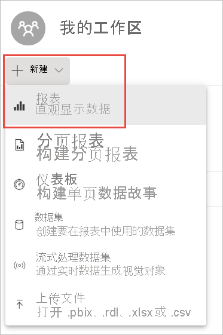
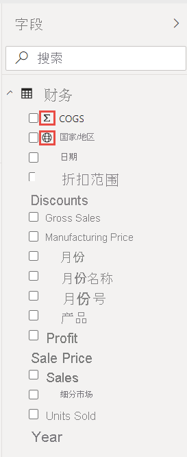
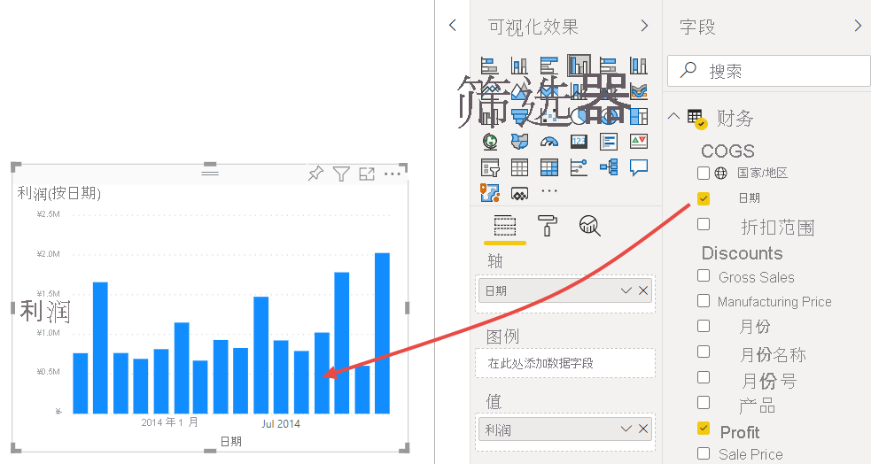
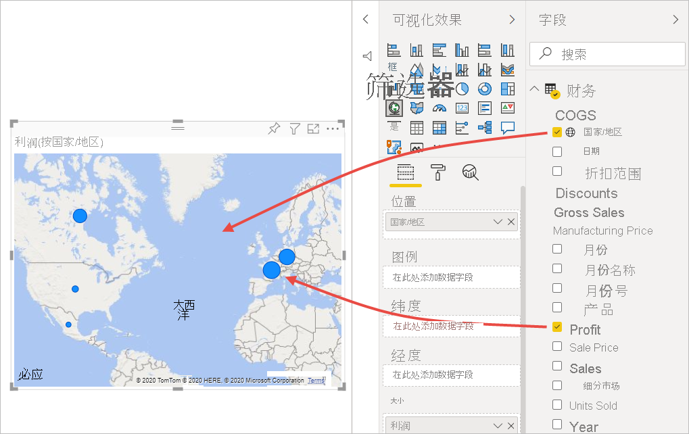
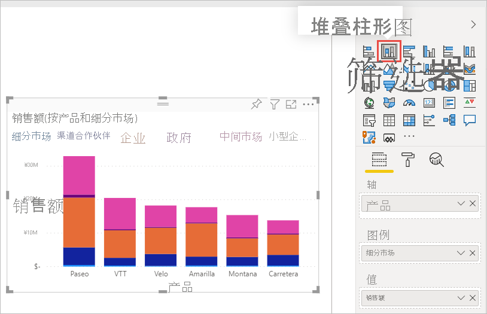
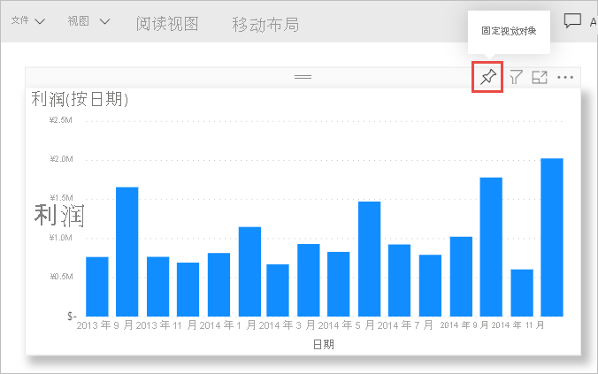
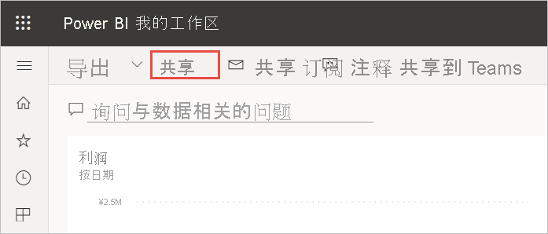
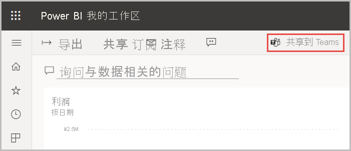

# 教程：从 Excel 工作簿到 Power BI 服务中的报表再到 Microsoft Teams
你的经理想要在下班前查看有关最新销售和利润数据的报表。 但最新数据位于各种第三方系统上以及你的笔记本电脑上的文件内。 以前，创建视觉对象和格式化报表都需要花费数小时，这让你深感焦虑。

别担心。 使用 Power BI，你可以立刻创建出色的报表并在 Microsoft Teams 中共享！

:::image type="content" source="media/service-from-excel-to-stunning-report/power-bi-financial-report-service.png" alt-text="已完成的财务示例报表的屏幕截图":::

在本教程中，我们将上传 Excel 文件、创建新报表，并将其与 Microsoft Teams 中的同事共享，所有操作均在 Power BI 内进行。 将了解如何执行以下操作：

> [!div class="checklist"]
> * 在 Excel 中准备数据。
> * 下载示例数据。
> * 在 Power BI 服务中生成报表。
> * 将报表视觉对象固定到仪表板。
> * 共享仪表板的链接。
> * 在 Microsoft Teams 中共享仪表板

## 在 Excel 中准备数据
让我们以一个简单的 Excel 文件作为示例。 

1. 在将 Excel 文件加载到 Power BI 之前，必须在平面表中组织数据。 在平面表中，每一列都包含相同的数据类型；例如，文本、日期、数字或货币。 表应包含标题行，但不包含任何显示总计的列或行。

   

2. 接下来，将数据格式设置为表格。 在 Excel 中，在“开始”选项卡上的“样式”组中，选择“套用表格格式”  。 

3. 选择要应用到工作表的表格样式。 

   Excel 工作表现已准备好加载到 Power BI 中。

   

## 将 Excel 文件上传到 Power BI 服务
Power BI 服务连接到多个数据源，包括位于计算机上的 Excel 文件。 

 > [!NOTE] 
 > 若要按照本教程其余部分的说明进行操作，请下载[财务示例工作簿](https://go.microsoft.com/fwlink/?LinkID=521962)。

1. 若要开始，请登录到 Power BI 服务。 如果还未注册，[你可以免费注册](https://powerbi.com)。
1. 在“我的工作区”中，选择“新建” > “上传文件”  。

    :::image type="content" source="media/service-from-excel-to-stunning-report/power-bi-new-upload.png" alt-text="“上传文件”选项的屏幕截图。":::

1. 选择“本地文件”，浏览到保存财务示例 Excel 文件的位置，然后选择“打开” 。
7. 在“本地文件”页上，选择“导入” 。

    现在你就有了一个财务示例数据集。 Power BI 还将自动创建一个空白仪表板。 如果看不到仪表板，请刷新浏览器。

    :::image type="content" source="media/service-from-excel-to-stunning-report/power-bi-financial-dataset.png" alt-text="带有财务示例数据的我的工作区的屏幕截图。":::

2. 你想要创建报表。 还是在“我的工作区”中，选择“新建” > “报表”  。

   

3. 在“选择创建报表所需的数据集”对话框中，选择“财务示例”数据集>“创建”  。

   

## 生成报表
 
报表将在“编辑”视图中打开并显示空白报表画布。 “可视化效果”、“筛选器”和“字段”窗格位于右侧  。 你的 Excel 工作簿表数据将在“字段”窗格中显示。 顶部为表的名称，“财务”。 在该名称下方，Power BI 会将列标题作为单个字段列出。

看到“字段”列表中的 Sigma 符号了吗？ Power BI 检测到这些字段为数值字段。 Power BI 还通过地球符号指示地理字段。

1. 若要为报表画布留出更多空间，请选择“隐藏导航窗格”，并最小化“筛选器”窗格 。

    :::image type="content" source="media/service-from-excel-to-stunning-report/power-bi-hide-nav-pane.png" alt-text="最小化导航窗格的屏幕截图。"::: 

1. 现在可以开始创建可视化效果。 假设你的经理想要查看一段时间内的利润。 在“字段”窗格中，将“利润”拖动到报表画布 。 

   默认情况下，Power BI 将显示带有一列的柱形图。 

    :::image type="content" source="media/service-from-excel-to-stunning-report/power-bi-profit-column.png" alt-text="带有一列的柱形图的屏幕截图。":::

3. 将“日期”拖动到报表画布。 

   Power BI 将更新柱形图以按日期显示利润。

   

    2014 年 12 月是盈利最多的月份。
   
    > [!TIP]
    > 如果图表值与你的期望不符，请检查聚合。 例如，在“值”上选择你刚才添加的“利润”字段，并确保数据以你期望的方式进行聚合 。 在此示例中，我们使用 **Sum**。
    > 

### 创建地图

你的经理想要知道哪个国家/地区的盈利最多。 使用地图可视化效果给经理留下深刻印象。 

1. 选择报表画布上的空白区域。 

2. 从“字段”窗格中，将“国家/地区”字段拖到报表画布，然后将“利润”字段拖到地图  。

   Power BI 将创建一个地图视觉对象，其中的气泡代表每个位置的相对利润。

   

    看来欧洲国家/地区的业绩胜过北美国家/地区。

### 创建显示销售额的视觉对象

怎么显示按产品和市场细分显示销售额的视觉对象呢？ 简单。 

1. 选择空白画布。

1. 在“字段”窗格中，选择“销售”、“产品”和“细分市场”字段旁边的复选框   。 
   
   Power BI 创建簇状柱形图。 

2. 通过选择“可视化效果”菜单中的其中某个图标来更改图表的类型。 例如，将其更改为“堆积柱形图”。 

   

3. 若要对图表进行排序，请依次选择“更多选项”(…)、“排序依据” 。

### 修饰视觉对象

在“可视化效果”窗格的“格式”选项卡上进行以下更改。

:::image type="content" source="media/desktop-excel-stunning-report/power-bi-format-tab-visualizations.png" alt-text="“可视化效果”窗格中“格式”选项卡的屏幕截图。":::

1. 选择“按日期显示利润”柱形图。 在“标题”部分，将“文本大小”更改为“16 磅”  。 将“阴影”切换为“开” 。 

1. 选择“按产品和细分市场列出的销售额”堆积柱形图。 在“标题”部分，将标题“文本大小”更改为“16 磅”  。 将“阴影”切换为“开” 。

1. 选择“按国家/地区列出的利润”地图。 在“地图样式”部分，将“主题”更改为“灰度”  。 在“标题”部分，将标题“文本大小”更改为“16 磅”  。 将“阴影”切换为“开” 。

## 固定到仪表板

现在，可以将所有视觉对象固定到 Power BI 默认创建的空白仪表板上。 

1. 将鼠标悬停在视觉对象上，然后选择“固定视觉对象”。

   

1. 必须先保存报表，然后才能将视觉对象固定到仪表板。 为报表指定名称并选择“保存”。
1. 将每个视觉对象固定到 Power BI 创建的仪表板：财务示例.xlsx。
1. 固定最后一个视觉对象时，请选择“转到仪表板”。
1. Power BI 自动将占位符“财务示例.xlsx”磁贴添加到仪表板。 选择“更多选项(…)” > “删除磁贴” 。

    :::image type="content" source="media/service-from-excel-to-stunning-report/power-bi-tile-more-options.png" alt-text="磁贴的更多选项的屏幕截图。":::

1. 根据需要重新排列并调整磁贴的大小。

仪表板和报表已准备就绪。

## 共享仪表板的链接

现在可以与经理共享你的仪表板了。 你可以与任何具有 Power BI 帐户的同事共享仪表板和基础报表。 他们可以与你的报表进行交互，但不能保存所做的更改。 如果你允许，他们可以与其他人再次共享，或基于基础数据集生成新报表。

1. 若要共享你的报表，可在仪表板顶部，选择 **共享**。

   

2. 在“共享仪表板”页中，在“输入电子邮件地址”框中输入收件人的电子邮件地址，并在其下方的框中添加一封邮件 。 

3. 确定所需的选项（如果有）：

    - 允许收件人共享你的仪表板。 
    - 允许收件人使用基础数据集生成新内容。
    - 向收件人发送电子邮件通知。

   

1. 选择 **共享**。

## 与 Microsoft Teams 共享

还可将报表和仪表板直接与 Microsoft Teams 中的同事共享。

1. 若要在 Teams 中共享，请在仪表板顶部选择“共享到 Teams”。

   

2. Power BI 显示“共享到 Teams”对话框。 输入用户、组或频道的名称，并选择“共享”。 
   
    :::image type="content" source="media/service-from-excel-to-stunning-report/power-bi-share-teams-dialog.png" alt-text="“共享到 Teams”对话框的屏幕截图":::

3. 此链接将显示在该用户、组或频道的“帖子”中。

   

## 后续步骤

* 现在，你已经在 Power BI 服务中创建了基本报表，不妨学习如何在 Power BI Desktop 中创建报表？ 尝试学习教程[从 Excel 工作簿变为 Power BI Desktop 中的出色报表](desktop-excel-stunning-report.md)。

更多问题？ [尝试参与 Power BI 社区](https://community.powerbi.com/)。
