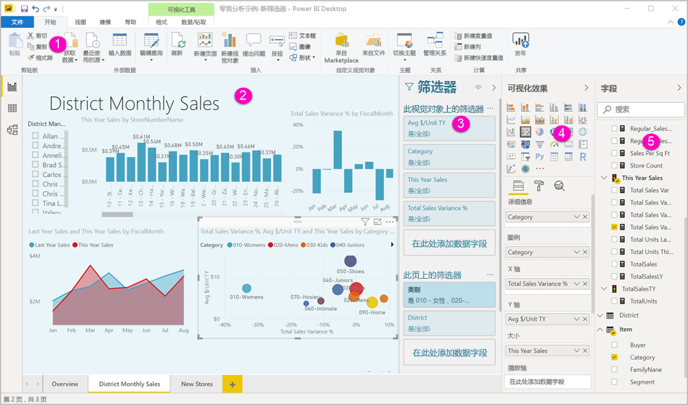
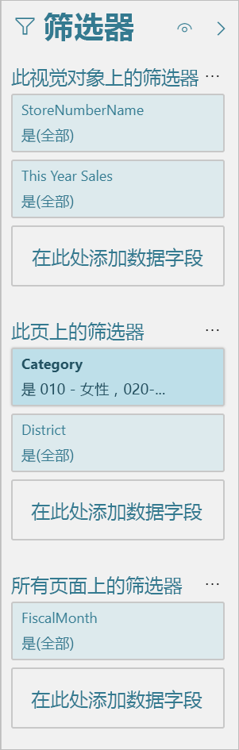
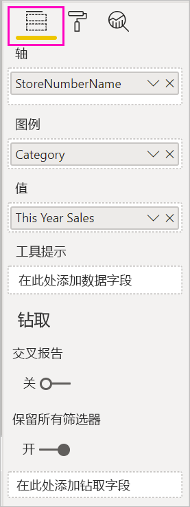
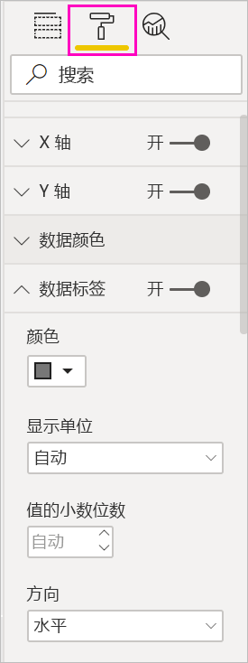
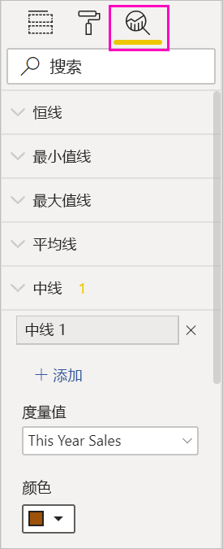
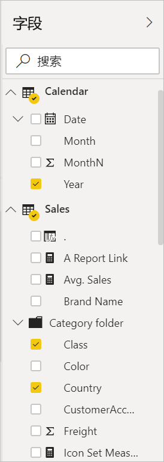

# Power BI 中的报表编辑器导览

在 Power BI Desktop 和 Power BI 服务中，报表编辑器用于设计最终用户所看到的报表，其中包含图表、表格、地图和其他视觉对象  。 这在两个环境中是类似的。 通常情况下，首先在 Power BI Desktop 中创建报表。 然后将报表发布到 Power BI 服务，可在其中继续修改报表。 还可以在 Power BI 服务中根据报表创建仪表板。

创建仪表板和报表后，将它们分发给报表使用者。 根据具体共享方式，最终用户可以在 Power BI 服务的“阅读”视图中与仪表板和报表进行交互，但不能对其进行编辑。 详细了解[报表使用者可在 Power BI 服务中执行哪些操作](../consumer/end-user-reading-view.md)。 

此视频显示 Power BI Desktop 中的报表编辑器。 本文也展示 Power BI Desktop 中的报表编辑器。 

<iframe width="560" height="315" src="https://www.youtube.com/embed/IkJda4O7oGs" frameborder="0" allowfullscreen></iframe>

在 Power BI 服务中，报表编辑器仅在“编辑视图”中可用。 要在“编辑”视图中打开报表，你必须是报表所有者或创建者，或者是报表所在的工作区的参与者。

Power BI 报表编辑器由几个主要部分组成：  

1. 顶部导航窗格
1. 报表画布
1. “筛选器”窗格
1. “可视化效果”窗格
1. 字段窗格

## 1.顶部导航窗格
顶部导航窗格中可用的操作有很多，新操作一直在增加。 有关特定操作的信息，请使用 Power BI 文档目录或搜索框。

## 2.报表画布
报表画布是显示工作内容的地方。 使用“字段”、“筛选器”和“可视化效果”窗格创建视觉对象时，将在报表画布中生成和显示这些视觉对象。 画布底部的每个选项卡均表示报表中的一个页面。 选择某个选项卡将打开该页。 

## 报表编辑器窗格

首次打开报表时，可以看到三个窗格：“筛选器”、“可视化效果”和“字段”。 前两个窗格位于左侧，即“可视化效果”和“筛选器”，它们可控制可视化效果的外观，包括：类型、字体、筛选、格式设置。 最后一个窗格位于右侧，即“字段”，它可管理将用于可视化效果的基础数据。 报告编辑器中显示的内容会随报表画布中选择的内容不同而异。 

例如，如果选择单个视觉对象，例如柱形图：

“筛选器”窗格显示视觉对象、页面或所有页面上的任何筛选器  。 在本例中有页面级筛选器，但是没有视觉对象级筛选器。

“可视化效果”窗格顶部会标识出正在使用的视觉对象类型  。 本例中标识出的是一个簇状柱形图。 

“可视化效果”窗格底部有三个选项卡  ：

“字段”显示视觉对象中的字段  。 有时可能需要向下滚动以查看全部详细信息。 此图表使用的是“StoreNumberName”和“This Year Sales”。

“格式”：要显示所选视觉效果的格式窗格，请选择滚漆筒图标  。

“分析”：要显示“分析”窗格，请选择放大镜图标  。

“字段”窗格列出数据模型中所有可用的表  。 展开表时，可以查看该表中的字段。 黄色复选标记表示可视化效果中至少有该表中的一个字段。

下面详细介绍各个窗格。

## 3.“筛选器”窗格
使用“筛选器”窗格可在页面、报表、钻取和视觉对象级别查看、设置和修改报表的持久筛选器。 是的，你可以对报表页和视觉对象执行即席筛选，方法是选择视觉对象元素，或使用切片器等工具。 “筛选器”窗格中筛选功能的优点是：筛选器的状态会与报表一起保存。 

“筛选器”窗格还有一项强大功能，即可使用尚未在报表中任意视觉对象中用过的字段来进行筛选  。 我来解释一下。 在创建可视化效果时，Power BI 会自动将可视化效果中的所有字段添加到“筛选器”窗格的视觉对象级别筛选器区域。 若希望通过当前未在可视化效果中使用的字段来设置视觉对象、页面、钻取或报表筛选器，只需将其拖到其中一个筛选器 Bucket。

新的筛选器体验能带来更强的灵活性。 例如，可以将筛选器的格式设置为类似于报表本身的格式。 还可以锁定筛选器或对报表使用者隐藏这些筛选器。 

了解有关[新筛选器体验](power-bi-report-filter.md)的详细信息。

## 4.“可视化效果”窗格

可视化效果窗格包含四个部分。 我们将从窗格顶部开始。

在此处选择可视化效果类型。 小图标显示了可以创建的不同类型的可视化效果。 上图中选择了气泡图。 如果未首先选择可视化效果类型，而是通过选择字段开始生成可视化效果，则 Power BI 将为你选择可视化效果类型。 你可以保留 Power BI 的选择或通过选择不同的图标更改类型。

可以将自定义可视化效果下载到 Power BI Desktop。 它们的图标也会显示在此窗格中。 

### 管理视觉对象中的字段

此窗格中的 bucket（有时称为“井”）会根据所选择的可视化效果类型而有所不同  。  例如，如果选择的是条形图，则会看到“轴”、“图例”和“值”。 当选择某个字段时，或将其拖到画布上时，Power BI 会将该字段添加到其中一个 bucket。  也可以直接将“字段”列表中的字段拖动到存储桶中。  某些存储桶仅限于特定类型的数据。  例如，**值**将不会接受非数字字段。 因此，如果将“类别”字段拖入“值”bucket，Power BI 会将其更改为“类别计数”    。

有关详细信息，请参阅[向 Power BI 报表添加可视化效果](../visuals/power-bi-report-add-visualizations-i.md)。

窗格的此部分还包含控制[钻取](desktop-drillthrough.md)和筛选器行为的选项。

### 格式化视觉对象
选择滚动油漆刷图标，以显示“格式设置”窗格。 可用选项取决于所选可视化效果的类型。

可以进行多种多样的格式设置。  若要了解详细信息，可以自行探索或参阅以下文章：

* [自定义可视化效果的标题、背景和图例](../visuals/power-bi-visualization-customize-title-background-and-legend.md)
* [颜色格式](../visuals/service-getting-started-with-color-formatting-and-axis-properties.md)
* [自定义 X 轴和 Y 轴属性](../visuals/power-bi-visualization-customize-x-axis-and-y-axis.md)

### 将分析添加到可视化效果
选择放大镜图标以显示“分析”窗格。 可用选项取决于所选可视化效果的类型。

通过 Power BI 服务中的“分析”窗格，可以将动态参考行添加到可视化效果，并重点关注重要趋势或见解。 若要了解详细信息，请参阅 [Power BI Desktop 中的“分析”窗格](../transform-model/desktop-analytics-pane.md)。

## 5.“字段”窗格
“字段”窗格显示数据中存在的表、文件夹和字段，可供创建可视化效果。

:::row:::
    :::column:::
        
    :::column-end:::
    :::column:::
        <ul><li>将字段拖到页上，以启动一个新的可视化效果。  还可以将字段拖动到现有可视化效果，以将字段添加到该可视化效果。  </li> <li>添加某一字段旁的选中标记时，Power BI 会将该字段添加到活动（或新的）可视化效果中。 它还决定将该字段放入哪个存储桶。  例如，该字段应用于图例、轴还是值？ Power BI 进行最佳推测，如有必要，可以将其从一个存储桶移动到另一个。   </li><li>无论哪种方式，每个所选的字段都会被添加到报表编辑器中的可视化效果窗格。</li></ul>
    :::column-end:::
:::row-end:::

在 Power BI Desktop 中，还可以选择显示/隐藏字段、添加计算等。

## 字段图标

Power BI 使用多种不同的图标来表示报表中的字段类型。 能够识别它们，就可以更好地了解它们在不同视觉对象中的作用。 下面是一些比较常见的图标。

|图标  |含义  |
|---------|---------|
|  | “字段”列表中的文件夹 |
| | 数值字段：例如，数值字段是可以求和或求平均值的聚合。 聚合随数据一起导入，并在报表所基于的数据模型中定义。 有关详细信息，请参阅 [Power BI 报表中的聚合函数](service-aggregates.md)。 |
| | 非数值数据类型的计算列：使用数据分析表达式 (DAX) 公式创建的一个新的非数值列，该公式定义该列的值。 详细了解[计算列](../transform-model/desktop-calculated-columns.md)。 |
|     |   数值计算列：使用数据分析表达式 (DAX) 公式创建新的列，该公式定义该列的值。 详细了解[计算列](../transform-model/desktop-calculated-columns.md)。 |
| |  度量值：度量值有自己的硬编码公式。 不能更改此计算，例如，如果该计算是求和，则只能进行求和。 值不会存储在列中。 它们是动态计算的，具体取决于它们在视觉对象中的位置。 有关详细信息，请参阅[了解度量值](../transform-model/desktop-measures.md)。 |
|     | 度量值组  |
| |      KPI：它是一个视觉提示，用于传达针对可度量目标已完成的进度。 详细了解[关键绩效指标 (KPI)](../visuals/power-bi-visualization-kpi.md) 视觉对象 |
|     |  字段的层次结构：选择箭头以查看构成层次结构的字段。  有关详细信息，请观看有关[创建和使用层次结构](https://www.youtube.com/watch?v=q8WDUAiTGeU)的 YouTube Power BI 视频。 |
|     | 地理数据：这些字段可用于创建地图可视化效果。 |
|      | 标识字段：具有此图标的字段是“唯一字段”，将被设置为显示全部值，即使它们具有重复项也是如此  。 例如，数据中可能存在两个名为 Robin Smith 的不同人员记录，每一条都将被视为唯一。 它们不会合成一条。   |
|   | 参数：设置参数以使报表和数据模型的某些部分（例如查询筛选器、数据源引用、度量值定义等）依赖于一个或多个参数值。 有关详细信息，请参阅这篇有关[查询参数](https://powerbi.microsoft.com/blog/deep-dive-into-query-parameters-and-power-bi-templates/)的 Power BI 博客文章。 |
|  | 带有内置日期表的日历日期字段 |

## 后续步骤
[创建报表](service-report-create-new.md)

有关报表的详细信息，请参阅 [Power BI 服务](service-report-create-new.md)、[Power BI Desktop](desktop-report-view.md) 和 [Power BI 移动应用](../consumer/mobile/mobile-apps-view-phone-report.md)。

[Power BI 设计器的基本概念](../fundamentals/service-basic-concepts.md)

更多问题？ [尝试参与 Power BI 社区](https://community.powerbi.com/)
