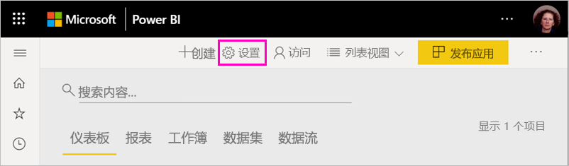
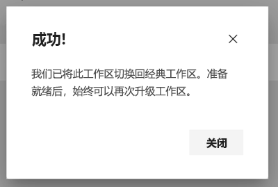

# 在 Power BI 中将经典工作区升级到新工作区

本文介绍如何将经典工作区升级到新工作区。 可以升级任何经典工作区。 新工作区具有更细化的工作区角色，方便你更好地管理对内容的访问。 你可以更灵活地管理升级后的工作区，因为它们更松散地连接到其原始 Office 365 组。 了解[新工作区体验](../service-new-workspaces.md)。 

>[!NOTE]
>工作区升级已推出公共预览版。 

但是，可能会需要你了解和规划工作区更改。 例如，内容包在新工作区体验中不受支持。 请参阅本文后面的[升级注意事项和限制](#upgrade-considerations-and-limitations)部分。

## 升级后要执行的操作

升级后应执行的几项操作。 最好先规划再升级：
- 查看访问列表并了解[升级后的权限](#permissions-after-upgrade)。
- 查看[联系列表](#modify-the-contact-list)并确保按要求设置。
- 如果尚未升级，请了解[新工作区体验](../service-new-workspaces.md)。

## 升级经典工作区

任何工作区管理员都可以升级工作区。 对于经典工作区，作为工作区管理员，你必须是基础 Office 365 组的所有者。 若要升级工作区，请执行以下步骤。

1. 在工作区内容列表中，选择“更多选项”(**...**) >“编辑此工作区”。

    

1. 展开“高级”并选择“立即升级”。

    

1. 查看对话框信息。 如果已在工作区中发布或安装内容包，则会出现警告。 准备就绪后，选中“我已准备好升级此工作区”，然后选择“升级”。

    

2. 在升级过程中，会看到“正在升级”消息。 升级工作区通常需要不到一分钟的时间。

1. 升级完成后，将看到“成功”对话框。 建议阅读[在 Power BI 的新工作区中组织工作](../service-new-workspaces.md)，以便熟悉新工作区与经典工作区的不同之处。

### 对其他工作区用户的影响

我们建议在极少有用户主动查看或编辑工作区项目的非工作时间进行升级。

系统会要求主动使用该工作区的用户刷新其浏览器。 编辑报表的用户可以选择在刷新之前进行保存。

## 升级注意事项和限制

- 工作区的 URL 和 ID、其包含的内容以及从工作区发布的应用程序不会更改。 安装在工作区中的内容包的内容会得到单独处理。 有关详细信息，请参阅本文中的[升级期间的内容包](#content-packs-during-upgrade)。
- 新工作区中不支持内容包。 阅读有关[已发布内容包](#published-content-packs)或[已安装内容包](#installed-content-packs)的内容，以了解升级期间如何进行处理。 建议在升级之前删除安装或发布在工作区的内容包。
- 经典工作区的 Office 365 组不受 Power BI 中工作区升级的影响。 任何团队、SharePoint 站点、邮箱或由 Office 365 管理的其他资源都不会发生变化。 升级 Power BI 工作区后，它们将保持不变。 Office 365 组继续像以前一样存在。
- 升级后，你的工作区的保护方式发生了变化。 有关详细信息，请参阅[升级后的工作区权限](#permissions-after-upgrade)部分。
- 如有需要，可提供“退回到经典工作区”选项。 但是，它不会在升级之前完全还原工作区的某些方面。 如果开始使用仅适用于新工作区的功能，则无法退回。 升级后 30 天内可以使用退回选项。

## 升级后的权限

在工作区内容列表顶部的菜单栏中选择“访问”，以便在升级后查看权限。

将每个 Office 365 组所有者分别添加到已升级工作区的管理员角色中。 将 Office 365 组本身将添加到工作区角色。 它所添加到的角色取决于经典工作区是“只读”还是“读写”：

- 如果工作区设置为“成员可以编辑 Power BI 内容”，则在升级后，会将 Office 365 组添加到具有“成员”角色的工作区访问列表中。
- 如果工作区设置为“成员仅可读取 Power BI 内容”，则在升级后，会将 Office 365 组添加到具有“查看者”角色的工作区访问列表中。

由于 Office 365 组已在工作区获得了角色，升级后添加到 Office 365 组的任何用户都将在工作区中使用该角色。 但是，如果在升级后将新所有者添加到 Office 365 组，则他们不具有工作区的管理员角色。

### 升级前后的角色差异

经典工作区和新工作区中的工作区角色不同。 在新的工作区，你可以向 Office 365 组、安全组或通讯组列表提供工作区角色。

- “成员”可以通过“成员”、“参与者”或“查看者”角色共享单个项目并授予对整个工作区的访问权限
- “查看者”只能查看内容，也不能在 Excel 中为任何工作区数据集导出基础数据或进行分析，除非他们具有“生成”权限。

通过共享或拥有应用权限而有权访问工作区项目的任何用户可以继续访问这些项目。 任何拥有工作区访问权限的用户还可以访问从工作区发布的应用。 这些用户未在应用访问列表中列出。

建议评估是否使用新的参与者角色。 升级后，可以更改 Office 365 组，使其在访问窗格中具有“参与者”角色。

升级后，可以考虑为工作区管理员创建一个安全或 Office 365 组或通讯组列表，而不是通过为单个用户分配角色来管理访问权限。

详细了解[新工作区中的角色](../service-new-workspaces.md#roles-in-the-new-workspaces)。

## 升级后的许可

“管理员”、“成员”或“参与者”工作区角色中的用户需要 Power BI Pro 许可才能访问工作区。

如果工作区位于共享容量中，则“查看者”工作区角色中的用户还需要 Power BI Pro 许可才能访问工作区。 但是，如果工作区位于高级容量中，则“查看者”角色中的用户不需要 Pro 许可即可访问工作区。

## 其他新工作区功能

新工作区具有经典工作区所没有的功能。 一个不同之处是，可以设置不同于工作区管理员或所有者的联系人列表。 一个相似之处是它仍连接到 Office 365 组 SharePoint 文档库。 

### 修改联系人列表

1. 在工作区内容列表顶部的菜单栏中选择“设置”，以便访问工作区设置。

    

2. 在“高级”下，将工作区“联系人列表”配置为从中升级工作区的 Office 365 组。 你可以将更多的用户或组添加到联系人列表，或将其切换到工作区管理员。

    

### 工作区 OneDrive 

升级后，工作区 OneDrive 将连接到 Office 365 组 SharePoint 文档库。 此文档库在“获取数据”>“文件”中显示为“OneDrive”选项。 请注意，并非所有工作区用户都有权使用该文档库，如果他们不在 Office 365 组中的话。

## 升级过程中的内容包

新工作区不支持内容包。 而是使用应用和共享数据集在工作区中分发内容。 建议在升级之前从工作区中删除已发布或已安装的内容包。 但是，如果在升级时存在已发布或已安装的内容包，升级过程将尝试保留此内容，如下所述。  升级后无法还原内容包或内容与内容包的关联。

### 已发布内容包

在升级过程中，将删除从工作区发布的内容包。 升级后，你将无法发布或更新这些内容包，即使还原到经典工作区也是如此。 如果其他人已在其自己的工作区中安装了内容包，则在升级后，他们会在其工作区中看到内容包内容的副本。 有关详细信息，请参阅**已安装内容包**部分。

### 已安装内容包

升级工作区时，或升级从中发布内容包的工作区时，已安装内容包会发生重要更改。 升级后，工作区会包含内容包内容的副本。 它会连接到原始工作区中的原始数据集。

但是，有一些重要的更改：

- 如果更新了内容包，则内容将不再更新。
- URL 和项目标识符发生更改，并且要求更新与他人共享的任何书签或链接。
- 工作区中原始内容包上的任何用户自定义项都将丢失。 自定义项包括订阅、警报、个人书签、永久性筛选器和收藏夹。
- 新用户可能无权访问内容包中的数据集。 你需要与数据集所有者合作，以确保工作区用户有权访问数据。

## 退回到经典工作区

作为升级体验的一部分，你可以选择在升级后的 30 天内退回到经典工作区。 此功能会还原工作区内容与原始 Office 365 组的关联。 如果组织在使用新工作区方面遇到了重大问题，则可以使用此功能。 但存在一些限制。 请先[阅读本文中有关切换回经典工作区的注意事项](#considerations-for-switching-back-to-classic)。

若要退回，你需要在工作区升级之前成为与之关联的 Office 365 组的所有者。 请执行以下步骤。

1. 在工作区内容列表中，选择“更多选项”(**...**) >“工作区设置”。

    

1. 展开“高级”，然后选择“切换回经典”。 如果此选项不可用，请参阅本文中的[切换回经典工作区的注意事项](#considerations-for-switching-back-to-classic)。

    

1. 准备就绪后，选择“我已准备好切换回经典”框，然后选择“切换到经典”。 你可能会在此对话框中看到警告或阻止程序。 如果遇到这些问题，请参阅本文中的[切换回注意事项](#considerations-for-switching-back-to-classic)。

    

1. 切换回完成后，会看到一个确认对话框。

    

### 切换回经典工作区的注意事项

如果以下任何有关工作区的条件成立，则无法切换回：

- Office 365 组已删除。
- 自升级后，时间已超过 30 天。
- 工作区中的数据集被其他工作区中的报表或仪表板使用。 这是为何？ 假设你在升级前从工作区中发布了内容包，并且有人在其他工作区中安装了该内容包。 升级后，数据集由该内容包中的报表和仪表板使用。
- 工作区是应用程序生命周期管理管道的一部分。
- 工作区用于模板应用。
- 工作区使用大模型功能。
- 工作区使用新的使用情况指标功能。

切换回经典工作区时，不会还原原始工作区的精确副本。 会发生以下更改：

- 工作区的权限由升级后的工作区最初连接到的 Office 365 组设置。
  - Office 365 组的任何管理员都会成为经典工作区的管理员。
  - Office 365 组的任何成员都会成为经典工作区的成员。 如果经典工作区原来设置为成员只能读取 Power BI 内容，则将还原此设置。
  - 升级完成后添加到工作区的任何用户或用户组（Office 365 组外部）将失去对工作区的访问权限。 可将他们添加到 Office 365 组，以授予其访问权限。 请注意，Office 365 组不允许在成员身份中嵌套安全组或通讯组。
  - 获得工作区应用访问权限的用户可以继续访问该应用。
  - 通过共享获得对工作区中项目的访问权限的用户可以继续访问这些项目。
- 升级前从经典工作区发布的内容包未还原。
- 升级前安装在经典工作区的内容包未还原。
- 用户在升级后在工作区中创建的订阅已被删除。 升级前就已存在的订阅将继续按预期方式工作。
- 不会保留数据警报。 它们会被删除。
- 如果在升级后重命名了工作区，则会还原工作区的名称以匹配 Office 365 组的名称。
- 正在进行的操作（如刷新）不受工作区升级的影响。

## 为租户管理到新工作区的迁移 

某些组织希望将多个或全部工作区移动到新工作区。 工作区升级工具重点介绍如何支持工作区管理员进行升级。 对于想要管理此类流程的组织，他们可以执行以下步骤。

1. Power BI 管理门户和相应 API 中的工作区列表提供了 Power BI 中所有工作区的列表。 经典工作区在列表中显示为“类型组”。
2. 与单个 Office 365 组所有者或 Office 365 管理员一起升级工作区。 如果要升级工作区，则需要成为该组的所有者。

工作区升级功能不提供用于批量升级或编程升级的工具。 此外，在你的组织中创建的新 Office 365 组将继续显示在 Power BI 中。 
   
   
## 已知问题

你可能会遇到一些已知问题：
- 升级后，用户可能会看到“模型加载失败”警告对话框。 此消息为错误显示，可以忽略。 
- 升级后，某些工作区名称与升级之前的名称不同。 出现这种情况时，工作区名称恢复为工作区之前的名称，或者工作区名称变为空白。 若要解决此问题，请将工作区重命名为所需名称。
- 升级已安装内容包的工作区后，可能会在工作区中看到升级前不可见的其他仪表板。 如果最近尚未更新内容包，则会发生这种情况。 你可以安全地删除这些仪表板了。

## 后续步骤
* [在 Power BI 中创建新工作区](../service-create-the-new-workspaces.md)
* [创建经典工作区](../service-create-workspaces.md)
* 是否有任何问题? [尝试咨询 Power BI 社区](https://community.powerbi.com/)
