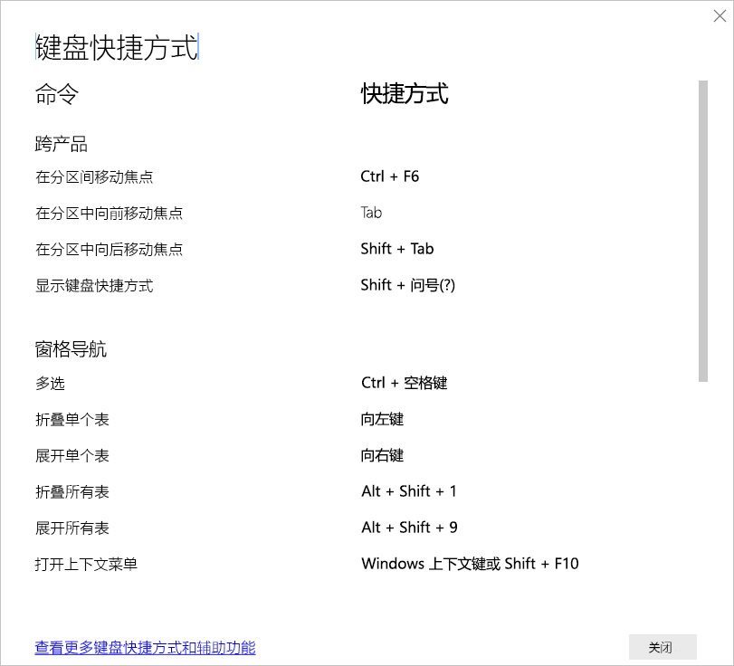

# Power BI Desktop 中的键盘快捷方式

键盘快捷方式有助于使用键盘在 Power BI 报表中移动。 本文中的表格介绍了 Power BI 报表中可用的快捷方式。 

使用 Power BI Desktop 时，可以按“Shift + ?”  显示键盘快捷方式，如下图所示。

除了在 Power BI Desktop 中使用这些键盘快捷方式，还可以在以下体验中使用这些快捷方式  ：

* “问答资源管理器”  对话框
* “入门指南”  对话框
* “文件”  菜单和“关于”  对话框
* “警告”  栏
* “文件还原”  对话框
* “哭脸”  对话框

在我们持续努力提升可访问性的情况下，以前的体验列表也支持屏幕阅读器和高对比度设置。

## 常用快捷方式
| 要执行此操作           | 操作方法                |
| :------------------- | :------------------- |
| 在分区间移动焦点  | Ctrl+F6  |
| 在分区中向前移动焦点 | Tab          |
| 在分区中向后移动焦点 | Shift+Tab  |
| 选择或取消选择对象 | Enter  或空格键  |
| 多重选择对象 | Ctrl+空格键  |

## 启用视觉对象
| 要执行此操作           | 操作方法                |
| :------------------- | :------------------- |
| 将焦点移动到视觉对象菜单 | Alt+Shift+F10  |
| 显示数据 | Alt+Shift+F11   |
| 输入一个视觉对象 | Ctrl+向右键  |
| 输入一层 | <bpt id="p1">**</bpt>Enter<ept id="p1">**</ept> |
| 退出一层或视觉对象 | Esc  |
| 选择或清除数据点的选定内容 | Enter  或空格键  |
| 多选 | Ctrl+Enter  或 Ctrl+空格键  |
| 右键单击 | <ul><li>Windows 键盘：Windows 上下文键+F10  。 Windows 上下文键位于左 Alt 键和向左键之间</li><li>其他键盘：Shift+F10 </li></ul> |
| 清除选定内容 | Ctrl+Shift+C  |
| 显示或隐藏工具提示 | Ctrl + H  |

## 表和矩阵导航
| 要执行此操作          | 操作方法                |
| :------------------- | :------------------- |
| 将焦点上移/下移一个单元格（跨所有区域中的所有单元格）  | 向上键 / 向下键   |
| 将焦点左移/右移一个单元格（跨所有区域中的所有单元格）  | 向左键 / 向右键   |

## 窗格导航
| 要执行此操作           | 操作方法                |
| :------------------- | :------------------- |
| 多选 | Ctrl+空格键  |
| 折叠单个表 | 向左键  |
| 展开单个表 | 向右键  |
| 折叠所有表 | Alt+Shift+1  |
| 展开所有表 | Alt+Shift+9  |
| 打开上下文菜单 | <ul><li>Windows 键盘：Windows 上下文键+F10  。  Windows 上下文键位于左 Alt 键和向左键之间</li><li>其他键盘：Shift+F10 </li></ul> |

## 切片器
| 要执行此操作         | 操作方法                |
| :------------------- | :------------------- |
| 与切片器进行交互 | Ctrl+向右键  |

## “选择”窗格
| 要执行此操作           | 操作方法                |
| :------------------- | :------------------- |
| 激活“选择”窗格 | F6  |
| 在分层中向上移动对象 | Ctrl+Shift+F  |
| 在分层中向下移动对象 | Ctrl+Shift+B  |
| 隐藏/显示（切换）对象 | Ctrl+Shift+S  |

## DAX 编辑器
| 要执行此操作          | 操作方法                |
| :------------------- | :------------------- |
| 向上/向下移动行 | Alt+向上键 / 向下键   |
| 向上/向下复制行 | Shift+Alt+向上键 / 向下键   |
| 在下方插入行 | Ctrl+Enter  |
| 在上方插入行 | Ctrl+Shift+Enter  |
| 跳转到匹配的括号 | Ctrl+Shift+ \  |
| 缩进行/将行扩展到边距 | Ctrl+] / [   |
| 插入光标 | Alt+单击  |
| 选择当前行 | Ctrl+I  |
| 选择当前所选内容的所有匹配项 | Ctrl+Shift+L  |
| 选择当前词语的所有匹配项 | Ctrl+F2  |

## 输入数据
| 要执行此操作           | 操作方法                |
| :------------------- | :------------------- |
| 退出可编辑网格 | Ctrl+Tab  |

## 注意事项和限制
辅助功能存在一些已知问题和限制。 以下列表列出了这些问题和限制：

* 通过 Power BI Desktop 使用屏幕阅读器时，如果在 Power BI Desktop 中打开任何文件前打开所选屏幕阅读器，则将获得最佳体验   。
* 如果使用讲述人，以 HTML 表形式导航“显示数据”时会存在一些相关限制  。

## 后续步骤

Power BI 辅助功能的文章集合如下所示：

* [Power BI 中的辅助功能概览](desktop-accessibility-overview.md) 
* [创建可访问 Power BI 报表](desktop-accessibility-creating-reports.md) 
* [通过辅助功能工具使用 Power BI 报表](desktop-accessibility-consuming-tools.md)
* [使用辅助功能工具创建 Power BI 报表](desktop-accessibility-creating-tools.md)
* [报表辅助功能清单](desktop-accessibility-creating-reports.md#report-accessibility-checklist)

你可能还会对以下文章感兴趣：

* [在 Power BI Desktop 中使用报表主题](desktop-report-themes.md)

