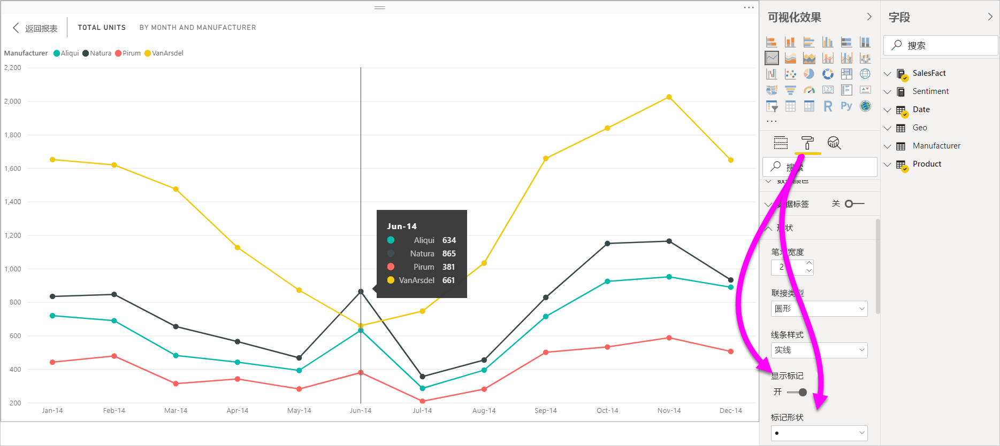
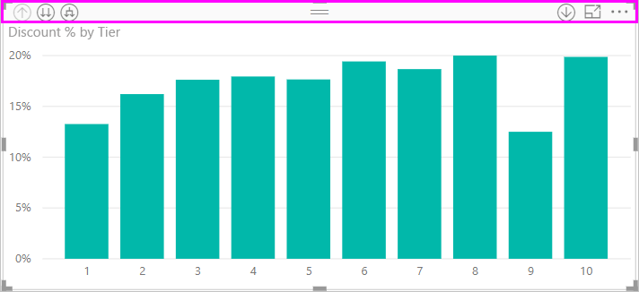
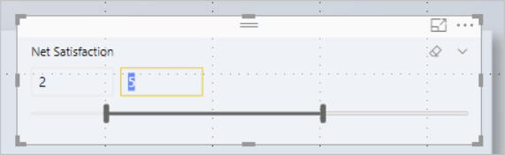
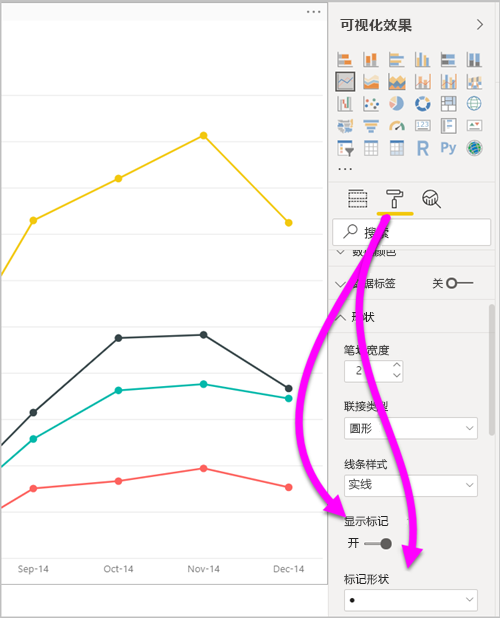
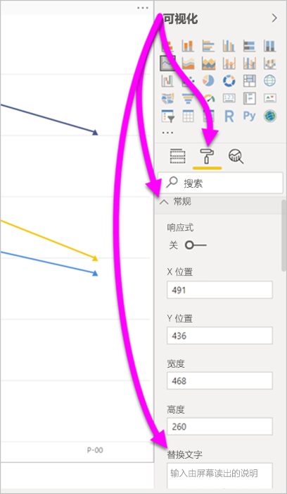
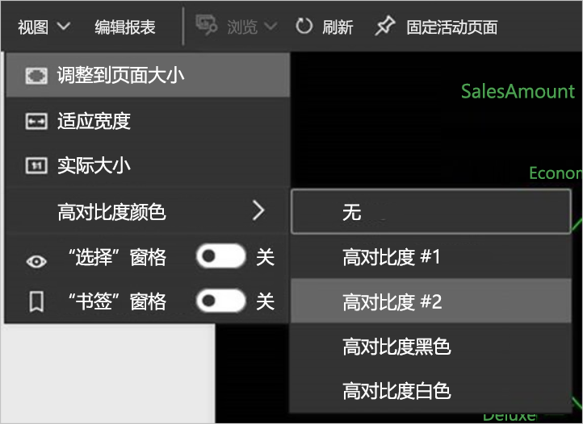

# Power BI Desktop 报表中的辅助功能
Power BI 具有使残疾人士能够更轻松地使用 Power BI 报表并与之进行交互的功能。 这些功能包括通过键盘或屏幕阅读器使用报表、通过按 Tab 键将焦点移动到页面中的各个对象以及在可视化效果中方便地使用标记。

## 通过键盘或屏幕阅读器使用 Power BI Desktop 报表
从 Power BI Desktop  的 2017 年 9 月版本开始，按 Shift+?  会显示一个窗口，其中介绍了可在 Power BI Desktop 中使用的辅助功能键盘快捷方式  。

借助辅助功能的增强功能，可以使用以下方法通过键盘或屏幕阅读器使用 Power BI 报表：

> [!NOTE]
> 查看报表时，通常应关闭扫描模式。

可以使用 Ctrl+F6 在报表页选项卡或在给定的报表页中的对象之间切换焦点  。

* 当焦点位于报表页选项卡上时，使用 Tab 或箭头键将焦点从一个报表页移到下一个报表页。   无论当前是否被选中，屏幕阅读器都会读出报表页的标题。 若要加载当前焦点所在的报表页，使用 Enter 或空格键。 
* 当焦点位于已加载的报表页上时，使用 Tab 将焦点移动到页面上的每个对象，其中包括所有文本框、图像、形状和图表  。 屏幕阅读器将朗读对象类型及对象标头（若有）。 如果报表作者提供了该对象的描述，则屏幕阅读器还会朗读它。 

在视觉对象之间导航时，可以按 Alt+Shift+F10 将焦点移到视觉对象标头  。 视觉对象标头包含各种选项，包括排序、导出图表后数据以及焦点模式。 

按 Alt+Shift+F11 可以访问“显示数据”窗口   。 此窗口使用户能够使用通常在屏幕阅读器中使用的相同键盘快捷方式来了解 HTML 表中的视觉对象所使用的数据。 

> [!NOTE]
> 仅可在屏幕阅读器中通过此键盘快捷方式访问“显示数据”功能  。 如果通过视觉对象标头中的选项打开“显示数据”，屏幕阅读器将无法访问此功能  。 使用“显示数据”时，请启用扫描模式，以便利用屏幕阅读器提供的所有热键  。

自 2018 年 7 月发布“Power BI Desktop”  以来，切片器还具有内置的辅助功能。 选择切片器时，若要调整切片器的值，使用 Ctrl+向右键（控制键加向右键）可在切片器内的各种控件间移动  。 例如，当你最初按 Ctrl+向右键时，焦点位于橡皮擦上  。 然后，按空格键等同于单击橡皮擦按钮，这将擦除切片器上的所有值。 

按 Tab 可在切片器中的控件间移动  。 位于橡皮擦上时，按 Tab 移动到下拉按钮  。 再按一次 Tab 则移动到第一个切片器值（如果切片器有多个值，如一个范围）  。 

这些附加辅助功能使用户能够通过屏幕阅读器和键盘导航充分利用 Power BI 报表。

## 创建可访问报表的提示
以下提示可帮助你创建更易于访问的 Power BI Desktop 报表。 

### 有关可访问的报表的一般提示

* 对于“行”、“区域”、“组合图”、“散点图”和“气泡”视觉对象，请打开“显示标记”开关，并对每行使用不同的标记形状        。
  
  * 若要打开“显示标记”开关，请在“可视化效果”窗格中选择“格式”部分，然后展开“形状”部分     。 向下滚动以找到“显示标记”开关，并将其切换到“开”   。
  * 若要自定义各个行，请找到“自定义系列”开关，并将其切换到“开”   。 然后，从“形状”部分中的下拉列表框中选择每行（如果使用区域图表，则为区域）的名称。   在下拉列表下方，可以调整用于所选行的标记的许多方面，包括其形状、颜色和大小。
  
    
  
  * 对每行使用不同的标记形状  可使报表使用者更容易区分行（或区域）。
* 作为上一个项目符号的后续内容，不要依赖颜色传达信息。 在折线图和散点图上使用形状时，请不要依赖条件格式在表和矩阵中提供见解。 
* 为报表上的每个视觉对象选择有意图的排序顺序。 当屏幕阅读器用户在图表背后的数据中导航时，它会选取与该视觉对象相同的排序顺序。
* 从主题库中选择高对比度且适合色盲人士的主题。 使用[“主题”预览功能](desktop-report-themes.md)将其导入  。
* 对于报表上的每个对象，请提供替换文字。 这样做可以确保报表使用者了解你要通过视觉对象表达的含义。 如果他们看不到视觉对象、图像、形状或文本框，这也会很有帮助。 通过在“可视化效果”窗格中选中对象（例如视觉对象、形状等），选择“格式”部分，可为 Power BI Desktop 报表上的任何对象提供替换文字    。 然后，展开“常规”，滚动到底部并填充“替换文字”文本框   。
  
  
* 请确保报表在文本和任意背景颜色之间有足够的对比度。 可以使用 [Colour Contrast Analyser](https://developer.paciellogroup.com/resources/contrastanalyser/)（颜色对比度分析程序）等多种工具检查报表颜色。 
* 使用易于阅读的文本大小和字体。 文本太小或难以阅读的字体对辅助功能没有任何帮助。
* 包括所有视觉对象中的标题、轴标签和数据标签。
* 为所有报表页使用有意义的标题。
* 尽可能避免报表中出现装饰形状和图像，因为它们将包含在报表的 Tab 键顺序中。 如果需要在报表中添加修饰对象，请更新对象的替换文字，以便屏幕阅读器用户知道它只用于修饰。

### 排列“字段”存储桶中的项
从 Power BI Desktop 的 2018 年 10 月版本开始，可以使用键盘导航“字段”井并与屏幕阅读器进行交互   。 

若要改进使用屏幕阅读器创建报表的过程，可以使用上下文菜单。 菜单允许在“字段”列表中向上或向下移动井中的字段  。 该菜单还允许将字段移动到其他井，例如“图例”、“值”等   。

## 报表的高对比度支持

使用 Windows 中的高对比度模式时，所选设置和调色板也会应用到 Power BI Desktop 的报表中  。 

Power BI Desktop 自动检测 Windows 中使用的高对比度主题，并将这些设置应用到报表  。 报表发布到 Power BI 服务或其他位置时，这些高对比度颜色也会跟随报表。

Power BI 服务还会尝试检测为 Windows 选择的高对比度设置。 该检测的有效性和准确性取决于显示 Power BI 服务的浏览器。 如果要在 Power BI 服务中手动设置主题，可选择“视图” > “高对比度颜色”，然后选择要应用于报表的主题   。

## 注意事项和限制
辅助功能存在一些已知问题和限制。 以下列表列出了这些问题和限制：

* 通过 Power BI Desktop 使用屏幕阅读器时，如果在 Power BI Desktop 中打开任何文件前打开所选屏幕阅读器，则将获得最佳体验   。
* 如果使用讲述人，以 HTML 表形式导航“显示数据”时会存在一些相关限制  。

## 键盘快捷方式
键盘快捷方式有助于使用键盘在 Power BI 报表中移动。 下表介绍了 Power BI 报表中可用的快捷方式。 除了在 Power BI Desktop 中使用这些键盘快捷方式，还可以在以下体验中使用这些快捷方式  ：

* “问答资源管理器”  对话框
* “入门指南”  对话框
* “文件”  菜单和“关于”  对话框
* “警告”  栏
* “文件还原”  对话框
* “哭脸”  对话框

在我们持续努力提升可访问性的情况下，以前的体验列表也支持屏幕阅读器和高对比度设置。

### 常用快捷方式
| 要执行此操作           | 操作方法                |
| :------------------- | :------------------- |
| 在分区间移动焦点  | Ctrl+F6  |
| 在分区中向前移动焦点 | Tab          |
| 在分区中向后移动焦点 | Shift+Tab  |
| 选择或取消选择对象 | Enter  或空格键  |
| 多重选择对象 | Ctrl+空格键  |

### 启用视觉对象
| 要执行此操作           | 操作方法                |
| :------------------- | :------------------- |
| 将焦点移动到视觉对象菜单 | Alt+Shift+F10  |
| 显示数据 | Alt+Shift+F11   |
| 输入一个视觉对象 | Ctrl+向右键  |
| 输入一层 | <bpt id="p1">**</bpt>Enter<ept id="p1">**</ept> |
| 退出一层或视觉对象 | Esc  |
| 选择或清除数据点的选定内容 | Enter  或空格键  |
| 多选 | Ctrl+Enter  或 Ctrl+空格键  |
| 右键单击 | <ul><li>Windows 键盘：Windows 上下文键+F10  Windows 上下文键位于左 Alt 键和向左键之间</li><li>其他键盘：Shift+F10 </li></ul> |
| 清除选定内容 | Ctrl+Shift+C  |

### 表和矩阵导航
| 要执行此操作          | 操作方法                |
| :------------------- | :------------------- |
| 将焦点上移/下移一个单元格（跨所有区域中的所有单元格）  | 向上键 / 向下键   |
| 将焦点左移/右移一个单元格（跨所有区域中的所有单元格）  | 向左键 / 向右键   |

### 窗格导航
| 要执行此操作           | 操作方法                |
| :------------------- | :------------------- |
| 多选 | Ctrl+空格键  |
| 折叠单个表 | 向左键  |
| 展开单个表 | 向右键  |
| 折叠所有表 | Alt+Shift+1  |
| 展开所有表 | Alt+Shift+9  |
| 打开上下文菜单 | <ul><li>Windows 键盘：Windows 上下文键+F10  。  Windows 上下文键位于左 Alt 键和向左键之间</li><li>其他键盘：Shift+F10 </li></ul> |

### 切片器
| 要执行此操作         | 操作方法                |
| :------------------- | :------------------- |
| 与切片器进行交互 | Ctrl+向右键  |

### “选择”窗格
| 要执行此操作           | 操作方法                |
| :------------------- | :------------------- |
| 激活“选择”窗格 | F6  |
| 在分层中向上移动对象 | Ctrl+Shift+F  |
| 在分层中向下移动对象 | Ctrl+Shift+B  |
| 隐藏/显示（切换）对象 | Ctrl+Shift+S  |

### DAX 编辑器
| 要执行此操作          | 操作方法                |
| :------------------- | :------------------- |
| 向上/向下移动行 | Alt+向上键 / 向下键   |
| 向上/向下复制行 | Shift+Alt+向上键 / 向下键   |
| 在下方插入行 | Ctrl+Enter  |
| 在上方插入行 | Ctrl+Shift+Enter  |
| 跳转到匹配的括号 | Ctrl+Shift+ \  |
| 缩进行/将行扩展到边距 | Ctrl+] / [   |
| 插入光标 | Alt+单击  |
| 选择当前行 | Ctrl+I  |
| 选择当前所选内容的所有匹配项 | Ctrl+Shift+L  |
| 选择当前词语的所有匹配项 | Ctrl+F2  |

### 输入数据
| 要执行此操作           | 操作方法                |
| :------------------- | :------------------- |
| 退出可编辑网格 | Ctrl+Tab  |

## 后续步骤
* [在 Power BI Desktop 中使用报表主题（预览版）](desktop-report-themes.md)

