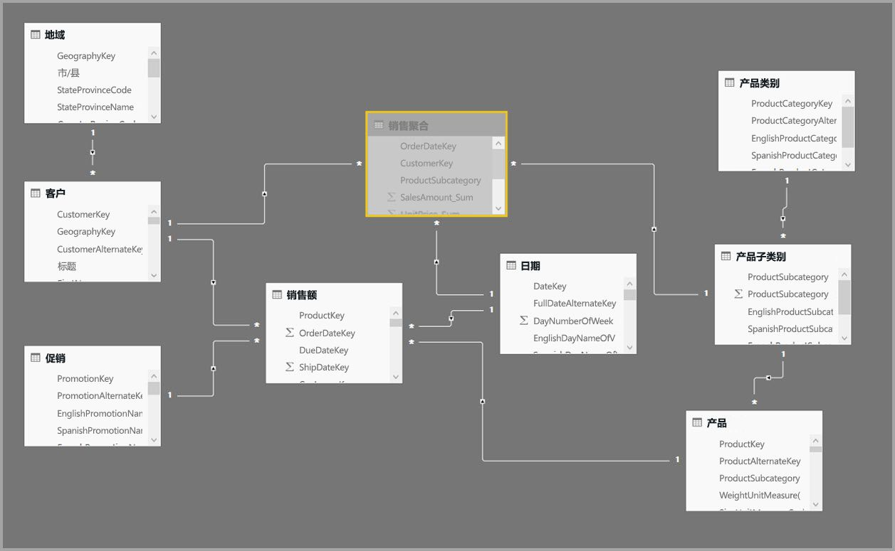
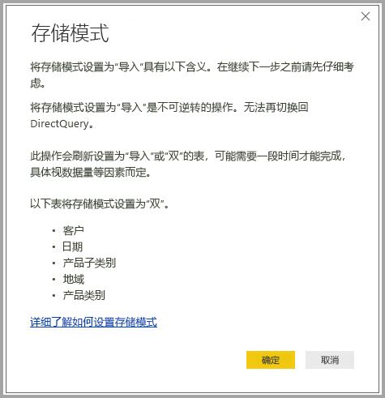
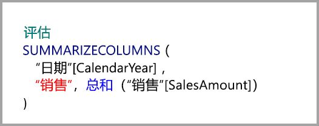
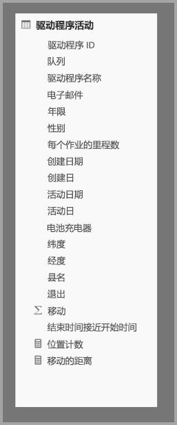
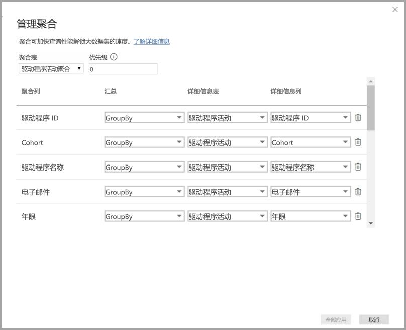
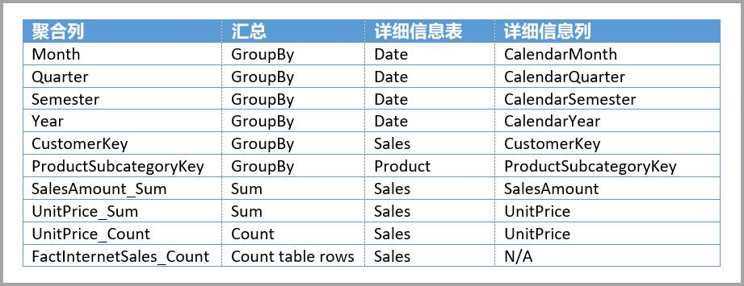
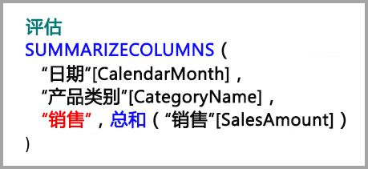
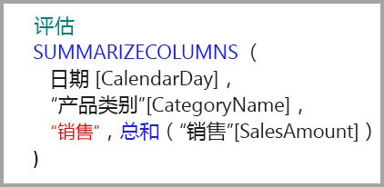

# 在 Power BI Desktop 中使用聚合

借助 Power BI 中的*聚合*，可缩小表的大小，以便专注于重要数据并提高查询性能。 聚合能够以无法另行实现的方式对大数据执行交互式分析，并且可大幅降低解锁大型数据集用于做出决策的成本。

使用聚合的一些优点包括：

- **更高的大数据查询性能**。 与 Power BI 视觉对象的每次交互都会向数据集提交 DAX 查询。 缓存的聚合数据使用详细信息数据所需资源的一小部分，因此，可解锁通过其他方式无法访问的大数据。
- **优化的数据刷新**。 更小的缓存大小可减少刷新时间，因此，用户可以更快地获得数据。
- **平衡的体系结构**。 Power BI 内存中缓存可处理聚合查询、限制 DirectQuery 模式下发送的查询以及帮助满足并发限制。 剩余的详细信息级查询通常是经过筛选的事务级查询，数据仓库和大数据系统通常能够很好地处理此类查询。

维度数据源（如数据仓库和数据市场）可使用[基于关系的聚合](#aggregation-based-on-relationships)。 基于 Hadoop 的大数据源通常[以 GroupBy 列为依据进行聚合](#aggregation-based-on-groupby-columns)。 本文介绍每种数据源的典型 Power BI 建模差异。

## 创建聚合表

若要创建聚合表，请执行以下操作：
1. 根据数据源和模型，使用所需字段设置新表。 
1. 使用“管理聚合”对话框定义聚合。
1. 如果适用，请更改聚合表的[存储模式](#storage-modes)。 

### 管理聚合

创建具有所需字段的新表后，在任何 Power BI Desktop 视图的“字段”窗格中，右键单击该表，然后选择“管理聚合”。

“管理聚合”对话框为表中的每一列显示一行，可在其中指定聚合行为。 在下面的示例中，对“Sales”详细信息表的查询会在内部重定向到“Sales Agg”聚合表。 

“管理聚合”对话框中的“汇总”下拉菜单提供以下值：
- 计数
- GroupBy
- Max
- 最小值
- 求和
- 计算表行数

在此基于关系的聚合示例中，GroupBy 条目是可选的。 除 DISTINCTCOUNT 外，它们不影响聚合行为，并且主要用于提高可读性。 如果不使用 GroupBy 条目，聚合仍可根据关系命中。 这与本文后面介绍的[大数据示例](#aggregation-based-on-groupby-columns)不同，在该示例中，需要 GroupBy 条目。

定义所需的聚合后，选择“全部应用”。 

### 验证

“管理聚合”对话框强制实施以下重要验证：

- “详细信息列”的数据类型必须与“聚合列”相同，“计数”和“计算表行数”**汇总**函数除外。 “计数”和“计算表行数”仅用于整数聚合列，且无需匹配的数据类型。
- 不允许使用涉及三个（及以上）表的链式聚合。 例如，**表 A** 上的聚合不能引用具有引用**表 C** 的聚合的**表 B**。
- 不允许使用重复聚合，重复聚合是指两个条目使用相同的**汇总**函数并引用相同的“详细信息表”和“详细信息列”。
- “详细信息表”必须使用 DirectQuery 存储模式，而不是 Import 存储模式。
- 不支持通过非活动关系所用的外键列进行分组以及依赖 USERELATIONSHIP 函数进行聚合命中。

大多数验证可通过禁用下拉值并在工具提示中显示解释性文本强制实施，如下图所示。

### 聚合表已隐藏

对数据集具有只读访问权限的用户无法查询聚合表。 这可以避免与*行级别安全性 (RLS)* 配合使用时的安全问题。 使用者和查询引用详细信息表（而不是聚合表），并且无需知晓聚合表的存在。

因此，聚合表对“报表”视图隐藏。 如果尚未隐藏该表，则在选择“全部应用”时，“管理聚合”对话框会将其设置为隐藏。

### 存储模式
聚合功能与表级存储模式交互。 Power BI 表可使用 *DirectQuery*、*Import* 或 *Dual* 存储模式。 DirectQuery 直接查询后端，而 Import 则将数据缓存到内存中并将查询发送到缓存的数据。 所有 Power BI Import 和非多维 DirectQuery 数据源都可与聚合配合使用。 

若要将聚合表的存储模式设置为“Import”以加快查询速度，请在Power BI Desktop 的“模型”视图中选择聚合表。 在“属性”窗格中，展开“高级”，然后在“存储模式”中下拉选项，选择“Import”。 请注意，此操作不可逆。 

有关表存储模式的详细信息，请参阅[在 Power BI Desktop 中管理存储模式](desktop-storage-mode.md)。

### 用于聚合的 RLS

若要正确用于聚合，RLS 表达式应同时筛选聚合表和详细信息表。 

在下面的示例中，“Geography”表上的 RLS 表达式可用于聚合，因为“Sales”表和“Sales Agg”表的关系筛选都可筛选“Geography”。 无论查询是否命中聚合表，都将成功应用 RLS。

“Product”表上的 RLS 表达式将仅筛选“Sales”详细信息表，而不筛选“Sales Agg”聚合表。 由于聚合表是详细信息表中数据的另一种表示形式，如果无法应用 RLS 筛选器，则应答聚合表中的查询会是不安全的行为。 不建议仅筛选详细信息表，因为通过此角色进行的用户查询不会受益于聚合命中。 

不允许使用仅筛选“Sales Agg”聚合表而不筛选“Sales”详细信息表的 RLS 表达式。

对于[基于 GroupBy 列的聚合](#aggregation-based-on-groupby-columns)，可使用应用于详细信息表的 RLS 表达式来筛选聚合表，因为聚合表中的所有 GroupBy 列都涵盖在详细信息表中。 另一方面，聚合表中的 RLS 筛选器无法应用于详细信息表，因此被禁用。

## 基于关系的聚合

维度模型通常使用*基于关系的聚合*。 来自数据仓库和数据市场的 Power BI 数据集类似于星型/雪花型架构，其中包含维度表和事实数据表之间的关系。

在来自单一数据源的以下模型中，表使用 DirectQuery 存储模式。 “Sales”事实数据表包含数十亿行。 将“Sales”的存储模式设置为“Import”，因为缓存将占用大量内存和管理开销。

相反，创建“Sales Agg”聚合表。 在“Sales Agg”表中，行数等于按“CustomerKey”、“DateKey”和“ProductSubcategoryKey”分组的“SalesAmount”的总和。 “Sales Agg”表的粒度比“Sales”表高，因此，它可能会包含数百万行，而不是数十亿行，这让管理变得容易得多。

如果以下维度表最常用于具有较高业务价值的查询，则可使用*一对多*或*多对一*关系来筛选“Sales Agg”表。

- 地域
- 客户
- 日期
- 产品子类别
- 产品类别

下图展示了此模型。

下表显示“Sales Agg”表的聚合。

> [!NOTE]
> 与所有表一样，“Sales Agg”表可灵活地通过各种方式进行加载。 可使用 ETL/ELT 进程或通过表的 [M 表达式](/powerquery-m/power-query-m-function-reference)在源数据库中执行聚合。 聚合表可使用 Import 存储模式（有无 [Power BI Premium 中的增量刷新](service-premium-incremental-refresh.md)均可），或者可使用 DirectQuery 并通过[列存储索引](/sql/relational-databases/indexes/columnstore-indexes-overview)针对快速查询进行优化。 这种灵活性可实现平衡的体系结构，从而分散查询负载，避免堵塞。

将“Sales Agg”聚合表的存储模式更改为“Import”会打开一个对话框，提示可将相关维度表设置为“Dual”存储模式。 

设置为“Dual”后，相关维度表即可用作“Import”或“DirectQuery”，具体取决于子查询。 在示例中：

- 可从内存中缓存返回以下查询：聚合“Sales Agg”表（“Import”模式）中的指标，并按相关“Dual”模式表中的属性进行分组。
- 可在 DirectQuery 模式下返回以下查询：聚合“Sales”表（“DirectQuery”模式）中的指标，并按相关“Dual”模式表中的属性进行分组。 查询逻辑（包括 GroupBy 操作）会向下传递到源数据库。

有关“Dual”存储模式的详细信息，请参阅[在 Power BI Desktop 中管理存储模式](desktop-storage-mode.md)。

### 强和弱关系

基于关系的聚合命中需要强关系。

强关系包括以下存储模式组合，其中两个表均来自单个源：

| *多*方上的表 | “一”端上的表 |
| ------------- |----------------------| 
| 双          | 双                 | 
| 导入        | 导入或双       | 
| DirectQuery   | DirectQuery 或双  | 

*跨源*关系被视为强关系的唯一情况为两个表均设置为“Import”。 多对多关系始终被视为弱。

有关不依赖于关系的*跨源*聚合命中，请参阅[基于 GroupBy 列的聚合](#aggregation-based-on-groupby-columns)。 

### 基于关系的聚合查询示例

下面的查询命中聚合，因为“Date”表中的列为可以命中聚合的粒度。 “SalesAmount”列使用“Sum”聚合。

以下查询不会命中聚合。 尽管请求的是“SalesAmount”的总和，但查询会对“Product”表中的列执行 GroupBy 操作，该表的粒度不能命中聚合。 如果观察模型中的关系，会发现产品子类别可以具有多个“Product”行。 该查询将无法确定要聚合到哪个产品。 在这种情况下，查询将恢复为 DirectQuery 并将 SQL 查询提交到数据源。

聚合不只是用于执行简单求和的简单计算。 复杂计算也能获益。 从概念上讲，复杂计算可针对每个 SUM、MIN、MAX 和 COUNT 划分为子查询，并且对每个子查询求值，以确定是否可以命中聚合。 由于查询计划优化，此逻辑并非在所有情况下都正确，但一般情况下都适用。 下面的示例将命中聚合：

COUNTROWS 函数可以受益于聚合。 以下查询会命中聚合，因为针对“Sales”表定义了“计算表行数”聚合。

AVERAGE 函数可以受益于聚合。 以下查询将命中聚合，因为 AVERAGE 的内部计算方法为 SUM 除以 COUNT。 由于 UnitPrice 列具有针对 SUM 和 COUNT 定义的聚合，因此将命中聚合。

在某些情况下，DISTINCTCOUNT 函数可受益于聚合。 下面的查询将命中聚合，因为 CustomerKey 有 GroupBy 项，可在聚合表中维持 CustomerKey 的独特性。 此技术仍可能会达到性能阈值，其中有超过 200 万到 500 万个非重复值可影响查询性能。 然而，它可用于以下方案：详细信息表中包含数十亿行，但列中包含 200 万到 500 万个非重复值。 在这种情况下，DISTINCTCOUNT 的执行速度快于扫描包含数十亿行的表，即使缓存到内存中也是如此。

## 基于 GroupBy 列的聚合 

基于 Hadoop 的大数据模型的特征与维度模型不同。 为了避免大型表之间的联接，大数据模型通常不会使用关系，而是将维度属性非规范化为事实数据表。 可使用*基于 GroupBy 列的聚合*解锁此类大数据模型，以便进行交互式分析。

下表包含要聚合的“移动”数值列。 所有其他列都是要分组的属性。 该表包含 IoT 数据和大量行。 存储模式为 DirectQuery。 由于容量巨大，对跨整个数据集聚合的数据源的查询运行缓慢。 

为了对此数据集启用交互式分析，可添加按大多数属性分组的聚合表，但经度和纬度等基数较大的属性除外。 这极大地减少了行数，使其小到足以顺利放入内存中缓存。 

可在“管理聚合”对话框中为“Driver Activity Agg”表定义聚合映射。 

在基于 GroupBy 列的聚合中，**GroupBy** 条目不是可选的。 如果没有这些条目，聚合将不会命中。 这与使用基于关系的聚合（其中 GroupBy 条目可选）不同。

下表显示“Driver Activity Agg”表的聚合。

你可将“Driver Activity Agg”聚合表的存储模式设置为“Import”。

### GroupBy 聚合查询示例

下面的查询会命中聚合，因为聚合表中涵盖了“Activity Date”列。 COUNTROWS 函数使用“计算表行数”聚合。

尤其是对于事实数据表中包含筛选器属性的模型，使用“计算表行数”聚合是个好办法。 在用户未显式请求的情况下，Power BI 可能使用 COUNTROWS 向数据集提交查询。 例如，筛选器对话框显示每个值的行计数。

## 组合聚合技术

可将关系和 GroupBy 列技术组合用于聚合。 基于关系的聚合可能会要求将非规范化维度表拆分为多个表。 如果这对特定维度表而言代价较大或不切实际，可复制该聚合表中的必要属性，以供这些聚合使用并为其他聚合使用关系。

例如，以下模型复制了“Sales Agg”表中的“Month”、“Quarter”、“Semester”和“Year”。 “Sales Agg”表和“Date”表之间没有关系，但与“Customer”和“Product Subcategory”有关系。 “Sales Agg”的存储模式为“导入”。

下表显示了在“Sales Agg”表的“管理聚合”对话框中设置的项。 “Date”为详细信息表的 GroupBy 条目为必选条目，以便命中用于按“Date”属性分组的查询的聚合。 如上一示例所示，因为存在关系，所以“CustomerKey”和“ProductSubcategoryKey”的“GroupBy”条目不会影响聚合命中，DISTINCTCOUNT 除外。

### 组合聚合查询示例

下面的查询会命中聚合，因为聚合表中包含“CalendarMonth”，且“CategoryName”可通过一对多关系访问。 “SalesAmount”使用“SUM”聚合。

下面的查询不会命中聚合，因为聚合表中不包含“CalendarDay”。

下面的时间智能查询不会命中聚合，因为 DATESYTD 函数会生成一个“CalendarDay”值表，而聚合表不涵盖“CalendarDay”。

## 聚合优先级

聚合优先级允许单个子查询使用多个聚合表。

下面的示例是包含多个源的[复合模型](desktop-composite-models.md)：

- “Driver Activity”（DirectQuery 模式）表包含来自大数据系统的数万亿行 IoT 数据。 它充当钻取查询，用于查看受控制筛选器上下文中的各个 IoT 读数。
- “Driver Activity Agg”表是 DirectQuery 模式的中间聚合表。 它在 Azure SQL 数据仓库中包含数十亿行，并已使用列存储索引在源处进行优化。
- “Driver Activity Agg2”（Import 模式）表的粒度很高，因为 GroupBy 属性较少且基数较低。 行数可以低至数千个，如此即可轻松放入内存中缓存。 这些属性恰好由高配置执行仪表板所用，因此引用它们的查询的运行速度应该很快。

> [!NOTE]
> 只有当聚合表来自 SQL Server、Azure SQL 或 Azure SQL 数据仓库源时，才支持将使用不同数据源的 DirectQuery 聚合表用于详细信息表。

此模型的内存占用量相对较小，但可解锁大型数据集。 它表示一种平衡的体系结构，因为它可根据使用查询负载的各体系结构组件的优势，将查询负载分散于各个组件。

“Driver Activity Agg2”的“管理聚合”对话框将“优先级”字段设置为“10”，这高于“Driver Activity Agg”。 较高的优先级设置意味着使用聚合的查询将先考虑“Driver Activity Agg2”。 如果子查询的粒度不在“Driver Activity Agg2”可应答范围内，则查询将转而考虑“Driver Activity Agg”。 两个聚合表都无法应答的详细信息查询将被定向到“Driver Activity”。

“详细信息表”列中指定的表为“Driver Activity”，而不是“Driver Activity Agg”，因为不允许使用链式聚合。

下表显示“Driver Activity Agg2”表的聚合。

## 检测查询是否命中聚合

SQL Profiler 可检测查询是从内存中缓存存储引擎返回还是由 DirectQuery 推送到数据源。 可使用同一过程来检测聚合是否将被命中。 有关详细信息，请参阅[命中或错过缓存的查询](desktop-storage-mode.md#queries-that-hit-or-miss-the-cache)。 

SQL Profiler 还提供 `Query Processing\Aggregate Table Rewrite Query` 扩展事件。

下面的 JSON 代码片段显示了使用聚合时的事件输出示例。

- **matchingResult** 显示子查询使用了聚合。
- **dataRequest** 显示子查询使用的 GroupBy 列和聚合列。
- mapping 表示已映射到的聚合表中的列。

## 保持缓存同步

除非内存中缓存与源数据保持同步，否则组合使用“DirectQuery”、“Import”和/或“Dual”存储模式的聚合可能会返回不同的数据。 例如，查询执行不会尝试通过筛选 DirectQuery 结果以匹配缓存值来掩盖数据问题。 如有必要，可通过一些现成的技术处理源中的此类问题。 性能优化只能以不影响满足业务需求能力的方式使用。 你有责任了解自己的数据流并相应地进行设计。 

## 后续步骤

有关复合模型的详细信息，请参阅：

- [在 Power BI Desktop 中使用复合模型](desktop-composite-models.md)
- [在 Power BI Desktop 中应用多对多关系](desktop-many-to-many-relationships.md)
- [在 Power BI Desktop 中管理存储模式](desktop-storage-mode.md)

有关 DirectQuery 的详细信息，请参阅：

- [关于在 Power BI 中使用 DirectQuery](desktop-directquery-about.md)
- [Power BI 数据源](desktop-directquery-data-sources.md)
