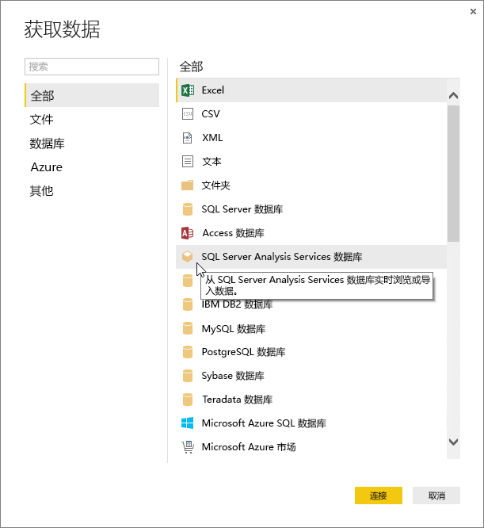
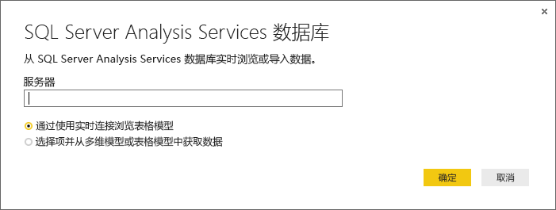

# 在 Power BI Desktop 中连接到 Analysis Services 表格数据
借助 Power BI Desktop，可通过两种方法连接到 SQL Server Analysis Services 表格模型并从中获取数据：通过使用实时连接浏览，或选择项并将其导入到 Power BI Desktop。

让我们仔细了解下。

**通过使用实时连接浏览**：使用实时连接时，表格模型或透视中的项（如表、列和度量值）会在 Power BI Desktop“字段”窗格列表中显示  。 可以使用 Power BI Desktop 的高级可视化效果和报表工具以全新且高度交互的方式浏览表格模型。

在进行实时连接时，表格模型中的数据不会导入到 Power BI Desktop 中。 每次与可视化效果进行交互时，Power BI Desktop 都将查询表格模型，并计算出你所看到的结果。 你始终都可以查看表格模型中可用的最新数据，可以从上次处理时间开始查看，也可以从表格模型中提供的 DirectQuery 表开始查看。 

请记住，表格模型是高度安全的。 在 Power BI Desktop 中显示的项目取决于你对连接到的表格模型所具有的权限。

当你在 Power BI Desktop 中创建了动态报表后，可以将它们发布到 Power BI 站点进行共享。 将可实时连接到表格模型的 Power BI Desktop 文件发布到 Power BI 站点时，必须由管理员安装和配置本地数据网关。 若要了解详细信息，请参阅[本地数据网关](service-gateway-onprem.md)。

**选择项并导入到 Power BI Desktop**：使用此选项连接时，可以选择表格模型或透视中的项（如表、列和度量值），并将其加载到 Power BI Desktop 模型。 使用 Power BI Desktop 的 Power Query 编辑器进一步绘制所需内容及其建模功能，以便进一步为数据建模。 由于 Power BI Desktop 与表格模型之间没有实时连接，因此可以脱机浏览 Power BI Desktop 模型或将其发布到 Power BI 站点。

## 要连接到表格模型，请执行以下操作：
1. 在 Power BI Desktop 中的“主页”选项卡上，选择“获取数据” > “更多” > “数据库”     。
   
1. 选择“SQL Server Analysis Services 数据库”，然后选择“连接”   。
   
   
3. 在“SQL Server Analysis Services 数据库”窗口中，输入服务器名称，选择连接模式，然后选择“确定”    。
   
   
4. “导航器”窗口中的此步骤取决于所选的连接模式  ：

   - 如果你正处于实时连接中，请选择表格模型或透视。
  
      
   - 如果选择项目并获取数据，请选择表格模型或透视，然后选择要加载的特定表或列。 若要在加载前对数据进行调整，请选择“编辑查询”以打开 Power Query 编辑器  。 准备就绪时，选择“加载”将数据导入到 Power BI Desktop  。

      

## 常见问题解答
**问：** 我是否需要一个本地数据网关？

**答：** 这视具体情况而定。 如果你使用 Power BI Desktop 实时连接到表格模型，但不打算发布到 Power BI 站点，则不需要网关。 另一方面，如果你确实想将其发布到 Power BI 站点，则数据网关是必需的，以确保 Power BI 服务与你的本地 Analysis Services 服务器之间的通信安全。 请务必在安装数据网关之前与 Analysis Services 服务器管理员联系。

如果你选择了选择项目并获取数据，则你会将表格模型数据直接导入到 Power BI Desktop 文件中，因此不需要网关。

**问：** 从 Power BI 服务实时连接到表格模型与从 Power BI Desktop 中实时连接到表格模型之间有什么区别？

**答：** 当从 Power BI 服务中的站点将表格模型实时连接到组织中的本地 Analysis Services 数据库时，需要本地数据网关来确保它们之间的通信安全。 当从 Power BI Desktop 实时连接到表格模型时，因为 Power BI Desktop 和要连接到的 Analysis Services 服务器都是在组织中本地运行的，因此不需要网关。 但是，如果将 Power BI Desktop 文件发布到 Power BI 站点，则需要网关。

**问：** 如果我创建了实时连接，我能否连接到同一个 Power BI Desktop 文件中的其他数据源？

**答：** 否。 你不能在同一文件中浏览实时数据并连接到其他类型的数据源。 如果你已导入数据或连接到 Power BI Desktop 文件中的另一个数据源，你则需要新建一个文件来实时浏览。

**问：** 如果我创建了实时连接，我可以在 Power BI Desktop 中编辑模型或进行查询吗？

**答：** 可以在 Power BI Desktop 中创建报表级别度量值，但当浏览实时数据时会禁用所有其他查询和建模功能。

**问：** 如果我创建了实时连接，它是安全的吗？

**答：** 是。 你当前的 Windows 凭据用于连接到 Analysis Services 服务器。 在实时浏览时，你不能在 Power BI 服务或 Power BI Desktop 中使用基本或存储的凭据。

**问：** 在导航器中，我看到模型和透视。 有什么区别？

**答：** 透视是表格模型的特定视图。 它可能仅包含特定的表、列或度量值，具体取决于独特的数据分析需求。 表格模型始终包含至少一个透视，其中能包含模型中的所有内容。 如果你不确定应选择哪种透视，请与管理员确认。

**问：** Analysis Services 的任何功能是否会改变 Power BI 的行为方式？

**答：** 是。 根据表格模型所使用的功能，Power BI Desktop 中的体验可能会发生改变。 示例包括：
* 你可能会看到模型中的度量值组合在“字段”窗格列表的顶部，而不是列旁边的表中  。 别担心，你仍可以正常使用它们，只是这样做可以更轻松地找到它们。

* 如果表格模型定义了计算组，则只能将它们与模型度量值结合使用，而不能与通过向视觉对象添加数值字段而创建的隐式度量值结合使用。 该模型还可能手动设置了“DiscourageImplicitMeasures”标记，这具有相同的效果  。 若要了解详细信息，请参阅 [Analysis Services 中的计算组](https://docs.microsoft.com/analysis-services/tabular-models/calculation-groups#benefits)。

## 初始连接后更改服务器名称
使用实时浏览连接创建 Power BI Desktop 文件后，可能会出现你想要将连接切换到其他服务器的情况。 例如，如果当你在连接到开发服务器时创建了 Power BI Desktop 文件，在发布到 Power BI 服务前，你想要将连接切换至生产服务器。

若要更改服务器名称，请执行以下操作：

1. 从“主页”选项卡中选择“编辑查询”   。

2. 在“SQL Server Analysis Services 数据库”窗口中，输入新的服务器名称，然后选择“确定”    。

   
## 故障排除 
以下列表介绍了连接到 SQL Server Analysis Services (SSAS) 或 Azure Analysis Services 时出现的所有已知问题： 

* **错误:无法加载模型架构**：当连接到 Analysis Services 的用户无权访问数据库/模型时，通常会出现此错误。

