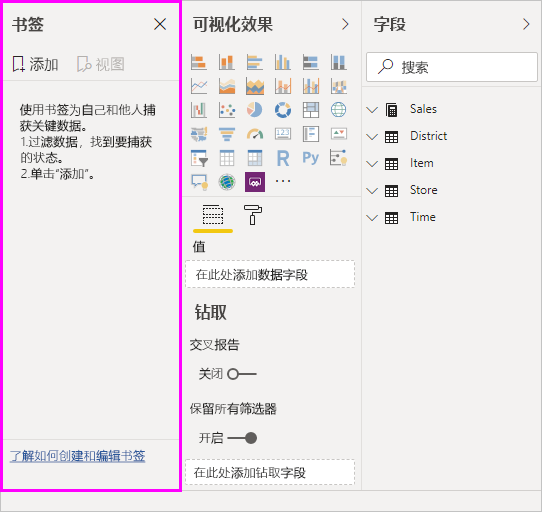
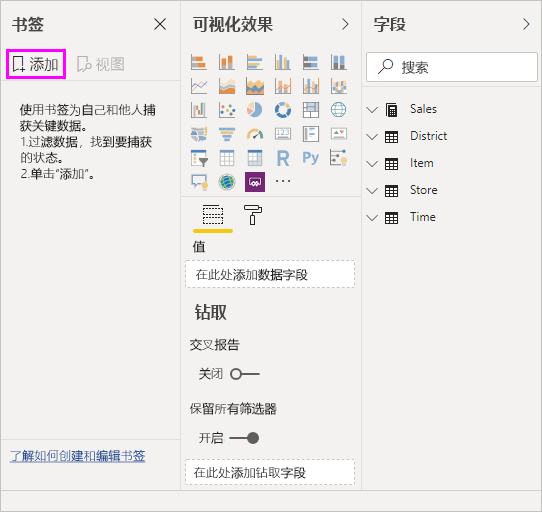
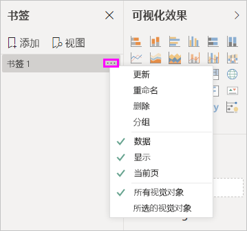
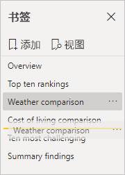
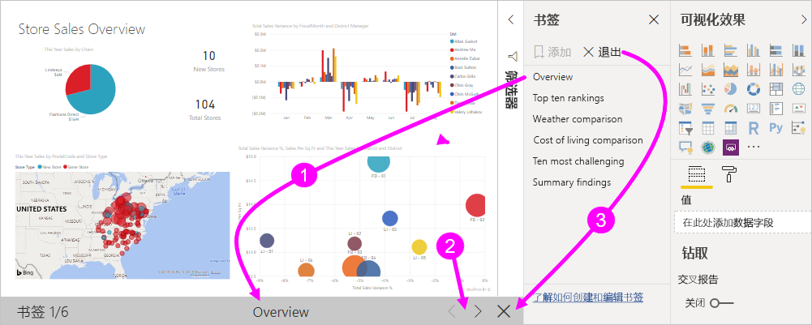
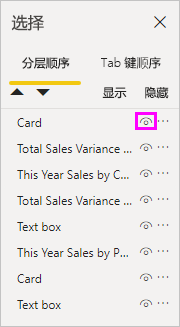
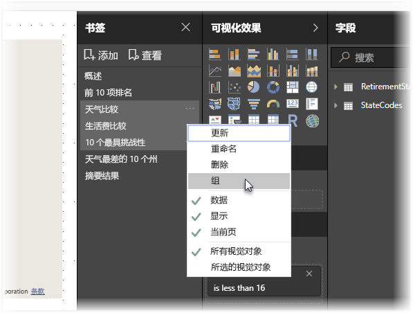
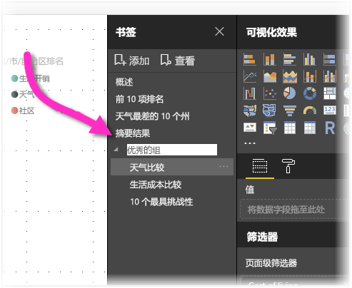
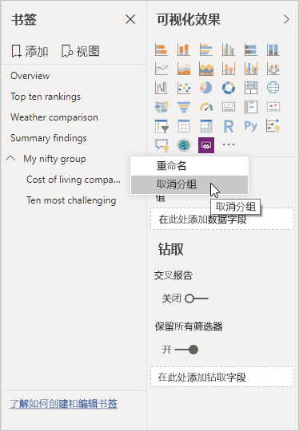

# 使用 Power BI Desktop 中的书签来共享见解和创建情景
使用 Power BI Desktop 中的书签，可以捕获当前配置的报表页视图（其中包含视觉对象的筛选和状态）  。 稍后，可以通过选择已保存书签恢复相应状态。 

还可以创建一系列书签，按所需的顺序进行排列，随后在演示文稿中逐个展示所有书签，以突出显示一系列见解，或要通过视觉对象和报表诠释的情景。 

书签的用途有许多。 例如，可以使用书签跟踪自己的报表创建进度（书签易于添加、删除和重命名），也可以通过创建书签来生成类似于 PowerPoint 的演示文稿，依序逐一展示所有书签，通过报表诠释情景。 

> [!TIP]
> 有关在 Power BI 服务中使用个人书签的信息，请参阅[在 Power BI 服务中公布个人书签](https://powerbi.microsoft.com/blog/announcing-personal-bookmarks-in-the-power-bi-service/)。 

## 使用书签
若要使用书签，请从 Power BI Desktop 功能区中选择“视图”选项卡，然后选择“书签窗格”   。 

创建书签时，以下元素将与书签一起保存：

* 当前页
* 筛选器
* 切片器（包括下拉列表或列表等切片器类型）和切片器状态
* 视觉对象选择状态（如交叉突出显示筛选器）
* 排序顺序
* 钻取位置
* 对象可见性（通过使用“选择”窗格  ）
* 任何可见对象的“焦点”或“聚焦”  模式

配置报表页，确保它在书签中的显示效果符合自己的要求。 按照所需方式排列报表页和视觉对象后，选择“书签”窗格中的“添加”，添加一个书签   。 

此时，Power BI Desktop 会创建书签，并为其提供一个通用名称。 可以选择书签名称旁边的省略号，再从出现的菜单中选择相应操作，从而轻松地重命名、删除或更新书签    。

创建书签后，通过在“书签”窗格中选择它来显示书签  。 

还可以选择是否每个书签都将应用“数据”属性（如筛选器和切片器）、“显示”属性（如聚焦及其可见性），以及“当前页”更改，显示添加书签时可见的页面    。 使用书签在报表视图或视觉对象选择之间切换时，这些功能非常有用，在这种情况下，你可能希望关闭数据属性，因此当用户通过选择书签切换视图时，不会重置筛选器。 

要做出此类更改，请选择书签名称旁的省略号，然后勾选或取消选中“数据”、“显示”及其他控件旁边的复选标记   。 

## 排列书签
创建书签时，可能会发现，书签的创建顺序不同于向受众展示书签的顺序。 这也没问题，因为可以轻松地对书签进行重新排序。

- 在“书签”窗格中，拖放书签以更改其顺序  。 

   书签之间的黄色栏决定了书签的拖放目标位置。

   

使用书签的“查看”功能时，书签顺序可能会变得非常重要，如下一部分所述  。

## 以幻灯片形式放映书签
若要依序展示一系列书签，可以选择“书签”  窗格中的“查看”  ，开始放映幻灯片。

在“查看”模式下，有一些功能值得注意  。

   

1. 书签名称显示在画布底部的书签标题栏中。

2. 书签标题栏中的箭头可用于移到下一个或上一个书签。

3. 可以退出“查看”模式，具体方法为选择“书签”窗格中的“退出”，或选择书签标题栏中的“X”     。 

在“查看”模式下，可以通过选择此窗格上的“X”关闭“书签”窗格，为演示文稿提供更多空间    。 同时，在“查看”模式下，所有视觉对象都可以进行交互和交叉突出显示，就像直接与它们交互时一样  。 

## 可见性：使用“选择”窗格
与“书签”窗格相关，“选择”窗格列出了当前页上的所有对象，方便用户选择对象，并指定对象是否可见   。 

在“选择”窗格中，选择一个对象并通过选择该对象右侧的眼睛图标切换该对象当前是否可见  。 

添加书签时，每个对象的可见状态也随之保存，具体视“选择”窗格中的设置而定  。 

请务必注意，切片器会继续筛选报表页，无论它们是否可见。 因此，可以创建切片器设置不同的多个书签，让一个报表页在各种书签中呈现出不同的显示效果（并突出显示不同的见解）。

## 形状和图像的书签关联
还可以将形状和图像与书签相关联。 借助此功能，在选择对象后，会看到与这个对象相关联的书签。 使用按钮时，此功能尤其有用。 有关详细信息，请参阅[使用 Power BI 中的按钮](desktop-buttons.md)。 

若要将书签分配给对象： 

1. 在报表画布中选择对象。 然后，从显示的“设置形状格式”窗格中，启用“操作”滑块    。

2. 展开“操作”部分  。 在“类型”下，选择“书签”   。

3. 在“书签”下，选择书签  。

   

对于与书签相关联的对象，可以执行各种有意思的操作。 可以在报表页上创建可视内容表，也可以提供相同信息的不同视图（如视觉对象类型）。

处于编辑模式时，请 Ctrl 并选择要跟踪的链接  。 不处于编辑模式下时，请选择要跟随链接的对象。 

## 书签组

从 2018 年 8 月版 Power BI Desktop 开始，可以创建并使用书签组。 书签组是指定书签的集合，可按照组的形式显示和排列。 

若要创建书签组： 
1. 按 Ctrl 并选择要包含在组中的书签  。 

2. 选择所选书签旁边的省略号，然后从出现的菜单中选择“组”  。

   

Power BI Desktop 自动将该组命名为“组 1”  。 可以选择此名称旁边的省略号，选择“重命名”，然后将其重命名为所需的任何名称  。

对于任何书签组，展开书签组的名称仅展开或折叠书签组，其本身并不代表书签。 

使用书签的“查看”功能时，将应用以下详细信息  ：

* 如果所选书签位于组中，在书签中选择“查看”时，查看会话中仅显示该组中的书签   。 

* 如果所选书签不在组中，或位于最高级别（如书签组的名称），将播放整个报表的所有书签，包括所有组中的书签。 

取消书签分组： 
1. 选择组中的任意书签，然后选择省略号。 

2. 从显示的菜单中选择“取消分组”  。

   

   对组中的任何书签选择“取消分组”将删除组中所有书签（会删除组，但不会删除书签本身）  。 

若要从组中删除单个书签： 
1. “取消分组”该组中的任何成员，这将删除整个组  。 

2. 按 Ctrl 并选择每个书签来选择新组中所需的成员，然后再次选择“组”   。 

## 使用“聚焦”
与书签一起发布的另一项功能是“聚焦”  。 使用“聚焦”，可以吸引用户注意特定图表。例如，在“查看”模式下呈现书签  。

比较一下“聚焦”与“焦点”模式，看看它们有何不同：

1. 使用焦点模式，可以选择视觉对象的“焦点模式”图标，这将导致视觉对象填充整个画布  。

2. 使用“聚焦”，可以从视觉对象的省略号中选择“聚焦”以突出显示其原始大小的视觉对象，这将导致页面上的所有其他视觉对象淡入接近透明的状态  。 

当选择上图中视觉对象的“焦点模式”图标时，页面显示如下  ：

相比之下，如果选择视觉对象的省略号菜单中的“聚焦”，页面如下所示  ：

如果在添加书签时选择了“焦点”或“聚焦”模式的任何一种，书签中会一直保留此模式。

## Power BI 服务中的书签
将包含至少一个书签的报表发布到 Power BI 服务后，可以在 Power BI 服务中查看这些书签，并与之交互。 当在报表中使用书签时，可以通过选择“查看” > “选择窗格”或“查看” > “书签窗格”来显示“选择”窗格和“书签”窗格       。 

在 Power BI 服务中，“书签”窗格的使用方式与在 Power BI Desktop 中一样，包括可以选择“查看”功能，依序展示书签，如同放映幻灯片一样   。

使用灰色书签标题栏（而不是黑色箭头）浏览书签。 （黑色箭头移动到报表页，而不是书签。）

## 启用书签预览功能（2018 年 3 月之前的版本）
自 Power BI Desktop 2018 年 3 月版起，推出通用版的标签功能。 

我们始终建议升级到最新版本。 但是如果你的 Power BI Desktop 版本早于此发布版本，可尝试使用自 Power BI Desktop2017 年 10 月版起推出的“书签”功能，而且 Power BI 服务中也具有启用了书签的报表。 

若要启用预览书签功能： 

1. 选择“文件” > “选项和设置” > “选项” > “预览功能”，然后选择“书签”      。 

   

2. 重新启动 Power BI Desktop，以启用书签的预览版本。

## 限制和注意事项
这一版“书签”功能有一些限制和注意事项。

* 大多数自定义视觉对象应该能够与书签很好地配合使用。 但是，如果在使用书签和自定义视觉对象时遇到问题，请与该自定义视觉对象的创建者联系，并要求他们向视觉对象添加书签支持。 
* 如果在创建书签后在报表页上添加视觉对象，此视觉对象会以默认状态显示。 也就是说，如果在之前创建书签的页面中引入切片器，此切片器会在默认状态下运行。
* 创建书签后，如果移动视觉对象，书签中也会自动予以反映。 

## 后续步骤
若要详细了解与书签类似的功能或如何与书签交互，请参阅以下文章：

* [在 Power BI Desktop 中使用钻取](desktop-drillthrough.md)
* [在“焦点”模式下显示仪表板磁贴或报表视觉对象](consumer/end-user-focus.md)

