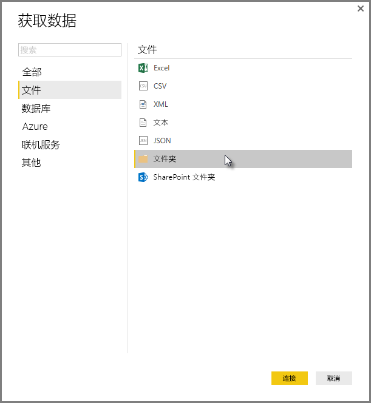
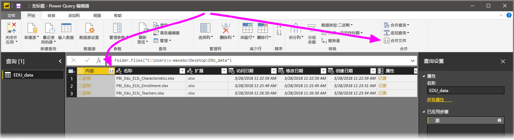
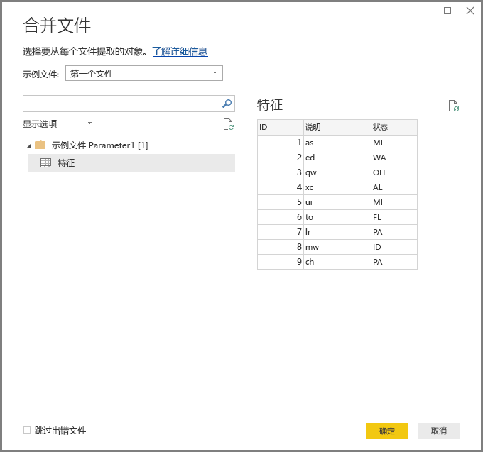
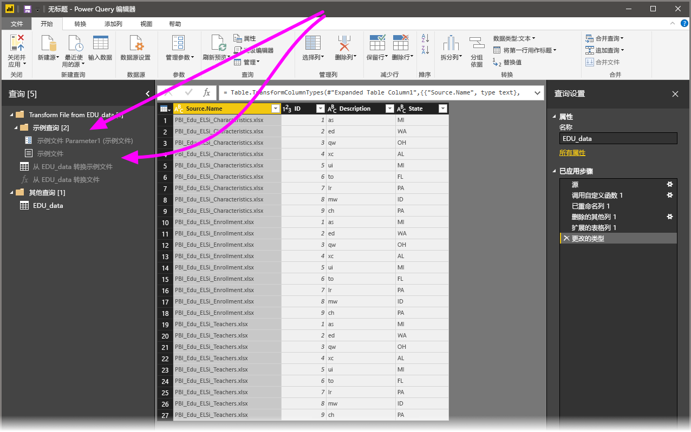

# 合并 Power BI Desktop 中的文件（二进制文件）
向 **Power BI Desktop** 导入数据的一个强大的方法是将具有同一架构的多个文件合并到一个逻辑表中。 如本文中所述，这一方便且受欢迎的方法变得更为便捷且使用范围更广。

若要从同一文件夹中启动合并文件的过程，请选择“获取数据”>“文件”>“文件夹”  。

## 合并文件行为
可从“查询编辑器”中的“主页”功能区选项卡或从列本身选择“合并文件”来**合并文件（二进制文件）**    。

**合并文件**转换执行如下操作：

* 合并文件  转换分析每个输入文件，并确定要使用的正确文件格式，如文本  或 Excel 工作簿  或 JSON  文件。
* 借助转换，可以从第一个文件选择特定对象，例如，要提取的 Excel 工作簿。 
  
  
* 合并文件  然后会自动执行以下查询：
  
  * 创建在单个文件中执行所有所需提取步骤的示例查询。
  * 创建功能查询，该功能查询将参数化示例查询的文件/二进制文件输入。   将示例查询和功能查询进行链接，以在功能查询中反映对示例查询所做的更改。
  * 使用输入二进制文件（如文件夹查询）将功能查询应用于原始查询，以使其应用于每一行的二进制文件输入的功能查询，然后将生成的数据提取扩展为顶级列。  
    
    

> [!NOTE]
> Excel 工作簿中的选择范围将影响合并二进制文件的行为。 例如，可以选择特定的工作表来合并该工作表，或者选择根目录来合并整个文件。 选择文件夹将合并该文件夹中找到的文件。 

借助**合并文件**行为，可以轻松合并给定文件夹内的所有文件，前提是它们具有相同的文件类型和结构（如同一列）。

此外，还可以通过修改自动创建的示例查询  轻松应用其他转换或提取步骤，而无需担心修改或创建其他功能查询  步骤。 对示例查询  所做的任何更改都会在链接的功能查询  中自动生成。

## 后续步骤
你可以使用 Power BI Desktop 连接到各种数据。 有关数据源的详细信息，请参阅下列资源：

* [什么是 Power BI Desktop？](desktop-what-is-desktop.md)
* [Power BI Desktop 中的数据源](desktop-data-sources.md)
* [使用 Power BI Desktop 调整和合并数据](desktop-shape-and-combine-data.md)
* [通过 Power BI Desktop 连接到 CSV 文件](desktop-connect-csv.md)   
* [直接将数据输入到 Power BI Desktop 中](desktop-enter-data-directly-into-desktop.md)   

