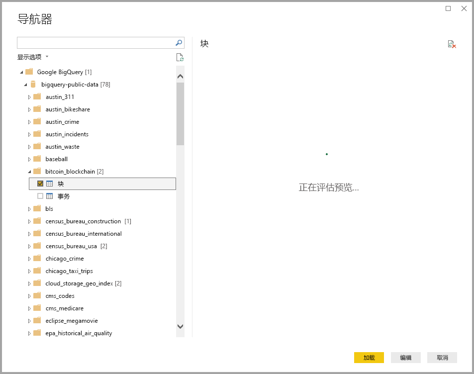

# <a name="connect-to-a-google-bigquery-database-in-power-bi-desktop"></a>在 Power BI Desktop 中连接到 Google BigQuery 数据库
在 Power BI Desktop 中，你可以连接到 Google BigQuery  数据库，并以 Power BI Desktop 中使用其他所有数据源相同的方式使用基础数据。

## <a name="connect-to-google-bigquery"></a>连接到 Google BigQuery
若要连接到 Google BigQuery  数据库，请从 Power BI Desktop 中的“主页”  功能区选择“获取数据”  。 选择左侧类别中的“数据库”  ，然后便会看到“Google BigQuery”  。


在显示的 Google BigQuery  窗口中，登录到 Google BigQuery 帐户并选择“连接”  。


登录后，将看到以下窗口指示已经过身份验证。 


连接成功后，将会出现“导航器”  窗口，并显示服务器上可用的数据。你可以从这些数据中选择要在 **Power BI Desktop** 中导入和使用的一个或多个元素。



## <a name="considerations-and-limitations"></a>注意事项和限制
对于 Google BigQuery  连接器，需要牢记以下限制和注意事项：

* Power BI Desktop 和 Power BI 服务中提供了 Google BigQuery 连接器。 在 Power BI 服务中，可以使用从 Power BI 到 Google BigQuery 的云到云连接访问连接器。

可以将 Power BI 与 Google BigQuery 计费项目  结合使用。 默认情况下，Power BI 使用从列表中为用户返回的第一个项目。 若要自定义与 Power BI 结合使用时计费项目的行为，可执行以下步骤：

 * 在“源”步骤的基础 M 中指定以下选项，这可以通过使用 Power BI Desktop 中的 Power Query 编辑器  进行自定义：

    ```Source = GoogleBigQuery.Database([BillingProject="Include-Billing-Project-Id-Here"])```

## <a name="next-steps"></a>后续步骤
你可以使用 Power BI Desktop 连接到各种数据。 有关数据源的详细信息，请参阅下列资源：

* [什么是 Power BI Desktop？](desktop-what-is-desktop.md)
* [Power BI Desktop 中的数据源](desktop-data-sources.md)
* [使用 Power BI Desktop 调整和合并数据](desktop-shape-and-combine-data.md)
* [通过 Power BI Desktop 连接到 Excel 工作簿](desktop-connect-excel.md)   
* [直接将数据输入到 Power BI Desktop 中](desktop-enter-data-directly-into-desktop.md)   

