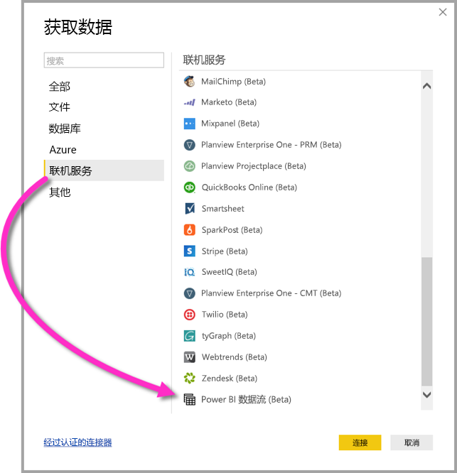

# 在 Power BI Desktop 中连接到 Power BI 数据流创建的数据 (Beta)
在 Power BI Desktop 中，可以连接到 Power BI 数据流创建的数据，就像在 Power BI Desktop 中连接任何其他数据源一样。

通过 Power BI 数据流 (Beta)连接器，可以连接到 Power BI 服务中的数据流创建的实体。 

## 注意事项和限制

若要使用此 Beta 版 Power BI 数据流连接器，必须运行最新版本的 Power BI Desktop。 可随时[下载 Power BI Desktop](desktop-get-the-desktop.md) 并将其安装到计算机上，以确保使用最新版本。  

> [!NOTE]
> 旧版 Power BI 数据流连接器需要下载一个 .MEZ 文件并将其放入文件夹中。 当前版本的 Power BI Desktop 包括 Power BI 数据流连接器，因此不再需要该文件，并且它可能导致与所包含的连接器版本冲突。 如果手动将该 .MEZ 文件放入文件夹，必须从“文档”>“Power BI Desktop”>“自定义连接器”文件夹删除下载的那个 .MEZ 文件，避免出现冲突。 

## 桌面性能
Power BI Desktop 在安装它的计算机上本地运行。 数据流的引入性能由多种因素决定。 这些因素包括数据大小、计算机的 CPU 和 RAM、网络带宽、与数据中心之间的距离以及其他因素。

用户可以提高数据流的数据引入性能。 例如，如果引入的数据大小太大，无法在计算机上管理 Power BI Desktop，可以使用数据流中的链接实体和计算实体来聚合数据（数据流内）并仅引入预先准备好的聚合数据。 通过这种方式，可以在数据流中在线处理大型数据，而不是在 Power BI Desktop 正在运行的实例中本地执行。 这种方法可以让 Power BI Desktop 引入更少量的数据，并使用户始终拥有快速且响应及时的数据流体验。

## 后续步骤
可通过 Power BI 数据流执行各种有趣的操作。 有关详细信息，请参阅下列资源：

* [数据流自助服务数据准备](service-dataflows-overview.md)
* [在 Power BI 中创建和使用数据流](service-dataflows-create-use.md)
* [在 Power BI Premium 上使用计算实体（预览）](service-dataflows-computed-entities-premium.md)
* [将数据流与本地数据源配合使用（预览）](service-dataflows-on-premises-gateways.md)
* [Power BI 数据流的开发人员资源（预览）](service-dataflows-developer-resources.md)

还有一些关于 Power BI Desktop 的文章，你可能会发现它们很有用：

* [Power BI Desktop 中的数据源](desktop-data-sources.md)
* [使用 Power BI Desktop 调整和合并数据](desktop-shape-and-combine-data.md)
* [直接将数据输入到 Power BI Desktop 中](desktop-enter-data-directly-into-desktop.md)   

