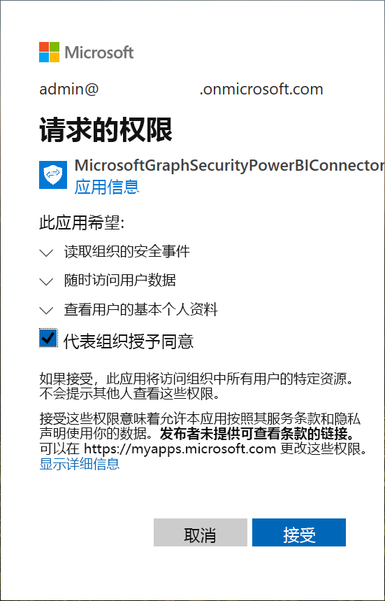
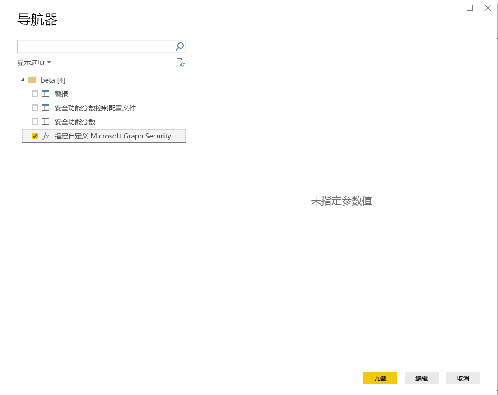

# 连接到 Power BI Desktop 中的 Microsoft Graph Security API

使用 Power BI Desktop 的 Microsoft Graph Security 连接器连接到 [Microsoft Graph Security API](https://aka.ms/graphsecuritydocs)。 然后可生成仪表板和报表，从而可深入了解与安全相关的[警报](https://docs.microsoft.com/graph/api/resources/alert?view=graph-rest-1.0)和[安全功能分数](https://docs.microsoft.com/graph/api/resources/securescores?view=graph-rest-beta)。

Microsoft Graph Security API 连接了来自 Microsoft 及其生态系统合作伙伴的[多个安全解决方案](https://aka.ms/graphsecurityalerts)，以更轻松地关联警报。 通过这种组合，可以访问丰富的上下文信息并简化自动化。 通过该组合，组织能够在降低成本和复杂性的同时，快速获得见解并跨多个安全产品执行操作。

## 使用 Microsoft Graph Security 连接器的先决条件

若要使用 Microsoft Graph Security 连接器，必须显式获得 Azure Active Directory (Azure AD) 租户管理员的同意。 请参阅 [Microsoft Graph Security 身份验证要求](https://aka.ms/graphsecurityauth)。
获得同意需要连接器的应用程序 ID 和名称，这里引用了该 ID 和名称，可在 [Azure 门户](https://portal.azure.com)中获得：

| 属性 | 值 |
|----------|-------|
| **应用程序名称** | `MicrosoftGraphSecurityPowerBIConnector` |
| **应用程序 ID** | `cab163b7-247d-4cb9-be32-39b6056d4189` |
|||

若要授予连接器同意，Azure AD 租户管理员可以使用以下任一方法：

* [为 Azure AD 应用程序授予同意](https://docs.microsoft.com/azure/active-directory/develop/v2-permissions-and-consent)

* 通过[应用程序许可体验](https://docs.microsoft.com/azure/active-directory/develop/application-consent-experience)响应逻辑应用在首次运行期间提交的请求
   
如果用户不是安全管理员角色的成员，则登录 Microsoft Graph Security 连接器的用户帐户必须是被分配的 Azure AD 安全读取者角色。 请参阅[向用户分配 Azure AD 角色](https://docs.microsoft.com/graph/security-authorization#assign-azure-ad-roles-to-users)。

## 使用 Microsoft Graph Security 连接器

按照以下步骤使用连接器：

1. 在 Power BI Desktop 的“主页”功能区中，选择“获取数据” > “更多”。
2. 在窗口左侧的类别列表中选择“联机服务”。
3. 选择“Microsoft Graph Security (Beta)”。

    
    
4. 在“Microsoft Graph Security”窗口中，选择要查询的 Microsoft Graph API 版本：v1.0 或 beta。

    
    
5. 出现提示时，请登录到 Azure Active Directory 帐户。 此帐户需要具有“安全读取者”或“安全管理员”角色，如上一节所述。

     
    
6. 如果是租户管理员，且还未获得 Microsoft Graph Security Power BI 连接器（应用程序）同意，则将出现以下对话框。 选择“代表组织授予同意”。

    
    
7. 登录后，将看到以下对话框，表示已经过身份验证。 选择“连接”。

    
    
8. 连接后，“导航器”窗口将显示步骤 4 中所选版本的 [Microsoft Graph 安全性 API](https://aka.ms/graphsecuritydocs) 中提供的警报、安全分数和其他实体。 选择要在 Power BI Desktop 中导入和使用的一个或多个实体。 然后，选择“加载”以获取在步骤 9 之后显示的结果视图。

    
    
9. 如果想使用 Microsoft Graph 安全性 API 进行高级查询，选择“指定自定义 Microsoft Graph 安全性 URL 以筛选结果”。 使用该功能，借助访问 API 所需的权限对 Microsoft Graph 安全性 API 发出 [OData.Feed](https://docs.microsoft.com/power-bi/desktop-connect-odata) 查询。

   以下示例使用 `https://graph.microsoft.com/v1.0/security/alerts?$filter=Severity eq 'High'` serviceUri。 要了解如何生成查询以筛选、排序或检索最新结果，请参阅 [OData 系统查询选项](https://docs.microsoft.com/graph/query-parameters)。

   
    
   选择“调用”时，OData.Feed 函数会调用 API，从而打开查询编辑器。 可以筛选和优化要使用的数据集。 然后，将该数据加载到 Power BI Desktop。

这是我们查询的 Microsoft Graph Security 实体的结果窗口：

   
    

现在，你已经准备好在 Power BI Desktop 中使用从 Microsoft Graph Security 连接器导入的数据。 可以创建图形或报告。 也可以与从 Excel 工作簿、数据库或其他数据源导入的其他数据进行交互。

## 后续步骤
* 在 [Microsoft Graph 安全性 GitHub Power BI 示例](https://aka.ms/graphsecuritypowerbiconnectorsamples)上查看使用此连接器的 Power BI 示例和模板。

* 有关用户方案和其他信息，请参阅 [Microsoft Graph 安全性 Power BI 连接器博客文章](https://aka.ms/graphsecuritypowerbiconnectorblogpost)。

* 可以使用 Power BI Desktop 连接到各种数据。 有关详细信息，请参阅下列资源：

    * [什么是 Power BI Desktop？](desktop-what-is-desktop.md)
    * [Power BI Desktop 中的数据源](desktop-data-sources.md)
    * [使用 Power BI Desktop 成型和合并数据](desktop-shape-and-combine-data.md)
    * [通过 Power BI Desktop 连接到 Excel 工作簿](desktop-connect-excel.md)
    * [直接将数据输入到 Power BI Desktop 中](desktop-enter-data-directly-into-desktop.md)
