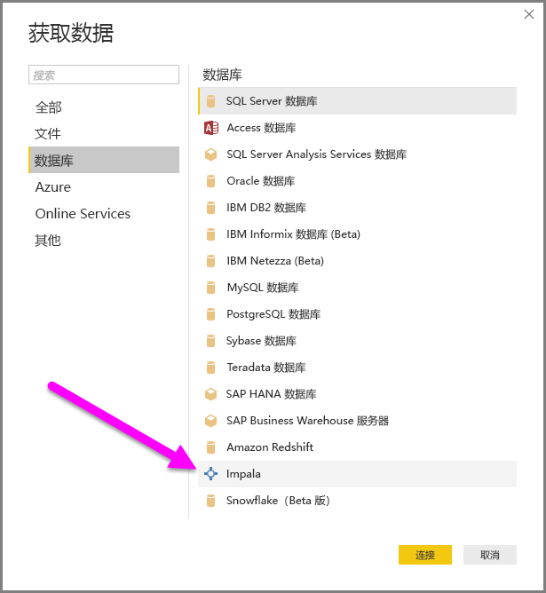
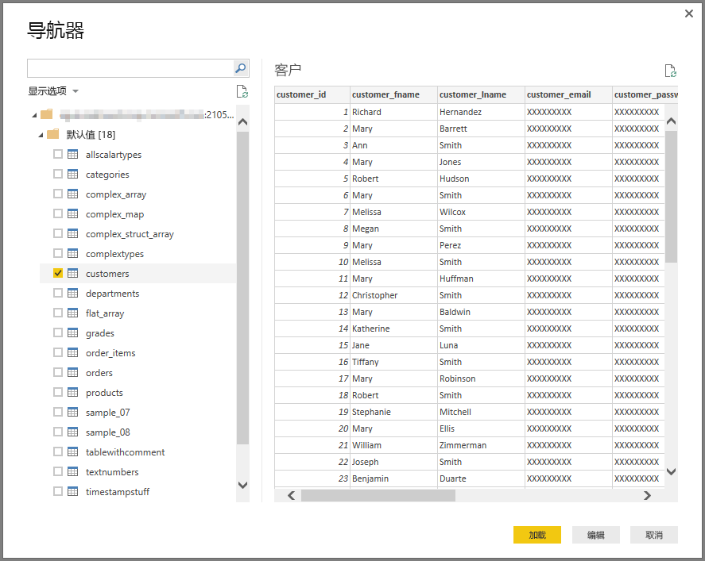

# 在 Power BI Desktop 中连接到 Impala 数据库
在 Power BI Desktop 中，可以连接到 Impala 数据库，并使用基础数据，就像在 Power BI Desktop 中使用其他任何数据源一样。

## 连接到 Impala 数据库
若要连接到 Impala 数据库，请按以下步骤操作： 

1. 在 Power BI Desktop 的“主页”功能区中，选择“获取数据”。 

2. 从左侧的类别中选择“数据库”。 此时，“Impala”显示。

    

3. 在随即显示的“Impala”窗口中，将 Impala 服务器名称键入或粘贴到框中。 然后，选择“确定”。 可以将数据直接导入 Power BI，也可以使用 DirectQuery。 详细了解如何[使用 DirectQuery](desktop-use-directquery.md)。

    

4. 看到提示时，输入凭据或匿名连接。 Impala 连接器支持匿名身份验证、基本身份验证（用户名 + 密码）和 Windows 身份验证。

    

    > [!NOTE]
    > 在你输入用户名和密码以连接特定 Impala 服务器后，Power BI Desktop 便会在后续连接尝试中使用这些相同的凭据。 可以通过“文件”>“选项和设置”>“数据源设置”来修改这些凭据。

5. 连接后，便会看到“导航器”窗口，其中显示服务器上的可用数据。 从此数据中选择要在 Power BI Desktop 中导入并使用的元素。

    

## 注意事项和限制
对于 Impala 连接器，请牢记以下几点限制和注意事项：

* 支持对本地数据网关使用 Impala 连接器（使用三种受支持的身份验证机制中的任意一种）。

## 后续步骤
使用 Power BI Desktop，可连接到多个不同的数据源。 若要详细了解数据源，请参阅以下资源：

* [什么是 Power BI Desktop？](desktop-what-is-desktop.md)
* [Power BI Desktop 中的数据源](desktop-data-sources.md)
* [使用 Power BI Desktop 成型和合并数据](desktop-shape-and-combine-data.md)
* [通过 Power BI Desktop 连接到 Excel 工作簿](desktop-connect-excel.md)   
* [直接将数据输入到 Power BI Desktop 中](desktop-enter-data-directly-into-desktop.md)   

