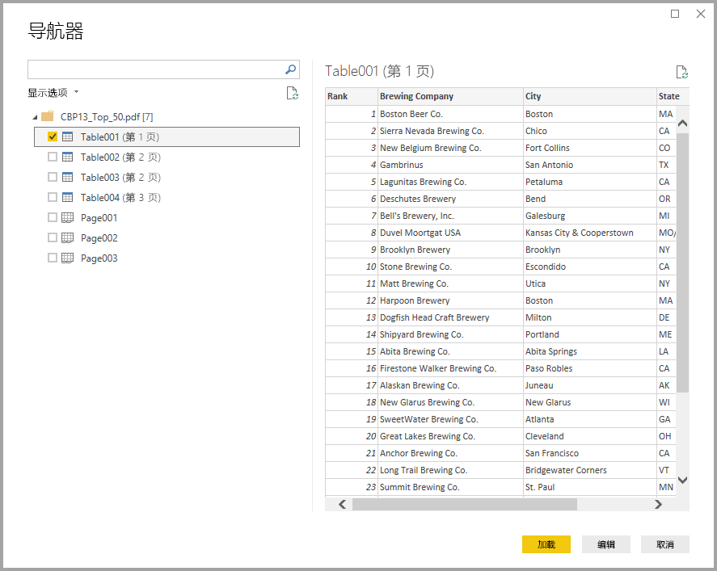

# 在 Power BI Desktop 中连接到 PDF 文件
在 Power BI Desktop 中，可以连接到 PDF 文件并使用文件中包含的数据，就像在 Power BI Desktop 中使用任何其他数据源一样  。

以下部分介绍如何连接到 PDF 文件，选择数据并将该数据添加到 Power BI Desktop   。

始终建议升级到最新版 Power BI Desktop，可通过[获取 Power BI Desktop](desktop-get-the-desktop.md) 中的链接获取最新版  。 

## 连接到 PDF 文件
若要连接到 PDF 文件，请从 Power BI Desktop 中的“主页”功能区选择“获取数据”    。 从左侧的类别中选择“文件”，然后即可看到 PDF   。

系统会提示你提供要使用的 PDF 文件的位置。 提供文件位置并加载 PDF 文件后，将会出现“导航器”窗口，并显示文件中可用的数据。可从这些数据中选择要在 Power BI Desktop 中导入和使用的一个或多个元素   。

选择 PDF 文件中已发现元素旁边的复选框，将其显示在右侧窗格中。 如果已准备好导入，请选择“加载”按钮，将数据添加到 Power BI Desktop 中   。

从 2018 年 11 月发布的 Power BI Desktop  开始，可以将起始页  和结束页  指定为 PDF 连接的可选参数。 还可以使用以下格式在 M 公式语言中指定这些参数：

`Pdf.Tables(File.Contents("c:\sample.pdf"), [StartPage=10, EndPage=11])`

## 后续步骤
你可以使用 Power BI Desktop 连接到各种数据。 有关数据源的详细信息，请参阅下列资源：

* [什么是 Power BI Desktop？](desktop-what-is-desktop.md)
* [Power BI Desktop 中的数据源](desktop-data-sources.md)
* [使用 Power BI Desktop 调整和合并数据](desktop-shape-and-combine-data.md)
* [通过 Power BI Desktop 连接到 Excel 工作簿](desktop-connect-excel.md)   
* [直接将数据输入到 Power BI Desktop 中](desktop-enter-data-directly-into-desktop.md)   

