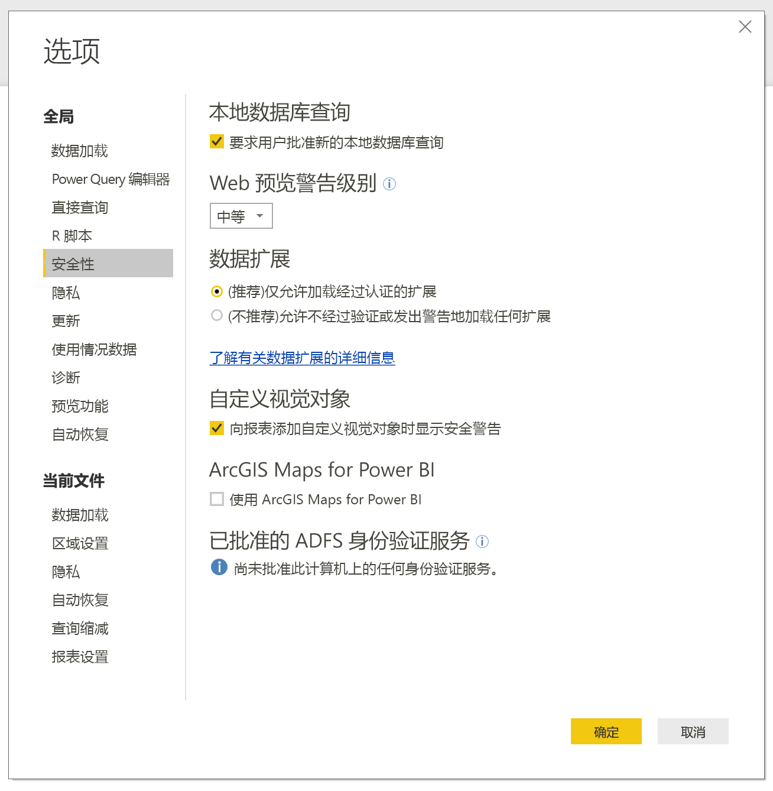

# Power BI 中的连接器扩展性

在 Power BI 中，客户和开发者可以通过多种方式扩展所连接到的数据源。 他们使用现有连接器和泛型数据源（例如 ODBC、OData、Oledb、Web、CSV、XML、JSON）。 或者，开发者会创建数据扩展插件（称为自定义连接器  ），并使它们成为认证连接器  。

当前，可使用菜单启用自定义连接器  ，以便安全地控制要在系统上运行的自定义代码级别。 可以在“获取数据”  对话框中选择 所有自定义连接器或是仅由 Microsoft 认证和分发的连接器。

## 自定义连接器

自定义连接器  能够容纳各种可能性，包括对业务至关重要的小型 API，以及 Microsoft 尚未发布连接器的大型行业特定服务。 许多连接器由供应商进行分发。 如果需要特定数据连接器，则应与供应商联系。

若要使用自定义连接器  ，请将其放在 \[Documents]\\Power BI Desktop\\Custom Connectors  文件夹中，并按照以下部分所述调整安全设置。

无需调整安全设置即可使用“经认证的连接器”  。

## 数据扩展插件安全性

若要更改数据扩展插件安全设置，请在 Power BI Desktop  中依次选择“文件”>“选项和设置”>“选项”>“安全”  。

在“数据扩展插件”下，可从两个安全级别中进行选择  ：

* （推荐）仅允许加载经过认证的扩展
* （不推荐）允许加载任何插件而不发出警告

如果计划使用“自定义连接器”或者自行或第三方开发的连接器，则必须选择“(不推荐)允许加载任何扩展而不发出警告”   。 除非绝对信任自定义连接器，否则不建议使用此安全设置。 因为其中的代码可以处理凭据（包括通过 HTTP 发送它们），会忽略隐私级别。

如果系统中存在自定义连接器，则会在“(推荐)”  安全设置中收到错误“以下连接器尚未获得认证，我们无法确认能否安全使用它”，后跟无法安全加载的连接器的列表。

若要在不更改安全性的情况下解决错误，请从“Custom Connectors”文件夹中删除未签名的连接器。

若要解决该错误并使用这些连接器，请将安全设置更改为之前所述的“(不推荐)允许任何扩展加载(不现实警告)”  设置。 然后重启 Power BI Desktop  。

## 经过认证的连接器

数据扩展插件的有限子集被视为已认证  。 可在“获取数据”  对话框中访问已认证连接器。 但是，创建连接器的第三方开发者负责维护和支持。 虽然 Microsoft 会分发连接器，但不对其性能或持续正常工作负责。

如果想要认证自定义连接器，请让供应商联系 dataconnectors@microsoft.com。
