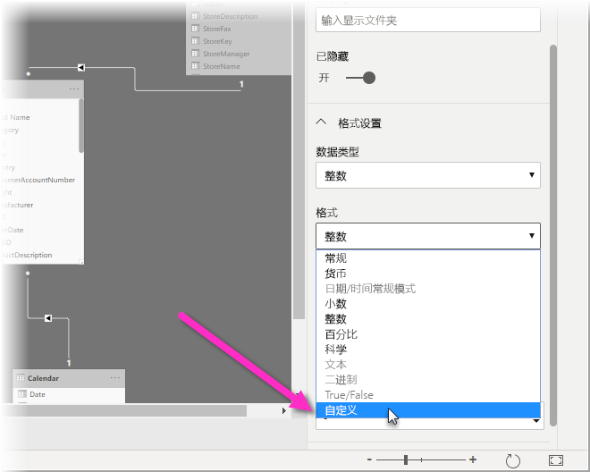

# 在 Power BI Desktop 中使用自定义格式字符串

借助 Power BI Desktop 中的自定义格式字符串，可以自定义字段在视觉对象中的显示方式，并确保报表的外观与预期外观完全相同。

## 如何使用自定义格式字符串

若要创建自定义格式字符串，请在“建模”视图中选择相应字段，然后从“属性”窗格中选择“格式”。

从“格式”下拉列表中选择“自定义”后，可以从常用格式字符串列表中进行选择。 

## 支持的自定义格式语法

自定义格式字符串遵循 Excel 和其他 Microsoft 产品通用的 VBA 样式语法，但不支持其他产品中使用的所有语法。 

下表定义 Power BI 中支持的语法。

下表显示了支持的日期符号：

| **符号** | **范围** |
| --- | --- |
| _d_ | 1-31（每月的某一日，不带前导零） |
| _dd_ | 01-31（每月的某一日，带有前导零） |
| _m_ | 1-12（每年的某一月，不带前导零，从 1 月 = 1 开始） |
| _mm_ | 01-12（每年的某一月，带有前导零，从 1 月 = 01 开始） |
| _mmm_ | 显示缩写的月份名称（回历月份名称没有缩写） |
| _mmmm_ | 显示完整的月份名称 |
| _yy_ | 00-99（年份的最后两位数） |
| _yyyy_ | 100-9999（三位数或四位数年份） |

下表显示了支持的时间符号：

| **符号** | **范围** |
| --- | --- |
| _h_ | 0-23（附加了 &quot;AM&quot; 或 &quot;PM&quot; 的 1-12）（一天中的时间，不带前导零） |
| _hh_ | 00-23（附加了 &quot;AM&quot; 或 &quot;PM&quot; 的 01-12）（一天中的时间，带有前导零） |
| _n_ | 0-59（每小时的某一分钟，不带前导零） |
| _nn_ | 00-59（每小时的某一分钟，带有前导零） |
| _m_ | 0-59（每小时的某一分钟，不带前导零）。 仅当前面带有 _h_ 或 _hh_ 时 |
| _mm_ | 00-59（每小时的某一分钟，带有前导零）。 仅当前面带有 _h_ 或 _hh_ 时 |
| _s_ | 0-59（一分钟中的某一秒，不带前导零） |
| _ss_ | 00-59（一分钟中的某一秒，带有前导零） |

可以查看有关如何设置自定义值字符串格式的[示例](https://docs.microsoft.com/office/vba/language/reference/user-interface-help/format-function-visual-basic-for-applications#example)。

数字的用户定义格式表达式可以包含用分号分隔的一至三个部分。 如果分号之间没有任何内容，则不会显示缺少的部分（将为 &quot;&quot;）。 如果未指定分号，则将使用正数格式。

下面是不同值字符串的不同格式的示例：

|   | **格式字符串** |   |   |   |
| --- | --- | --- | --- | --- |
| **值** | **0.00;-0.0;&quot;零&quot;** | **0.00;;** | **0.00;-0.0;** | **0.00;** |
| **-1.234** | -1.2 | &quot;&quot; | -1.2 | &quot;&quot; |
| **0** | &quot;零&quot; | &quot;&quot; | &quot;&quot; | 0.00 |
| **1.234** | 1.23 | 1.23 | 1.23 | 1.23 |

下表标识了预定义的命名日期和时间格式：

| **格式名称** | **说明** |
| --- | --- |
| **常规日期** | 显示日期和/或时间，例如 4/3/93 05:34 PM。 如果没有小数部分，则仅显示日期，例如 4/3/93。 如果没有整数部分，则仅显示时间，例如 05:34 PM。 日期显示由你的系统设置来决定。 |
| **长日期** | 根据系统的长日期格式显示日期。 |
| **短日期** | 使用系统的短日期格式显示日期。 |
| **长时间** | 使用系统的长时间格式显示时间；包括小时、分钟、秒。 |
| **短时间** | 使用 24 小时格式显示时间，例如 17:45。 |

命名数字格式

下表标识了预定义的命名数字格式：

| **格式名称** | **说明** |
| --- | --- |
| **常规数字** | 显示不带千位分隔符的数字。 |
| **货币** | 显示带有千位分隔符的数字（如果适用）；显示小数点分隔符右侧的两位数。 输出基于系统区域设置。 |
| **固定** | 显示小数点分隔符左侧至少一位数，以及小数点分隔符右侧两位数。 |
| **标准** | 显示带有千位分隔符的数字，小数点分隔符左侧至少一位数，以及小数点分隔符右侧两位数。 |
| **百分比** | 显示乘以 100 的数字，并在右侧附加百分号 (**%**)；始终显示小数点分隔符右侧两位数。 |
| **科学** | 使用标准科学记数法。 |

下表标识了可用于创建用户定义的日期/时间格式的字符。

| **字符** | **说明** |
| --- | --- |
| (**:**) | 时间分隔符。 在某些区域设置中，其他字符可用于表示时间分隔符。 设置时间值格式时，时间分隔符用于分隔小时、分钟和秒。 在格式化的输出中用作时间分隔符的实际字符由你的系统设置来决定。 |
| (**/**) | 日期分隔符。 在某些区域设置中，其他字符可用于表示日期分隔符。 设置日期值格式时，日期分隔符用于分隔日期、月份和年份。 在格式化的输出中用作日期分隔符的实际字符由你的系统设置来决定。 |
| d | 将日期显示为不带前导零的数字 (1–31)。 |
| dd | 将日期显示为带有前导零的数字 (01–31)。 |
| ddd | 以缩写形式 (Sun–Sat) 显示日期。 已本地化。 |
| dddd | 以全称形式 (Sunday–Saturday) 显示日期。 已本地化。 |
| m | 将月份显示为不带前导零的数字 (1–12)。 如果 m 紧接在 h 或 hh 之后，则显示分钟而不是月份。 |
| mm | 将月份显示为带有前导零的数字 (01–12)。 如果 m 紧接在 h 或 hh 之后，则显示分钟而不是月份。 |
| mmm | 以缩写形式 (Jan–Dec) 显示月份。 已本地化。 |
| mmmm | 以全称形式 (January–December) 显示月份。 已本地化。 |
| yy | 将年份显示为 2 位数字 (00–99)。 |
| yyyy | 将年份显示为 4 位数字 (100–9999)。 |
| h | 将小时显示为不带前导零的数字 (0–23)。 |
| hh | 将小时显示为带有前导零的数字 (00–23)。 |
| n | 将分显示为不带前导零的数字 (0–59)。 |
| nn | 将分显示为带有前导零的数字 (00–59)。 |
| S | 将秒显示为不带前导零的数字 (0–59)。 |
| ss | 将秒显示为带有前导零的数字 (00–59)。 |
| AM/PM | 使用 12 小时制时钟并显示大写的 AM 以及中午之前的任意小时；显示大写的 PM 以及中午到晚上 11:59 之间的任意小时。 |

下表标识了可用于创建用户定义的数字格式的字符。

| **字符** | **说明** |
| --- | --- |
| 无 | 显示不带格式的数字。 |
| (**0**) | 数字占位符。 显示一个数字或零。 如果在格式字符串中出现 0 的位置处，表达式具有一个数字，则显示该数字；否则，在该位置处显示零。 如果数字位数少于格式表达式中的零个数（小数任意一侧），则显示前导零或尾随零。 如果小数点分隔符右侧的数字位数多于格式表达式中小数点分隔符右侧的零个数，则将该数字舍入为与零个数相同的小数位数。 如果小数点分隔符左侧的数字位数多于格式表达式中小数点分隔符左侧的零个数，则不加修改地显示额外的数字。 |
| (**#**) | 数字占位符。 显示一个数字或不显示任何内容。 如果在格式字符串中出现 # 的位置处，表达式具有一个数字，则显示该数字；否则，在该位置处不显示任何内容。 此符号的工作原理与 0 数字占位符类似，不同之处在于，如果数字位数等于或少于格式表达式中小数点分隔符任意一侧的 # 字符数，则不会显示前导零或尾随零。 |
| (**.** ) | 小数点占位符。 在某些区域设置中，逗号用作小数点分隔符。 小数点占位符用于确定小数点分隔符左侧和右侧显示的位数。 如果格式表达式只包含此符号左侧的数字符号，则小于 1 的数字以小数点分隔符开头。 若要显示带有小数数字的前导零，请将 0 用作小数点分隔符左侧的第一个数字占位符。 在格式化的输出中用作小数点占位符的实际字符取决于系统所识别的数字格式。 |
| (**%)** | 百分比占位符。 表达式乘以 100。 百分比字符 (**%**) 插入在格式字符串中出现的位置。 |
| (**,**) | 千位分隔符。 在某些区域设置中，句点用作千位分隔符。 千位分隔符用于在小数点分隔符左侧具有四位或更多位数的数字中分隔千位与百位。 如果格式包含由数字占位符（**0** 或 **#**）包围的千位分隔符，则指定千位分隔符的标准用法。 两个相邻千位分隔符或紧接在小数点分隔符左侧的千位分隔符（无论是否指定小数）表示&quot;通过将数字除以 1000 来缩小数字，并根据需要进行舍入。&quot;例如，可以使用格式字符串 &quot;##0,,&quot; 将 100 百万表示为 100。 小于 1 百万的数字显示为 0。 除紧接在小数点分隔符左侧以外的任何位置中的两个相邻千位分隔符仅被视为指定千位分隔符的使用。 在格式化的输出中用作千位分隔符的实际字符取决于系统所识别的数字格式。 |
| (**:**) | 时间分隔符。 在某些区域设置中，其他字符可用于表示时间分隔符。 设置时间值格式时，时间分隔符用于分隔小时、分钟和秒。 在格式化的输出中用作时间分隔符的实际字符由你的系统设置来决定。 |
| (**/**) | 日期分隔符。 在某些区域设置中，其他字符可用于表示日期分隔符。 设置日期值格式时，日期分隔符用于分隔日期、月份和年份。 在格式化的输出中用作日期分隔符的实际字符由你的系统设置来决定。 |
| (**E- E+ e- e+**) | 科学记数格式。 如果格式表达式在 E-、E+、e- 或 e+ 右侧至少包含一个数字占位符（**0** 或 **#**），则以科学记数法格式显示数字，并在数字及其指数之间插入 E 或 e。 右侧的数字占位符数决定了指数中的位数。 使用 E- 或 e- 在负指数旁边放置减号。 使用 E+ 或 e+ 在负指数旁边放置减号，在正指数旁边放置加号。 |
| **- + $**  ( ) | 显示文本字符。 若要显示未列出的字符，请在开头加上一个反斜杠 (\) 或用双引号 (&quot; &quot;) 将它括起来。 |
| (**\**) | 显示格式字符串中的下一个字符。 若要将具有特殊含义的字符显示为文本字符，请在开头加上一个反斜杠 (\)。 不会显示反斜杠本身。 使用反斜杠与用双引号将下一个字符括起来相同。 若要显示反斜杠，请使用两个反斜杠 (\\)。 不能显示为文本字符的字符示例包括日期格式和时间格式字符（a、c、d、h、m、n、p、q、s、t、w、/ 和 :）、数字格式字符（#、0、%、E、e、逗号和句点）以及字符串格式字符（@、&amp;、\&lt;、\&gt; 和 !）。 |
| (&quot;ABC&quot;) | 显示双引号 (&quot; &quot;) 中的字符串。 |

## 后续步骤
你可能还会对以下文章感兴趣：

* [VBA 格式字符串](https://docs.microsoft.com/office/vba/language/reference/user-interface-help/format-function-visual-basic-for-applications#example)
* [Power BI Desktop 中的度量值](desktop-measures.md)
* [Power BI Desktop 中的数据类型](desktop-data-types.md)
* [表格中的条件格式设置](desktop-conditional-table-formatting.md)

