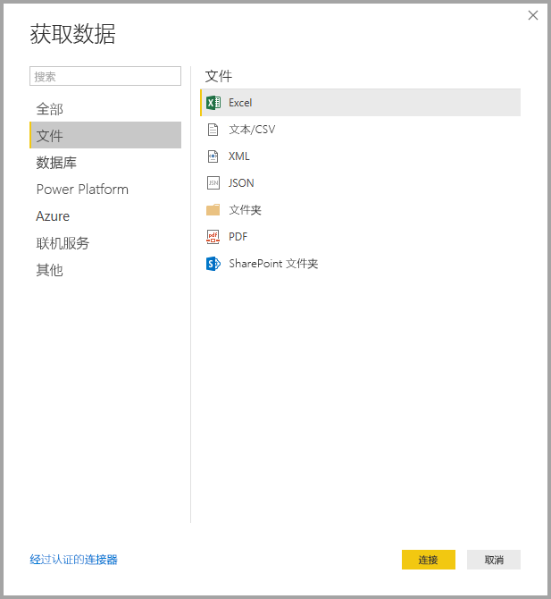
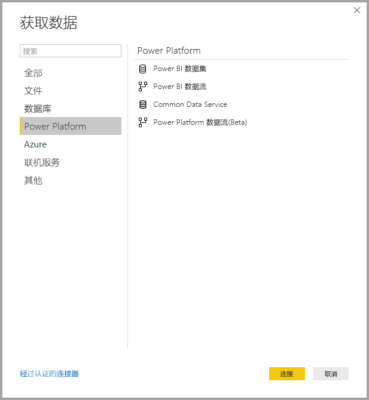
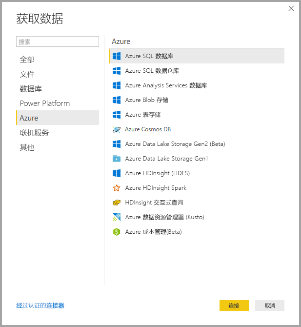
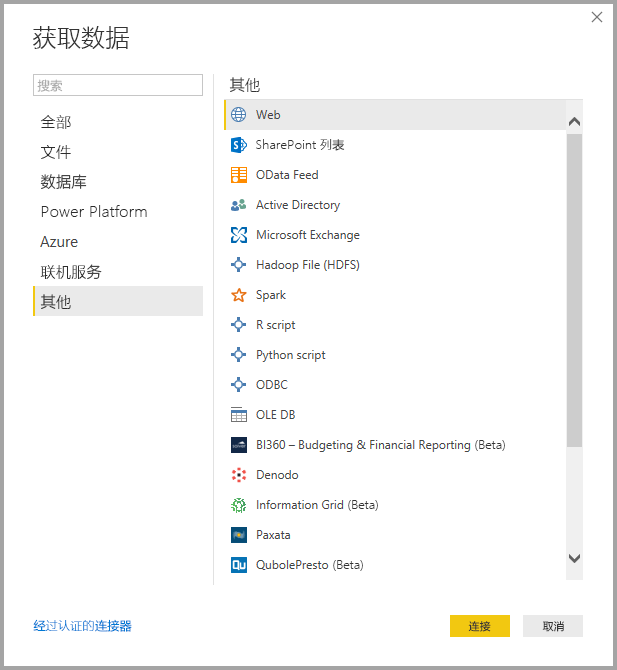
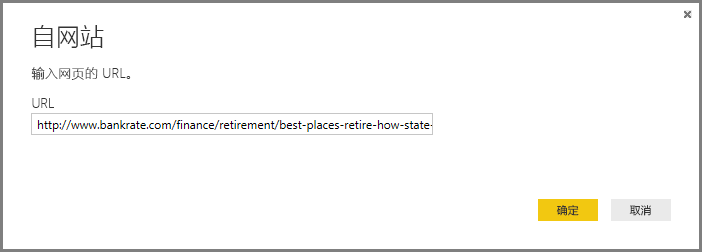
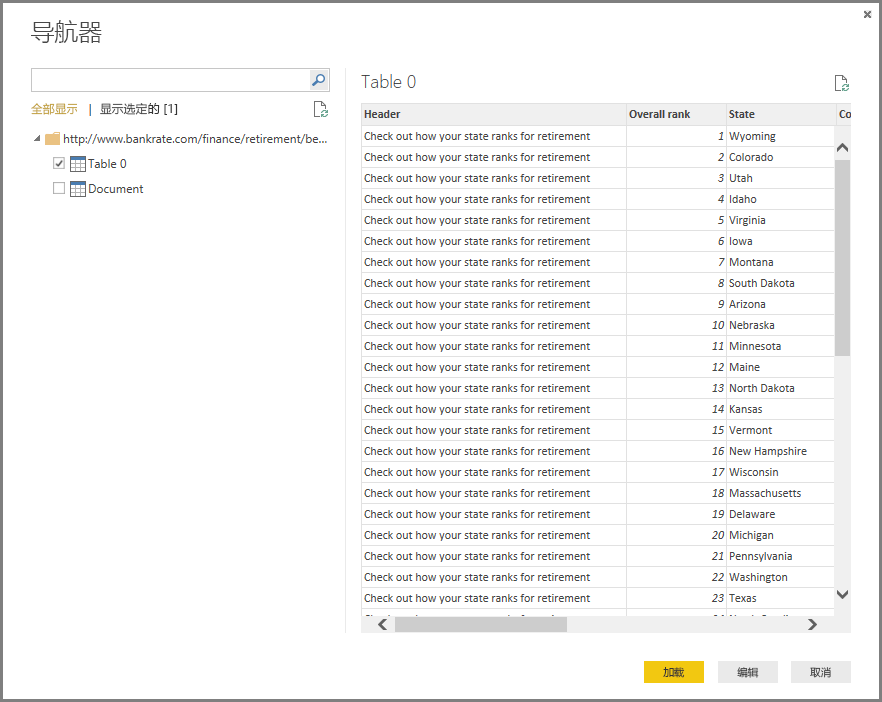

# <a name="data-sources-in-power-bi-desktop"></a>Power BI Desktop 中的数据源

使用 Power BI Desktop，你可以连接到来自许多不同的源的数据。 有关可用数据源的完整列表，请参阅 [Power BI 数据源](power-bi-data-sources.md)。

你可以使用“主页”功能区连接到数据。 若要显示“最常用”数据类型菜单，请选择“获取数据”按钮标签或向下箭头。


转到“获取数据”对话框，显示“最常用”数据类型菜单，然后选择“更多”。 你还可以通过直接选择“获取数据”图标来打开“获取数据”对话框（绕过“最常用”菜单）。


> [!NOTE]
> Power BI 团队正在不断扩展适用于 Power BI Desktop 和 Power BI 服务的数据源。 因此，你通常会看到工作过程中的数据源版本标记为 **Beta** 或**预览**。 标记为 Beta 或预览的任何数据源所提供的支持和功能有限，不应在生产环境中使用。 此外，任何标记为 Power BI Desktop Beta 或预览版的数据源在数据源正式发布 (GA) 之前可能都无法在 Power BI 服务或其他 Microsoft 服务中使用。

> [!NOTE]
> Power BI Desktop 中的许多数据连接器都需要 Internet Explorer 10（或更高版本）进行身份验证。 


## <a name="data-sources"></a>数据源

“获取数据”对话框按以下类别组织数据类型：

* 全部
* 文件
* 数据库
* Power Platform
* Azure
* Online Services
* 其他

**全部**类别包括来自所有类别的所有数据连接类型。

### <a name="file-data-sources"></a>文件数据源

**文件**类别提供下列数据连接：

* Excel
* 文本/CSV
* XML
* JSON
* 文件夹
* PDF
* SharePoint 文件夹

下图显示**文件**的**获取数据**窗口。



### <a name="database-data-sources"></a>数据库数据源

**数据库**类别提供下列数据连接：

* SQL Server 数据库
* Access 数据库
* SQL Server Analysis Services 数据库
* Oracle 数据库
* IBM DB2 数据库
* IBM Informix 数据库 (Beta)
* IBM Netezza
* MySQL 数据库
* PostgreSQL 数据库
* Sybase 数据库
* Teradata 数据库
* SAP HANA 数据库
* SAP Business Warehouse 应用程序服务器
* SAP Business Warehouse 消息服务器
* Amazon Redshift
* Impala
* Google BigQuery
* Vertica
* Snowflake
* Essbase
* AtScale 多维数据集 (Beta)
* BI 连接器
* Denodo
* Dremio
* Exasol
* Indexima (Beta)
* InterSystems IRIS (Beta)
* Jethro (Beta)
* Kyligence
* MarkLogic

> [!NOTE]
> 某些数据库连接器需要通过选择“文件”>“选项和设置”>“选项”，然后再选择“预览功能”才能启用。 如果你没有看到上面提到的某些连接器，但想使用它们，请检查“预览功能”设置。 另请注意，标记为 *Beta* 或*预览*的任何数据源所提供的支持和功能有限，不应在生产环境中使用。

下图显示**数据库**的**获取数据**窗口。


### <a name="power-platform-data-sources"></a>Power Platform 数据源

“Power 平台”类别提供下列数据连接：

* Power BI 数据集
* Power BI 数据流
* Common Data Service
* Power Platform 数据流

下图显示 Power 平台的“获取数据”窗口。



### <a name="azure-data-sources"></a>Azure 数据源

**Azure** 类别提供下列数据连接：

* Azure SQL 数据库
* Azure SQL 数据仓库
* Azure Analysis Services 数据库
* Azure Blob 存储
* Azure 表存储
* Azure Cosmos DB
* Azure Data Lake Storage Gen2
* Azure Data Lake Storage Gen1
* Azure HDInsight (HDFS)
* Azure HDInsight Spark
* HDInsight 交互式查询
* Azure 数据资源管理器 (Kusto)
* Azure 成本管理
* Azure 时序见解 (Beta)

下图显示 **Azure** 的**获取数据**窗口。



### <a name="online-services-data-sources"></a>联机服务数据源

**Online Services** 类别提供下列数据连接：

* SharePoint Online 列表
* Microsoft Exchange Online
* Dynamics 365 (联机)
* Dynamics NAV
* Dynamics 365 Business Central
* Dynamics 365 Business Central (本地)
* Microsoft Azure 使用见解(Beta)
* Azure DevOps (Beta)
* Azure DevOps Server (Beta)
* Salesforce 对象
* Salesforce 报表
* Google Analytics
* Adobe Analytics
* appFigures (Beta)
* Data.World - 获取数据集 (Beta)
* Facebook
* GitHub (Beta)
* LinkedIn Sales Navigator (Beta)
* MailChimp (Beta)
* Marketo (Beta)
* Mixpanel (Beta)
* Planview Enterprise One - PRM (Beta)
* Planview Projectplace (Beta)
* QuickBooks Online (Beta)
* Smartsheet
* SparkPost (Beta)
* SweetIQ (Beta)
* Planview Enterprise One - CTM (Beta)
* Twilio (Beta)
* tyGraph (Beta)
* Webtrends (Beta)
* Zendesk (Beta)
* Dynamics 365 Customer Insights (Beta)
* Emigo Data Source
* Entersoft Business Suite (Beta)
* Industrial App Store
* Intune 数据仓库 (Beta)
* Microsoft Graph Security (Beta)
* Product Insights (Beta)
* Quick Base
* TeamDesk (Beta)
* Workplace Analytics (Beta)

下图显示 **Online Services** 的**获取数据**窗口。


### <a name="other-data-sources"></a>其他数据源

**其他**类别提供下列数据连接：

* Web
* SharePoint 列表
* OData 数据源
* Active Directory
* Microsoft Exchange
* Hadoop 文件 (HDFS)
* Spark
* R 脚本
* Python 脚本
* ODBC
* OLE DB
* BI360 - Budgeting & Financial Reporting (Beta)
* Information Grid (Beta)
* Paxata
* QubolePresto (Beta)
* Roamler (Beta)
* Siteimprove (Beta)
* SurveyMonkey (Beta)
* Tenforce (Smart)List (Beta)
* Vena (Beta)
* 工作人员维度 (Beta)
* 空白查询

下图显示**其他**的**获取数据**窗口。



> [!NOTE]
> 此时，无法连接到使用 Azure Active Directory 保护的自定义数据源。

## <a name="connecting-to-a-data-source"></a>连接到数据源

若要连接到数据源，请从**获取数据**窗口选择数据源，然后选择**连接**。 在下图中，已从**其他**数据连接类别中选择了 **Web**。


将显示特定于数据连接类型的连接窗口。 如果需要提供凭据，将提示你提供凭据。 下图显示输入 URL 以便连接到 Web 数据源。



输入 URL 或资源连接信息，然后选择“确定”。 Power BI Desktop 会建立到数据源的连接，并在“导航器”中显示可用的数据源。



若要加载数据，请在“导航器”窗格底部选择“加载”按钮。 若要在加载数据之前在 Power Query 编辑器中转换或编辑查询，请选择“转换数据”按钮。

这就是连接到 Power BI Desktop 中的数据源的所有相关信息！ 尝试从我们不断增多的数据源列表连接到数据，并经常回访 - 我们会持续将数据源添加到此列表中。

## <a name="using-pbids-files-to-get-data"></a>使用 PBIDS 文件获取数据

PBIDS 文件是具有特定结构的 Power BI Desktop 文件，并且具有 .PBIDS 扩展名，用于标识它是 Power BI 数据源文件。

可以创建 PBIDS 文件，用于简化组织中报表创建者的“获取数据”体验。 为了使新的报表作者更容易使用 PBIDS 文件，我们建议管理员为常用连接创建这些文件。

当作者打开 PBIDS 文件时，Power BI Desktop 将打开并提示用户提供凭据，以进行身份验证并连接到文件中指定的数据源。 此时将显示“导航”对话框，用户必须从该数据源中选择要加载到模型中的表。 如果未在 PBIDS 文件中指定数据库，用户可能还需要选择数据库。

之后，用户便可以开始生成可视化效果，或选择“最近使用的源”，将一组新的表加载到模型中。

目前，PBIDS 文件仅支持一个文件中的单个数据源。 指定多个数据源会导致错误。

若要创建 PBIDS 文件，管理员必须为单一连接指定所需的输入。 他们还可以将连接模式指定为“DirectQuery”或“导入”。 如果文件中缺少“模式”或者为 null，系统会提示在 Power BI Desktop 中打开文件的用户选择“DirectQuery”或“导入”。

### <a name="pbids-file-examples"></a>PBIDS 文件示例

本节提供了一些来自常用数据源的示例。 PBIDS 文件类型仅支持在 Power BI Desktop 中同时支持的数据连接，但有两个例外：“实时连接”和“空白查询”。

PBIDS 文件不包括身份验证信息以及表和架构信息。  

以下代码片段显示了 PBIDS 文件的几个常见示例，但是它们并不完整，也不全面。 对于其他数据源，可以参阅[协议和地址信息的数据源引用 (DSR) 格式](https://docs.microsoft.com/azure/data-catalog/data-catalog-dsr#data-source-reference-specification)。

这些示例只是为了方便起见，并不全面，也不包含 DSR 格式的所有受支持的连接器。 管理员或组织可以使用这些示例作为指南来创建自己的数据源，从而创建和支持自己的数据源文件。

#### <a name="azure-as"></a>Azure AS

```json
{ 
    "version": "0.1", 
    "connections": [ 
    { 
        "details": { 
        "protocol": "analysis-services", 
        "address": { 
            "server": "server-here" 
        }, 
        } 
    } 
    ] 
}
```

#### <a name="folder"></a>文件夹

```json
{ 
  "version": "0.1", 
  "connections": [ 
    { 
      "details": { 
        "protocol": "folder", 
        "address": { 
            "path": "folder-path-here" 
        } 
      } 
    } 
  ] 
} 
```

#### <a name="odata"></a>OData

```json
{ 
  "version": "0.1", 
  "connections": [ 
    { 
      "details": { 
        "protocol": "odata", 
        "address": { 
            "url": "URL-here" 
        } 
      } 
    } 
  ] 
} 
```

#### <a name="sap-bw"></a>SAP BW

```json
{ 
  "version": "0.1", 
  "connections": [ 
    { 
      "details": { 
        "protocol": "sap-bw-olap", 
        "address": { 
          "server": "server-name-here", 
          "systemNumber": "system-number-here", 
          "clientId": "client-id-here" 
        }, 
      } 
    } 
  ] 
} 
```

#### <a name="sap-hana"></a>SAP Hana

```json
{ 
  "version": "0.1", 
  "connections": [ 
    { 
      "details": { 
        "protocol": "sap-hana-sql", 
        "address": { 
          "server": "server-name-here:port-here" 
        }, 
      } 
    } 
  ] 
} 
```

#### <a name="sharepoint-list"></a>SharePoint 列表

URL 必须指向 SharePoint 站点本身，而不是站点内的列表。 用户将获取一个导航器，并用该导航器从该站点选择一个或多个列表，其中每个列表都成为模型中的一个表。

```json
{ 
  "version": "0.1", 
  "connections": [ 
    { 
      "details": { 
        "protocol": "sharepoint-list", 
        "address": { 
          "url": "URL-here" 
        }, 
       } 
    } 
  ] 
} 
```

#### <a name="sql-server"></a>SQL Server

```json
{ 
  "version": "0.1", 
  "connections": [ 
    { 
      "details": { 
        "protocol": "tds", 
        "address": { 
          "server": "server-name-here", 
          "database": "db-name-here (optional) "
        } 
      }, 
      "options": {}, 
      "mode": "DirectQuery" 
    } 
  ] 
} 
```

#### <a name="text-file"></a>文本文件

```json
{ 
  "version": "0.1", 
  "connections": [ 
    { 
      "details": { 
        "protocol": "file", 
        "address": { 
            "path": "path-here" 
        } 
      } 
    } 
  ] 
} 
```

#### <a name="web"></a>Web

```json
{ 
  "version": "0.1", 
  "connections": [ 
    { 
      "details": { 
        "protocol": "http", 
        "address": { 
            "url": "URL-here" 
        } 
      } 
    } 
  ] 
} 
```

#### <a name="dataflow"></a>数据流

```json
{
  "version": "0.1",
  "connections": [
    {
      "details": {
        "protocol": "powerbi-dataflows",
        "address": {
          "workspace":"workspace id (Guid)",
          "dataflow":"optional dataflow id (Guid)",
          "entity":"optional entity name"
        }
       }
    }
  ]
}
```

## <a name="next-steps"></a>后续步骤

可以使用 Power BI Desktop 执行各种操作。 有关其功能的详细信息，请参阅下列资源：

* [什么是 Power BI Desktop？](desktop-what-is-desktop.md)
* [Power BI Desktop 的查询概述](desktop-query-overview.md)
* [Power BI Desktop 中的数据类型](desktop-data-types.md)
* [使用 Power BI Desktop 成型和合并数据](desktop-shape-and-combine-data.md)
* [Power BI Desktop 中的常见查询任务](desktop-common-query-tasks.md)
