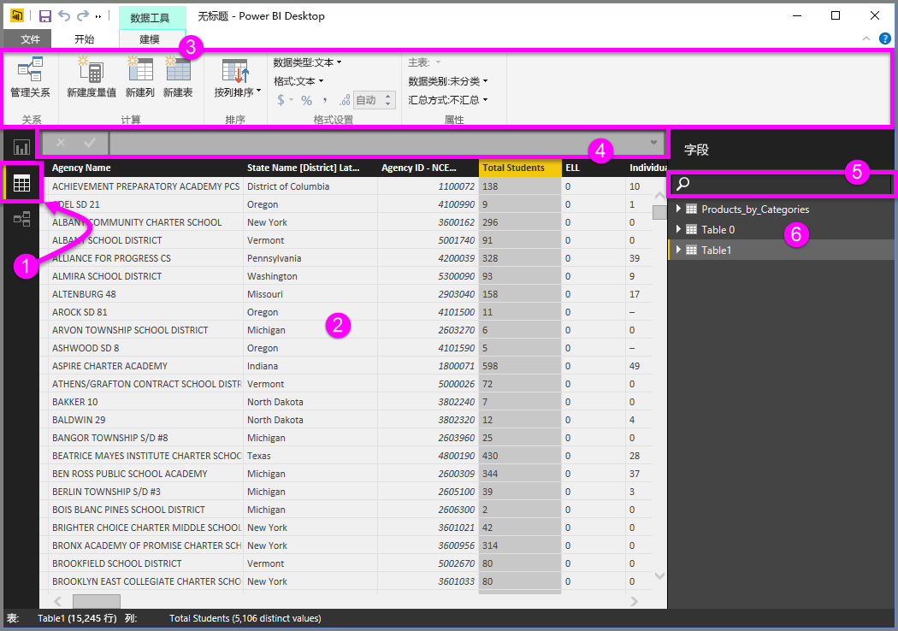
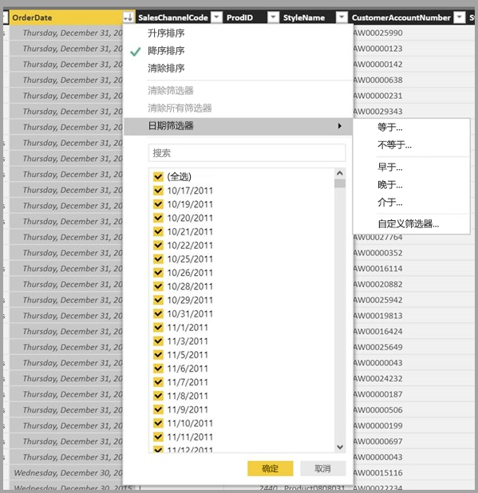

# Power BI Desktop 中的数据视图
数据视图有助于检查、浏览和了解 Power BI Desktop 模型中的数据。 它与你在查询编辑器中查看表、列和数据的方式不同。 在数据视图中，你所看到的数据是在将其加载到模型之后的样子。

进行数据建模时，有时想要查看表或列中的实际内容而不想在报表画布上创建视觉对象，通常需要查看到行级别。 如果要创建度量值和计算列，或者需要识别数据类型或数据类别，这会非常有用。

让我们进一步了解数据视图中的一些元素。

1. 数据视图图标 - 选择此图标可进入数据视图。

2. 数据网格 - 显示选中的表以及其中的所有列和行。 报表视图中的隐藏列显示为灰色。右键单击列可获取相关选项。

3. 建模功能区 - 可在此处管理关系、创建计算、更改列的数据类型、格式、数据类别。

4. 公式栏 - 输入度量值和计算列的 DAX 公式。

5. 搜索 - 在模型中搜索表或列。

6. 字段列表 - 选择要在数据网格中查看的表或列。

## 在数据视图中进行筛选

还可以在数据视图中对数据进行筛选和排序。 每列显示标识排序方向的图表（若适用）。

可筛选列中的单个值或根据数据特点使用高级筛选功能。 

> [!NOTE]
> 当创建 Power BI 模型所用区域设置与当前界面设置不同时（例如，模型以美国英语创建，而你正在以西班牙语查看），除文本字段以外，搜索框不会出现在数据视图用户界面的其他字段中。
