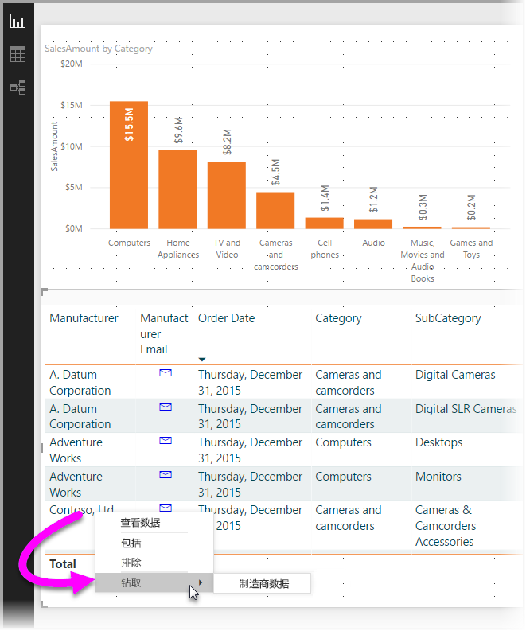
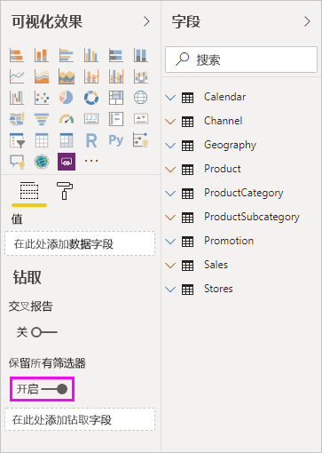
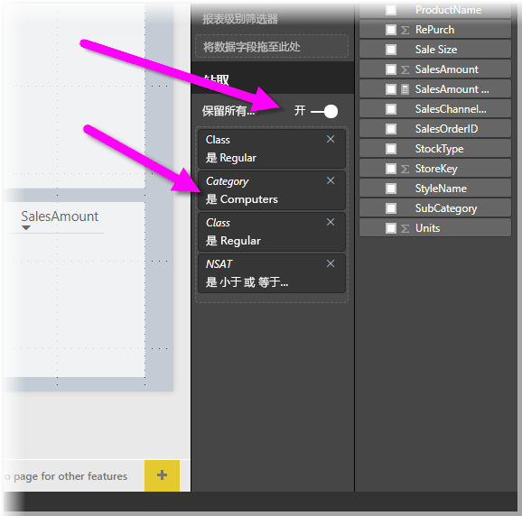

# 在 Power BI Desktop 中使用钻取
在 Power BI Desktop  中使用钻取  功能，可创建以特定实体（如供应商、客户或制造商）为重点的报表页。 用户可以右键单击其他报表页中的数据点。 然后，便能钻取到重点页，以获取筛选到相应上下文的详细信息。

## 使用钻取
1. 若要使用钻取  功能，请先创建报表页，其中包含要为之提供钻取的实体类型对应的视觉对象。 

    例如，假设要为制造商提供钻取。 然后，不妨创建钻取页，其中包含显示总销售额、总发货量、按类别划分的销售额、按地区划分的销售额等的视觉对象。 这样一来，钻取到此页后，便会看到选定制造商的专用视觉对象。

2. 然后，在此钻取页上的“可视化效果”  窗格中，将“字段”  部分中要为之启用钻取的字段拖到“钻取筛选器”  井中。

    

    将字段添加到“钻取筛选器”  框中后，Power BI Desktop  会自动创建“返回”  按钮视觉对象。 此视觉对象成为已发布报表中的按钮。 如果用户在 Power BI 服务  中使用报表，可以单击此按钮返回到原始报表页。

    

## 使用你自己的图像作为“后退”按钮    
 因为后退按钮是图像，所以可以将此视觉对象的图像替换为所需的任何图像。 它仍用作便于报表使用者返回到原始页的后退按钮。 若要对后退按钮使用你自己的图像，请按以下步骤操作：

1. 在“主页”  选项卡上，选择“图像”  。 然后，找到你的图像，并将它置于钻取页上。

2. 选择钻取页上的新图像。 在“设置图像格式”  部分下，先将“链接”  滑块移至“开”  ，再将“类型”  设置为“后退”  。 你的图像现充当“后退”按钮。

    

    
     此时，用户可以右键单击报表中的数据点，并使用支持钻取到相应页的上下文菜单。 

    

    当报表使用者选择“钻取”后，便会对报表页进行筛选，以显示他们右键单击的数据点的相关信息。 例如，假设报表使用者右键单击了 Contoso（制造商）的数据点，并选择了“钻取”。 然后，他们便会转到筛选到 Contoso 的钻取页。

## 传递钻取中的所有筛选器

自 2018 年 5 月版的 Power BI Desktop 起，可将已应用的所有筛选器传递到“钻取”窗口  。 例如，可以只选择某个类别的产品和筛选到此类别的视觉对象，然后选择“钻取”。 可能想要了解在应用了所有这些筛选器时该钻取操作的呈现情况。

若要保留已应用的所有筛选器，请在“可视化效果”  窗格的“钻取”  部分中，将“传递所有筛选器”  开关设置为“开”  。 

在 2018 年 5 月之前发布的 Power BI Desktop  版本中，这种行为等同于将此开关设置为“关”  。

然后，在钻取视觉对象时，可看到因源视觉对象应用了临时筛选器而应用的筛选器。 在“钻取”窗口中，以斜体显示这些临时筛选器。 

为此，可使用工具提示页，但这会提供一种异常体验，因为工具提示似乎会无法正常运行。 所以，不建议为此使用工具提示。

## 将度量值添加到钻取

除了能将所有筛选器传递到钻取窗口之外，还可向钻取区域添加度量值或汇总数字列。 将钻取字段拖到“钻取”卡即可应用它。 

添加度量值或汇总数字列时，如果视觉对象的“值”  区域使用了字段，便可钻取到页。

在报表中使用钻取  功能就是这么简单。 这样一来，可以获取选择用于钻取筛选器的实体信息的扩展视图。

## 后续步骤

你可能还会对以下文章感兴趣：

* [在 Power BI Desktop 中使用跨报表钻取](desktop-cross-report-drill-through.md)
* [在 Power BI Desktop 中使用切片器](visuals/power-bi-visualization-slicers.md)

