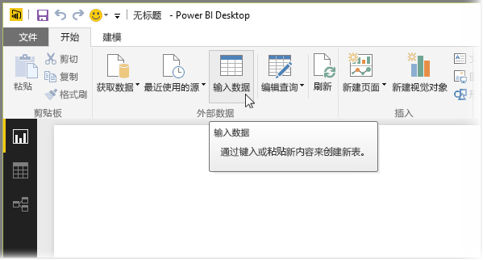
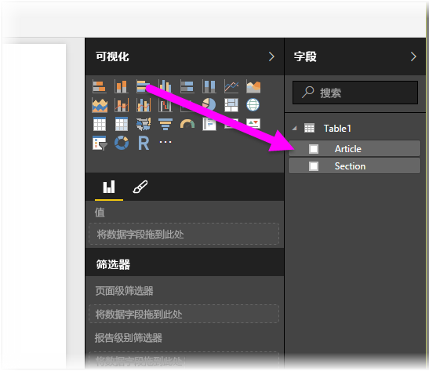

# 直接在 Power BI Desktop 中输入数据

使用 Power BI Desktop，你可以直接输入数据并在报表和可视化效果中使用该数据。 例如，可以复制部分工作簿或网页，然后将其粘贴到 Power BI Desktop。

若要以新表的形式直接在 Power BI Desktop 中输入数据，请从“主页”功能区选择“输入数据”   。

如果适当，Power BI Desktop 可能会尝试对数据进行次要转换，如同当你从任何源加载数据时一样。 例如，在以下情况下它会将数据的第一行提升至标头。

如果要对输入或粘贴的数据进行调整，请选择“编辑”  以打开“查询编辑器”  。 在将数据引入 Power BI Desktop 之前，可以对其进行调整和转换。 选择“负载”  以导入显示的数据。

当你选择“加载”  时，Power BI Desktop 将根据你的数据创建新表，并使其在“字段”  窗格可用。 下图中，Power BI Desktop 显示了我的新表，名称为“Table1”  ，以及在该表中创建的两个字段。

就是这么简单。 将数据输入到 Power BI Desktop 就是这么简单。

现在可以使用 Power BI Desktop 中的数据了。 你可以创建视觉对象、报表或与你可能想要连接和导入的其他数据（如 Excel 工作簿、数据库或任何其他数据源）进行交互。

## 后续步骤

你可以使用 Power BI Desktop 连接到各种数据。 有关数据源的详细信息，请参阅下列资源：

* [什么是 Power BI Desktop？](desktop-what-is-desktop.md)
* [Power BI Desktop 中的数据源](desktop-data-sources.md)
* [使用 Power BI Desktop 成型和合并数据](desktop-shape-and-combine-data.md)
* [通过 Power BI Desktop 连接到 Excel 工作簿](desktop-connect-excel.md)
* [通过 Power BI Desktop 连接到 CSV 文件](desktop-connect-csv.md)
