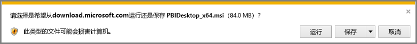

# 获取 Power BI Desktop
**Power BI Desktop** 允许用户生成高级查询、模型和实现数据可视化效果的报表。 通过 Power BI Desktop  ，可以生成数据模型、创建报表，并通过发布到 Power BI 服务共享工作。  **Power BI Desktop** 可免费下载。

可以通过两种方法获取 Power BI Desktop  ，以下部分将介绍这两种方法：

* 直接下载（在计算机上下载并安装包） 
* 作为 **Microsoft Store** 的应用安装

这两种方法都会将最新版本的 Power BI Desktop  获取到计算机上，但值得注意的是这两种方法存在一些区别，以下部分将具体介绍。

## 下载 Power BI Desktop
若要下载最新版 **Power BI Desktop**，可以依次选择 Power BI 服务右上角的下载图标和“**Power BI Desktop**”。

还可以在下面的下载页面中下载最新版 Power BI Desktop：

* [Power BI Desktop 下载（32 位和 64 位版本）](https://powerbi.microsoft.com/desktop)  。
  
  

无论选择哪种下载方式，下载 **Power BI Desktop** 后，系统便会立即提示你运行安装文件：

从 2019 年 7 月版本开始，Power BI Desktop 发布为包含所有受支持语言的单个 .exe 安装包  。 32 位和 64 位版本有单独的 .exe 文件。 .msi 包将于 2019 年 9 月版本后停用，之后必须使用 .exe 可执行文件进行安装。 这一方法使分发、更新和安装（尤其是对于管理员来说）变得更为轻松和方便。 还可以使用命令行参数自定义安装过程，如后文[在安装期间使用命令行选项](#using-command-line-options-during-installation)一节所述。

启动安装包之后，Power BI Desktop 会当作一个应用程序进行安装，并在桌面上运行  。

> [!NOTE]
> 不支持在同一台计算机上安装下载的 (MSI) 版本和 Microsoft Store  版本的 Power BI Desktop  （有时称为“并行”  安装）。
> 
> 

## 作为 Microsoft Store 的应用安装
还可以使用以下链接从 Microsoft Store 获取 Power BI Desktop  ：

* [通过 Microsoft Store  安装 Power BI Desktop  ](http://aka.ms/pbidesktopstore)

  

从 Microsoft Store 获取 Power BI Desktop  有以下几个优点：

* **自动更新** - Windows 在后台自动下载已发布的最新版本，因此你使用的始终是最新版本。
* **较小下载** - Microsoft Store  可确保只将每次更新中更改的组件下载到计算机，从而减少每次更新的下载量。
* **不需要管理员权限** - 直接下载包并安装后，必须成为管理员才能成功完成安装。 如果从 Microsoft Store 获取 Power BI Desktop，则不需要管理员权限   。
* **已启用 IT 推出** - 可更轻松地部署 Microsoft Store  版本，或向组织中的所有人推出  版本，并可通过适用于企业的 Microsoft Store  提供 Power BI Desktop  。
* **语言检测** - Microsoft 官方商城版本包括所有受支持的语言，并会在每次启动时查看计算机上使用的语言  。 这还会影响 Power BI Desktop  中创建的模型的本地化；例如，内置日期层次结构将匹配创建 .pbix 文件时 Power BI Desktop  所使用的语言。

从 Microsoft Store 安装 Power BI Desktop  时，需要注意以下几个注意事项和限制：

* 如果使用 SAP 连接器，可能需要将 SAP 驱动程序文件移动到 Windows\System32  文件夹。
* 通过 Microsoft 官方商城安装 Power BI Desktop 的过程不会从 .exe 版本复制用户设置  。 可能需要重新连接到最新数据源并重新输入数据源凭据。 

> [!NOTE]
> 不支持在同一台计算机上安装下载的 (MSI) 版本和 Microsoft Store  版本的 Power BI Desktop  （有时称为“并行”  安装）。 应先手动卸载 Power BI Desktop  ，然后再从 Microsoft Store  下载它
> 
> [!NOTE]
> Power BI 报表服务器版本 Power BI Desktop  与本文中介绍的版本分开安装，并且安装步骤也不同。 若要了解 Power BI Desktop  的报表服务器版本，请参阅[创建 Power BI 报表服务器的 Power BI 报表](report-server/quickstart-create-powerbi-report.md)一文。
> 
> 

## 使用 Power BI Desktop
启动 **Power BI Desktop** 时，将显示欢迎屏幕。 

如果用户是首次使用 Power BI Desktop  （如果安装不是为了升级），系统会提示填写表单，并回答几道问题，或提示必须先登录 Power BI 服务  ，然后才能继续操作。

你可以在此处开始创建数据模型或报表，然后在 Power BI 服务上与他人共享。 请查看文末的**详细信息**链接，以链接到可帮助你开始使用 **Power BI Desktop** 的指南。

## 最低要求
以下列表提供了运行 **Power BI Desktop** 的最低要求：

* Windows 7/Windows Server 2008 R2 或更高版本
* .NET 4.5
* Internet Explorer 10 或更高版本
* **内存 (RAM)：** 可用内存至少为 1 GB，建议为 1.5 GB 或以上。
* **显示器：** 建议分辨率至少为 1440x900 或 1600x900 (16:9)。 不建议使用如 1024x768 或 1280x800 等较低分辨率，原因是某些控件（如关闭启动屏幕）需要更高的分辨率才能显示。
* **Windows 显示设置：** 如果将显示设置设为将文本、应用和其他项的大小更改为大于 100%，可能看不到某些必须先关闭或响应才能继续使用 Power BI Desktop  的对话框。 如果遇到此问题，请在 Windows 中依次转到“设置”>“系统”>“显示”  ，检查“显示设置”  ，再使用滑块将显示设置恢复为 100%。
* **CPU：** 建议为 1 千兆赫 (GHz) 或更快的 x86 或 x64 位处理器。

## 注意事项和限制

我们始终希望你能获得超棒的 Power BI Desktop 使用体验。 有时，可能会在使用 Power BI Desktop 时遇到问题，因此本部分介绍了解决可能会出现的问题的解决方案或建议。 

### 在安装期间使用命令行选项 

安装 Power BI Desktop 时，可以使用命令行开关设置属性和选项。 对于管理或辅助整个组织的 Power BI Desktop 安装的管理员来说，这非常有用。 这些选项适用于 .msi 和 .exe 安装。 

|命令行选项  |行为  |
|---------|---------|
|-q、-quiet、-s、-silent     |静默安装         |
|-passive     |安装过程中只显示进度条         |
|-norestart     |隐藏计算机重启要求         |
|-forcerestart     |安装后重启计算机而不发出提示         |
|-promptrestart     |如果需要重启计算机，提示用户（默认）         |
|-l<>、-log<>     |将安装记录到特定文件，在 <> 中指定文件         |
|-uninstall     |卸载 Power BI Desktop         |
|-repair     |修复安装（如果当前尚未安装，则进行安装）         |
|-package、-update     |安装 Power BI Desktop（只要未指定 -uninstall 或 -repair，这就是默认操作）         |

### 无法使用旧版 Power BI Desktop

一些用户在使用 Power BI Desktop 的过时版本时遇到类似以下错误  ： 

    "We weren't able to restore the saved database to the model" 

通常，更新到 Power BI Desktop 的当前版本可解决此问题。

### 禁用通知
建议更新到最新版 Power BI Desktop，以利用功能、性能、稳定性和其他改进方面的进步优势。 一些组织可能不希望用户更新到每个新版本。 若要禁用通知，可按以下步骤操作来修改注册表：

1. 使用注册表编辑器转到 HKEY_LOCAL_MACHINE\SOFTWARE\Microsoft\Microsoft Power BI Desktop 
2. 使用以下设置创建新条目：REG_DWORD :*DisableUpdateNotification*
3. 将新条目的值设置为“1”  。

必须重启计算机，更改才能生效。

### Power BI Desktop 在加载时未占据整个屏幕

在某些情况下（包括特定屏幕分辨率配置），一些用户可能会发现 Power BI Desktop 呈现的内容包含大块黑色区域。 这通常是由于最新操作系统更新所致（它们影响了项的呈现方式），并不是 Power BI Desktop 内容呈现方式的直接结果。 无论如何，大块黑色区域并不像优质视觉对象那样有吸引力，因此，请按以下步骤操作来解决此问题：

1. 按“开始”键，再在随即显示的搜索栏中键入“模糊”  一词。
2. 在出现的对话框中，选择选项：让 Windows 修复模糊应用。 
3. 重启 Power BI Desktop。

在后续 Windows 更新发布后，此问题可能就会得到解决。 
 

## 后续步骤
一旦安装了 **Power BI Desktop**，以下内容可帮助你快速启动和运行：

* [什么是 Power BI Desktop？](desktop-what-is-desktop.md)
* [Power BI Desktop 的查询概述](desktop-query-overview.md)
* [Power BI Desktop 中的数据源](desktop-data-sources.md)
* [连接到 Power BI Desktop 中的数据](desktop-connect-to-data.md)
* [使用 Power BI Desktop 调整和合并数据](desktop-shape-and-combine-data.md)
* [Power BI Desktop 中的常见查询任务](desktop-common-query-tasks.md)   

