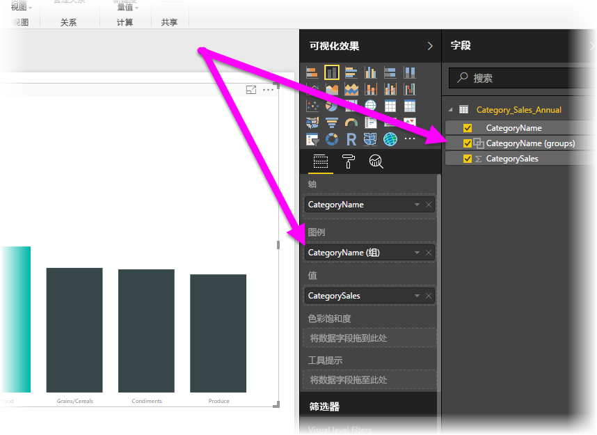

# 在 Power BI Desktop 中使用分组和装箱
在创建视觉对象后，Power BI Desktop 会根据基础数据中的值，将数据分入各区块（或组）中。 这种自动归类效果通常不错，但你有时可能会想要优化这些区块的显示方式。 例如，你可能想要在一个宽泛的产品类别（ *组* ）中划分出三个子类别。 或者，你可能希望将销售额数据按 1,000,000 美元大小进行装箱，而不是按照等分 923,983 美元。

在 Power BI Desktop 中，你可以对数据点进行分组，以便更清楚地查看、分析和浏览视觉对象中的数据和趋势。 还可以定义装箱大小（通常称为“装箱”），将值归入大小相同的组中，以便有助于你对数据进行可视化展示。

## 使用分组
若要使用分组，请通过按住 Ctrl 同时单击选择视觉对象上的两个或多个元素。 然后，右键单击所选多个元素中的一个，并从随即显示的菜单中选择“分组”。

创建的组会被添加到视觉对象的“图例”存储桶中，同时还会显示在“字段”列表中。

创建组后，可以右键单击“图例”存储桶或“字段”列表中的字段，然后选择“编辑组”，从而轻松编辑该组的成员。

在随即显示的**组**窗口中，可以新建组，也可以修改现有组。 如要重命名组，只需双击“组和成员”框中的“组”标题，然后键入一个新名称即可。

可以使用组进行各种操作。 可以将“未分组值”列表中的项添加到一个新组或现有组中。 若要新建组，请从“未分组值”框中选择两个或多个项（按住 Ctrl 的同时单击），然后单击该框下方的“组”按钮。

可以将未分组中的项添加到现有组中，只需选择该项，然后选择要在其中添加此值的现有组，之后单击“**组**”按钮即可。 若要删除组中的项，请在“**组和成员**”框中选择相应项，然后单击“**取消分组**”。 你还可以选择是将未分组的项归入**其他**组中，还是保留其未分组状态。

> [!NOTE]
> 也可以为“字段”中的任意字段创建组，而无需从现有视觉对象中的选择多个元素。 只需右键单击相应字段，然后从随即显示的菜单中选择“新建组”即可。

## 使用装箱
可以在 **Power BI Desktop** 中对数字和时间类型字段设置装箱大小。 借助装箱，可以合理精简 **Power BI Desktop** 显示的数据。

若要应用装箱大小，请右键单击“字段”，然后选择“新建组”。

在“**组**”窗口中，设置所需的“**装箱大小**”。

选择“ **确定** ”后，你会发现“ **字段** ”窗格中显示一个新字段，且后跟“ *（装箱）* ”一词。 然后，可以将该字段拖到画布上，以在视觉对象中使用此装箱大小。

若要了解**装箱**的运作方式，请观看此[视频](https://www.youtube.com/watch?v=BRvdZSfO0DY)。

一切就是这么简单！使用**分组**和**装箱**可以确保报表中的视觉对象按你所需的方式显示数据。

