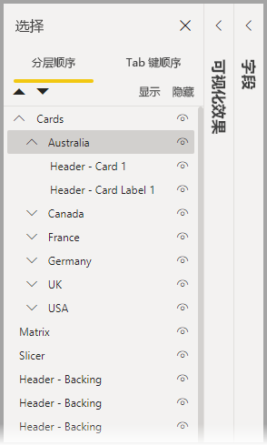
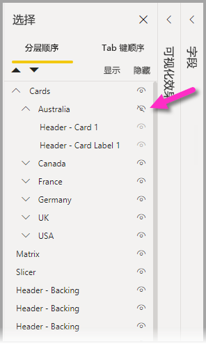
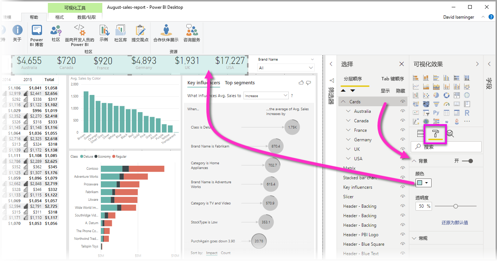

# 在 Power BI Desktop 报表中对视觉对象进行分组
使用 Power BI Desktop 中的分组功能，你可以在报表中将视觉对象（例如按钮、文本框、形状图像以及创建的任何视觉）分为一组，就像在 PowerPoint 中对项进行分组一样   。 通过在报表中对视觉对象进行分组，可以将组视为单个对象，从而更轻松、快速且直观地移动、调整大小和处理报表中的图层。

## 创建组

若要在 Power BI Desktop 中创建一组视觉对象，请从画布中选择第一个视觉对象，然后按住 Ctrl 按钮，单击组中你所需的一个或多个其他视觉对象，然后右键单击视觉对象集合，并从显示的菜单中选择“组”  。

组显示在“选择”窗格中  。 可以根据报表需要设置多个视觉对象组，也可以嵌套视觉对象组。 在下图中，澳大利亚组嵌套在卡片图组下   。 可以通过选择组名旁边的插入符来展开组，并通过再次选择插入符来折叠它。 

在“选择”窗格中，还可以拖放所有视觉对象以将其包含在组中，从组中删除它们，嵌套组或从嵌套中删除组或单个视觉对象  。 只需拖动要调整的视觉对象，然后将其放置在所需位置即可。 如果存在重叠，则视觉分层由其在分层顺序列表中的顺序确定  。

若要取消分组，只需选择该组，从显示的菜单中右键单击“取消分组”并选中它  。

## 隐藏和显示视觉对象或组

可以使用“选择”窗格轻松隐藏或显示组  。 若要隐藏组，请选择组名称（或任何单个视觉对象）旁边的眼睛按钮，以切换是隐藏还是显示该视觉对象或组。 在下图中，隐藏了“澳大利亚”组，并显示嵌套在“卡片”图组中的其余组   。

隐藏组时，将隐藏该组中的所有视觉对象，其眼睛按钮显示为灰色（无法切换为打开或关闭，因为隐藏了整个组）。 要隐藏组中的某些视觉对象，切换该视觉对象旁边的眼睛按钮，即可只隐藏该组中的该视觉对象。

## 选择组中的视觉对象

可以通过几种方法来导航和选择一组视觉对象中的项。 下表描述了该行为：

* 单击组内的空白区域（例如视觉对象之间的空白区域）不会选中任何内容
* 单击组中的视觉对象将选中整个组；再次单击将选中该视觉对象
* 选择一个组，再选择报表画布上的其他对象，然后从右键单击菜单中选择“组”，将创建一个嵌套组 
* 选择两个组并右键单击，将显示合并所选组的选项，而不显示嵌套所选组的选项

## 应用背景色

还可以使用“可视化效果”窗格的“格式设置”部分将背景颜色应用于组，如下图所示   。 

应用背景色时，单击组中视觉对象之间的空间将选中组（与此相比，单击组中视觉对象之间的空白不会选中组）。 

## 后续步骤
若要获取有关分组的详细信息，请观看以下视频：

* [Power BI Desktop 中的分组功能 - 视频](https://youtu.be/sf4n7VXoQHY?t=10)

你可能还会对以下文章感兴趣：

* [在 Power BI Desktop 中使用跨报表钻取](desktop-cross-report-drill-through.md)
* [在 Power BI Desktop 中使用切片器](visuals/power-bi-visualization-slicers.md)

