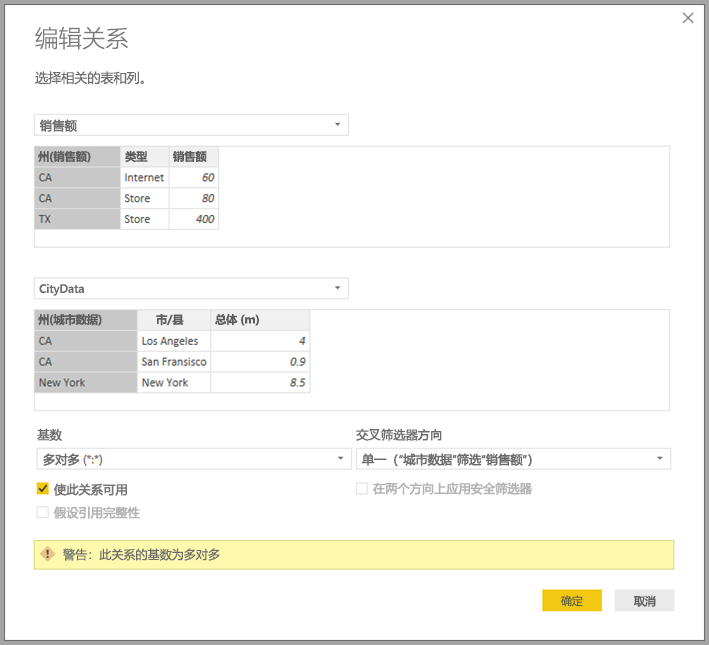

# Power BI Desktop 中具有多对多基数的关系

借助 Power BI Desktop 中的“具有多对多基数的关系”功能，可以联接使用“多对多”基数的表。 此外，还能更轻松、更直观地创建包含两个或多个数据源的数据模型。 “具有多对多基数的关系”功能是 Power BI Desktop 中大型“复合模型”能力的一部分。

Power BI Desktop 中的“具有多对多基数的关系”能力是以下三个相关功能之一：

* **复合模型**：允许报表有任意组合的两个或多个数据连接，包括 DirectQuery 连接或“导入”。 有关详细信息，请参阅 [Power BI Desktop 中的复合模型（预览版）](desktop-composite-models.md)。

* **具有多对多基数的关系**：借助“复合模型”，可以在表之间建立“具有多对多基数的关系”。 这种方法删除了对表中唯一值的要求。 它还删除了旧解决办法，如为建立关系而仅引入新表。 本文进一步介绍了此功能。

* **存储模式**：现在可以指定哪些视觉对象需要查询后端数据源。 导入的是不需要查询的视觉对象，即使基于 DirectQuery，也不例外。 此功能有助于提升性能，并减少后端负载。 以前，即使是切片器等简单视觉对象，也会启动发送至后端源的查询。 有关详细信息，请参阅 [Power BI Desktop 中的存储模式（预览版）](desktop-storage-mode.md)。

## “具有多对多基数的关系”所解决的问题

“具有多对多基数的关系”功能推出之前，两个表之间的关系是在 Power BI 中定义的。 关系中涉及的至少一个表列必须包含唯一值。 不过，通常没有列包含唯一值。 

例如，两个表有一个标记为“Country”的列，但两个表中的“Country”值都不唯一。 必须创建解决办法，才能联接此类表。 其中一种解决办法是，在模型中引入包含必要唯一值的附加表。 借助“具有多对多基数的关系”功能，可以使用具有“多对多”基数的关系直接联接此类表。  

## 使用“具有多对多基数的关系”

在 Power BI 中定义两个表之间的关系时，必须定义关系基数。 例如，ProductSales 和 Product 之间的关系（使用列 ProductSales[ProductCode] 和 Product[ProductCode]）定义为“多对一”。 之所以这样定义关系是因为，每个产品都会有很多销售额，而且 “Product”表中的 (ProductCode) 列是唯一的。 当你将关系基数定义为“多对一”、“一对多”或“1 对 1”后，Power BI 会验证基数，以便确保选定基数与实际数据匹配。

例如，请查看下图中的简单模型：

现在，假设“Product”表只显示两行，如下所示：

此外，还假设“Sales”表只有四行，其中产品 C 占一行。由于出现了引用完整性错误，因此“Product”表中没有产品 C 对应的行。

“ProductName”和“Price”（来自“Product”表），以及每个产品的总“Qty”（来自“ProductSales”表）如下图所示： 

如上图所示，出现一个与产品 C 的销售额相关联的空白“ProductName”行。此空行说明以下信息：

* “ProductSales”表中任何与“Product”表没有对应关系的行。 此处反应的是引用完整性问题，就像此示例中的产品 C 一样。

* “ProductSales”表中所有外键列是空的行。  

因此，在这两种情况下，空白行表示 ProductName 和 Price 未知的销售。

有时，表是通过两个列联接起来，但这两个列都不是由唯一值构成的。 例如下面的两个表：

* “Sales”表按“State”显示销售额数据，其中每一行都包含相应州采用的销售类型对应的销售额。 州包括“CA”、“WA”和“TX”。 

    

* “CityData”表显示城市数据，包括人口和州（包括“CA”、“WA”和“New York”）。

    

尽管两个表中都有“State”列，并且按州和各州的总人口报告总销售额是合理需求，但存在一个问题，即“State”列在这两个表中都不是唯一的。 

## 旧解决办法

在低于 2018 年 7 月版的 Power BI Desktop 中，用户无法在这些表之间建立直接关系。 常见解决办法如下：

* 创建仅包含唯一州 ID 的第三个表。 此表可为以下任意或所有表：
  * 计算表（使用数据分析表达式 [DAX] 定义）。
  * 基于查询编辑器中定义的查询的表，可显示从表之一中提取的唯一 ID。
  * 组合的完整集。

* 使用常见的多对一关系，将这两个原始表关联到此新表。

可以让解决办法表一直处于可见状态，也可以隐藏它，这样它就不会出现在“字段”列表中了。 如果隐藏此表，多对一关系通常会设置为在两个方向上进行筛选，并且两个表中的“State”字段都可以使用。 随后的交叉筛选会传播到另一个表。 这种方法如下图所示：

显示“State”（来自“CityData”表）以及总“Population”和总“Sales”的视觉对象如下所示：

> [!NOTE]
> 因为此解决办法使用了“CityData”表中的州，所以只会列出这个表中的州（也就不包括“TX”）。 此外，与多对一关系不同，虽然总计行包含所有销售额（包括 TX 的销售额），但详细信息中并没有一个空白行来对应不匹配行信息。 同样，也没有空白行来对应值为空的州的销售额。

如果还向此视觉对象添加了“City”，尽管每个城市的人口是已知的，但针对“City”显示的“Sales”只会重复相应“State”的“Sales”。 如果列中的分组与某聚合度量值无关，通常就会发生这种情况，如下图所示：

如果将新的“Sales”表定义为此解决办法中所有“States”的组合，并且让它在“字段”列表中一直可见，相同的视觉对象就会同时显示“State”（在新表上）、总“Population”和总“Sales”，如下图所示：

可以看到，表中“TX”的“Sales”数据已知，但“Population”数据未知，而“New York”的“Population”数据已知，但“Sales”数据未知。 这种解决办法并不是最佳的，也存在很多问题。 通过创建具有多对多基数的关系，可以解决所产生的问题，如下一部分所述。

## 使用“具有多对多基数的关系”，而非该解决办法

自 Power BI Desktop 2018 年 7 月版起，可以直接关联表（如之前介绍的表），再也不用无奈地采用类似解决办法了。 现在可以将关系基数设置为“多对多”。 此设置表明，两个表都不包含唯一值。 对于这种关系，仍可以控制哪个表筛选另一个表，也能应用双向筛选（即每个表都进行相互筛选）。  

在 Power BI Desktop 中，当两个表中的关系列都不包含唯一值时，默认基数会被设置为“多对多”。 在这种情况下，系统会显示一条警告消息，以确认关系设置为预期行为，而不是由数据问题导致的非预期效果。  

例如，如果直接在“CityData”和“Sales”之间建立关系（其中筛选器应从“CityData”流向“Sales”），Power BI Desktop 会显示“编辑关系”窗口，如下图所示：

随即生成的“关系”视图显示两个表之间的直接多对多关系。 表在“字段”列表中的显示以及表在视觉对象创建时的后续行为与应用解决办法时的行为相似。 在解决办法中，显示唯一“State”数据的额外表不可见。 例如，如上一部分所述，显示“State”、“Population”和“Sales”数据的视觉对象如下所示：

“具有多对多基数的关系”与更典型的“多对一”关系的主要区别如下：

* 显示的值不包括说明另一个表中存在不匹配行的空白行， 也不包括在另一个表的关系中使用的列为空的行。
* 无法使用 `RELATED()` 函数，因为可以关联多行。
* 对一个表使用 `ALL()` 函数不会删除通过多对多关系应用于其他相关表的筛选器。 在前面的示例中，下面脚本中定义的度量值不会删除对相关“CityData”表中列应用的筛选器：

    

    显示“State”、“Sales”和“Sales total”数据的视觉对象如下所示：

    

在注意到上述差异的同时，请确保使用 `ALL(\<Table>)` 的计算（如在总计中所占的百分比）返回的结果符合预期。 

## 限制和注意事项

此版本的“具有多对多基数的关系”和复合模型存在一些限制。

以下 Live Connect（多维）源无法用于复合模型：

* SAP HANA
* SAP Business Warehouse
* SQL Server Analysis Services
* Power BI 数据集
* Azure Analysis Services

使用 DirectQuery 连接到这些多维数据源时，既无法同时连接到另一个 DirectQuery 源，也无法将它与导入数据相结合。

使用“具有多对多基数的关系”时，仍要遵守现有的 DirectQuery 使用限制。 现在每个表都要遵循其中许多限制，具体视表的存储模式而定。 例如，导入表中的计算列可以引用其他表，但 DirectQuery 表中的计算列仍只能引用同一表中的列。 如果模型中的任意表是 DirectQuery，其他限制适用于整个模型。 例如，如果模型中任意表的存储模式为“DirectQuery”，QuickInsights 和问答功能对模型不可用。 

## 后续步骤

若要详细了解复合模型和 DirectQuery，请参阅以下文章：
* [Power BI Desktop 中的复合模型（预览版）](desktop-composite-models.md)
* [Power BI Desktop 中的存储模式（预览版）](desktop-storage-mode.md)
* [在 Power BI Desktop 中使用 DirectQuery](desktop-directquery-about.md)
* [Power BI Desktop 中 DirectQuery 支持的数据源](desktop-directquery-data-sources.md)
