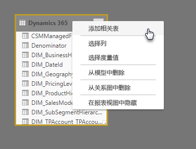

# 使用 Power BI Desktop 中的建模视图

使用“Power BI Desktop”中的“建模视图”，可以查看和使用含有多个表的复杂数据集   。

## 使用建模视图

若要访问建模视图，请选择 Power BI Desktop  左侧显示的建模视图图标，如下图中所示。

## 创建单独关系图

使用建模视图，可以创建仅包含模型中表子集的模型的关系图。 这可以帮助你提供你想要使用的表的更清晰视图，并让你能够更为轻松地使用复杂数据集。 若要创建仅包含表子集的新关系图，请单击 Power BI Desktop 窗口底部的“所有表”  选项卡旁的 **+** 符号。

然后，可以将表从“字段”  列表拖动到关系图面。 右键单击表，然后从显示的菜单中选择“添加相关表”  。

执行此操作时，与原始表相关的表将显示在新关系图中。 下图显示选择了“添加相关表”  菜单选项后相关表的显示方式。

## 设置公共属性

通过按住 CTRL  键的同时单击多个表，可以在建模视图中选择多个对象。 当你选择多个表时，这些表将在建模视图中突出显示。 当多个表突出显示时，在“属性”  窗格中应用的更改将应用到所有所选表。

例如，可以在关系图视图中更改多个表的[存储模式](desktop-storage-mode.md)，方法是按住 CTRL  键的同时选择表，然后更改“属性”  窗格中的存储模式设置。

## 后续步骤

以下文章提供了更多有关数据模型的信息，并详细介绍了 DirectQuery。

* [Power BI Desktop 中的聚合（预览）](desktop-aggregations.md)
* [Power BI Desktop 中的复合模型](desktop-composite-models.md)
* [Power BI Desktop 中的存储模式（预览）](desktop-storage-mode.md)
* [Power BI Desktop 中的多对多关系](desktop-many-to-many-relationships.md)

DirectQuery 文章：

* [在 Power BI 中使用 DirectQuery](desktop-directquery-about.md)
* [Power BI 中 DirectQuery 支持的数据源](desktop-directquery-data-sources.md)
