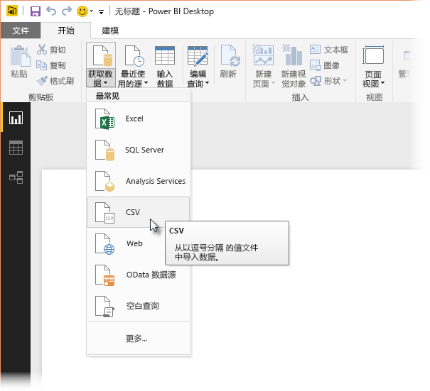
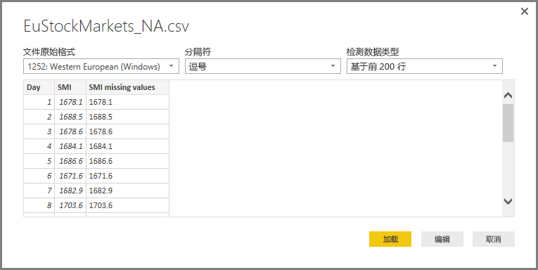
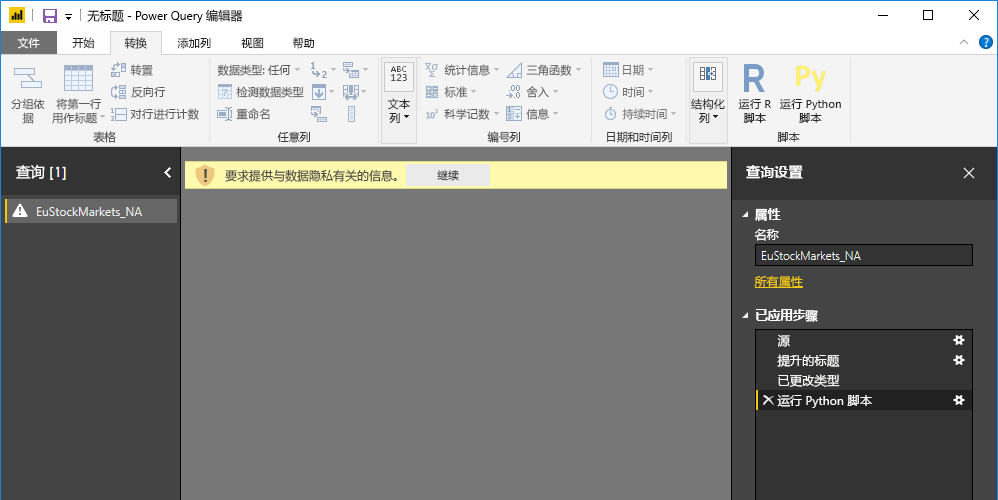

# <a name="use-python-in-query-editor"></a>在查询编辑器中使用 Python
你可以在 Power BI Desktop 查询编辑器  中使用 Python  ，Python 是统计学家、数据科学家和数据分析师使用最广泛的一种编程语言。  查询编辑器中集成的 Python 可让你用 Python 来执行数据清理，并在数据集中执行高级数据调整和分析，包括丢失数据补全、预测和聚类分析，此处仅举几例。  Python 是一种功能强大的语言，可用于在“查询编辑器”  中准备你的数据模型并创建报表。

## <a name="installing-python"></a>安装 Python
若要在 Power BI Desktop 的查询编辑器  中使用 Python  ，需要在本地计算机上安装 Python  。 可以从很多位置免费下载并安装 Python  ，其中包括 [Python 官方下载页面](https://www.python.org/)和 [Anaconda](https://anaconda.org/anaconda/python/)。

## <a name="using-python-in-query-editor"></a>在查询编辑器中使用 Python
若要演示如何在查询编辑器  中使用 Python  ，请以基于 .CSV 文件格式的股票市场数据集为例（可[从此处下载](https://download.microsoft.com/download/F/8/A/F8AA9DC9-8545-4AAE-9305-27AD1D01DC03/EuStockMarkets_NA.csv)）并按照示例进行操作。 此示例中的步骤如下所示：

1. 首先，将数据加载到 **Power BI Desktop**中。 本例中，请加载 EuStockMarkets_NA.csv  文件，并在 Power BI Desktop  的“主页”  功能区中依次选择“获取数据”和“CSV”  。
   
   
2. 选择该文件，并选择“打开”  ，然后该 CSV 将显示在“CSV 文件”  对话框中。
   
   
3. 加载数据后，你会在 Power BI Desktop 中的 **“字段”** 窗格中看到它。
   
   
4. 通过从 **Power BI Desktop** 中的“主页”  选项卡中选择“查询编辑器”  来打开“查询编辑器”  。
   
   
5. 在“转换”  选项卡中，选择“运行 Python 脚本”  ，然后“运行 Python 脚本”  编辑器随即出现（如下一步中所示）。 注意，第 15 和 20 行受数据丢失影响。下图中无法看见的其他行也是如此。 以下步骤演示 Python 如何（并将）为你补全这些行。
   
   
6. 此示例中，请输入以下脚本代码：
   
    ```python
       import pandas as pd
       completedData = dataset.fillna(method='backfill', inplace=False)
       dataset["completedValues"] =  completedData["SMI missing values"]
   ```

   > [!NOTE]
   > 需要在 Python 环境中安装 pandas  库才能使之前的脚本代码正常运行。 若要安装 pandas，请在 Python 安装中运行以下命令：|      > pip install pandas
   > 
   > 
   
   当放入“运行 Python 脚本”  对话框时，代码如下所示：
   
   
7. 选择“确定”  后，“查询编辑器”  将显示与数据隐私相关的警告。
   
   
8. 为使 Python 脚本在 Power BI 服务中正常工作，所有的数据源都需要设置为“公用”  。 有关隐私设置及其含义的详细信息，请参阅[隐私级别](desktop-privacy-levels.md)。
   
   
   
   请注意“字段”  窗格中的名为 completedValues  的新列。 注意，有一些行缺少数据元素，如第 15 和 18 行。 下一节中将介绍 Python 如何处理该问题。
   

只需要五行 Python 脚本，  查询编辑器就能用预测模型填写丢失的值。

## <a name="creating-visuals-from-python-script-data"></a>从 Python 脚本数据创建视觉效果
现在，我们可创建视觉对象，以查看 Python 脚本代码如何使用 pandas  库补全缺少的值，如下图所示：


创建好该视觉对象，以及需要使用 Power BI Desktop  创建的任何其他视觉对象之后，可保存 Power BI Desktop  文件（保存为 .pbix 文件），然后在 Power BI 服务中使用数据模型（及其内附的 Python 脚本）。

> [!NOTE]
> 想要查看完成了这些步骤的完整 .pbix 文件吗？ 真幸运 - 你可以在**此处**下载示例中使用的完整 [Power BI Desktop](https://download.microsoft.com/download/A/B/C/ABCF5589-B88F-49D4-ADEB-4A623589FC09/Complete%20Values%20with%20Python%20in%20PQ.pbix) 文件。

将 .pbix 文件上传到 Power BI 服务后，还需要几个步骤来启用数据刷新（在服务中），以及启用服务中待更新的视觉对象（为了更新视觉对象，数据需要访问 Python）。 其它步骤如下所示：

*  为数据集启用计划的刷新 - 若要为包含 Python 脚本数据集的工作簿启用计划刷新，请参阅[配置计划的刷新](refresh-scheduled-refresh.md)，其中也包含有关  “个人网关”的信息。
*  安装个人网关 - 需要在安装 Python 及文件所在的相同计算机上安装个人网关  ；Power BI 服务必须访问该工作簿并重新呈现任何已更新的视觉对象。 你可以获取有关如何[安装和配置个人网关](personal-gateway.md)的详细信息。

## <a name="limitations"></a>限制
对包含在  “查询编辑器”中创建的 Python 脚本的查询有一些限制：

* 所有 Python 数据源设置都必须设置为“公用”  ，并且在  “查询编辑器”所创建的查询中的所有其他步骤也必须设为“公用”。 若要获取数据源设置，请在 **Power BI Desktop** 中，选择“文件”>“选项和设置”>“数据源设置”  。
  
  
  
  从“数据源设置”  对话框中，选择数据源，然后选择“编辑权限...”  并确保“隐私级别”  设置为“公用”  。
  
      
* 若要为 Python 视觉对象或数据集启用计划的刷新，你需要启用“计划的刷新”  ，并且将“个人网关”安装在存储工作簿和 Python 安装的计算机上  。 有关这两方面的详细信息，请参阅本文中的之前章节，其中提供了链接可了解每个方面的详细信息。
* 当前不支持嵌套表（表中表） 

通过 Python 和自定义查询能够执行各种各样的操作，因此，你可以按照想要显示的方式来探索和整理数据。

