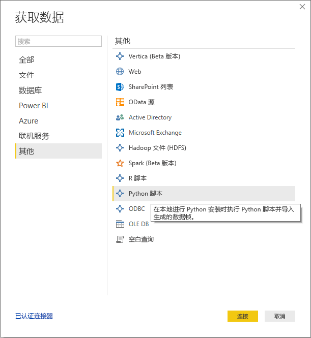
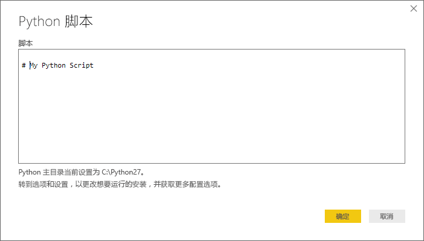
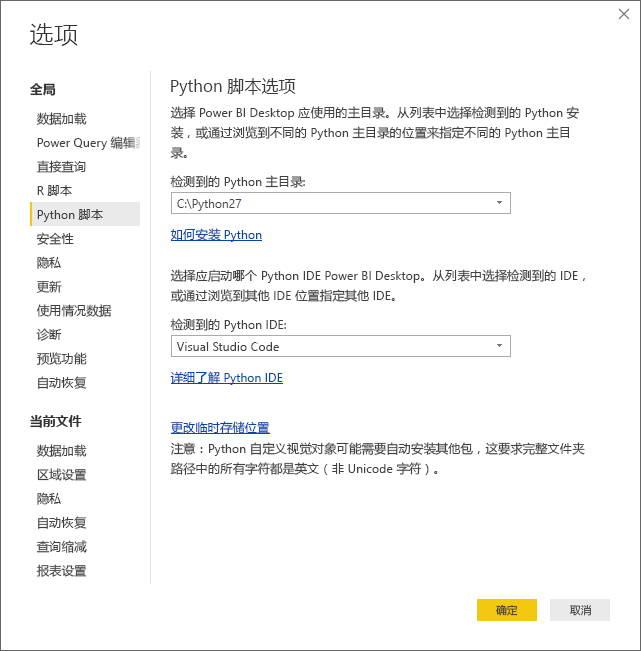

# <a name="run-python-scripts-in-power-bi-desktop"></a>在 Power BI Desktop 中运行 Python 脚本
你可以直接在 Power BI Desktop 中运行 Python 脚本，并将结果数据集导入 Power BI Desktop 数据模型。

## <a name="install-python"></a>安装 Python
若要在 Power BI Desktop 中运行 Python 脚本，需要在本地计算机上安装 Python。 可以从很多位置免费下载并安装 Python，其中包括 [Python 官方下载页面](https://www.python.org/)和 [Anaconda](https://anaconda.org/anaconda/python/)。 Power BI Desktop 中当前版本的 Python 脚本在安装路径中支持 Unicode 字符以及空格（空字符）。

### <a name="install-required-python-packages"></a>安装必需 Python 包
必须安装两个 Python 包（Pandas 和 Matplotlib），才能执行 Power BI Python 集成。  使用 pip 命令行工具来安装以下两个包。

```
pip install pandas
pip install matplotlib
```

## <a name="run-python-scripts"></a>运行 Python 脚本
在 Power BI Desktop 中只需几步，即可运行 Python 脚本并创建数据模型，从中可创建报表并在 Power BI 服务上共享它们。

### <a name="prepare-a-python-script"></a>准备 Python 脚本
若要在 Power BI Desktop 中运行 Python 脚本，请在本地 Python 开发环境中创建脚本并确保其成功运行。

若要在 Power BI Desktop 中运行脚本，请确保该脚本可在未修改的新工作区中成功运行。 这意味着必须以显式方式加载和运行所有包和依赖项。

在 Power BI Desktop 中准备和运行 Python 脚本时，会有一些限制：

* 仅会导入 Pandas 数据帧，因此，请确保要导入到 Power BI 的数据都以数据帧表示
* 任何 Python 脚本若运行时间超过 30 分钟就会超时
* Python 脚本中的交互式调用（如等待用户输入）会终止脚本执行
* 在 Python 脚本中设置工作目录时，必须定义工作目录的完整路径，而非相对路径
* 当前不支持嵌套表（表中表） 

### <a name="run-your-python-script-and-import-data"></a>运行 Python 脚本并导入数据
1. 在 Power BI Desktop 中，可在“获取数据”中找到 Python 脚本数据连接器。 若要运行 Python 脚本，请选择“获取数据”&gt;“更多...”，然后选择“其他”&gt;“Python 脚本”，如下图所示：
   
   
2. 如果本地计算机上安装了 Python，则会选择已安装的最新版本作为 Python 引擎。 只需将脚本复制到脚本窗口，然后选择**确定**。
   
   
3. 如果未安装 Python，未标识 Python，或者如果本地计算机上有多个安装，则会显示警告。
   
   
   
   Python 安装设置集中位于“选项”对话框的 Python 脚本部分。 若要指定 Python 安装设置，请选择“文件”>“选项和设置”，再依次选择“选项”>“Python 脚本”。 如果有多个 Python 安装可用，则会显示一个下拉菜单，让你选择要使用的安装。 另外，你还可以选择“其他”并提供自定义路径。
   
   
4. 选择“确定”，运行 Python 脚本。 脚本成功运行后，即可选择要将其添加到 Power BI 模型的所得数据帧。

### <a name="refresh"></a>刷新
你可以在 Power BI Desktop 中刷新 Python 脚本。 刷新 Python 脚本时，Power BI Desktop 会再次在 Power BI Desktop 环境中运行 Python 脚本。

## <a name="next-steps"></a>后续步骤
查看以下更多信息，了解有关 Power BI 中的 Python。

* [在 Power BI Desktop 中创建 Python 视觉对象](desktop-python-visuals.md)
* [将外部 Python IDE 与 Power BI 一起使用](desktop-python-ide.md)
