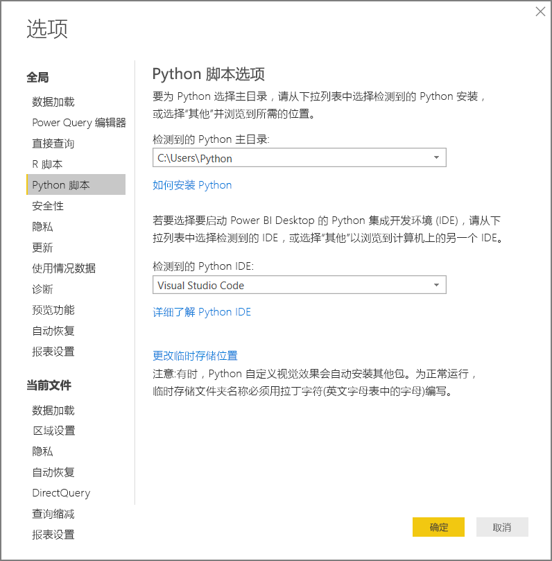

# <a name="run-python-scripts-in-power-bi-desktop"></a>在 Power BI Desktop 中运行 Python 脚本

你可以直接在 Power BI Desktop 中运行 Python 脚本，并将结果数据集导入 Power BI Desktop 数据模型。

## <a name="install-python"></a>安装 Python

若要在 Power BI Desktop 中运行 Python 脚本，需要在本地计算机上安装 Python。 可以从[Python 网站](https://www.python.org/)下载 Python。 当前的 Python 脚本版本支持在安装路径中包含 Unicode 字符和空格。

### <a name="install-required-python-packages"></a>安装所需的 Python 包

Power BI Python 集成需要安装两个 Python 包：

* [Pandas](https://pandas.pydata.org/)。 用于数据操作和分析的软件库。 它提供了用于处理数值表和时序的数据结构和操作。 导入的数据必须位于 [pandas 数据帧](https://www.tutorialspoint.com/python_pandas/python_pandas_dataframe.htm)中。 数据帧是一种二维数据结构。 例如，数据按表格的形式分布在行和列中。
* [Matplotlib](https://matplotlib.org/)。 Python 的绘图库及其数值数学扩展 [NumPy](https://www.numpy.org/)。 它提供了面向对象的 API，可使用通用 GUI 工具包（例如 Tkinter、wxPython、Qt 或 GTK+）将绘图嵌入到应用程序中。

在控制台或 shell 中，使用 [pip](https://pip.pypa.io/en/stable/) 命令行工具安装这两个包。 Pip 工具与最新的 Python 版本打包在一起。

```CMD
pip install pandas
pip install matplotlib
```

## <a name="enable-python-scripting"></a>启用 Python 脚本

要启用 Python 脚本，请执行以下操作：

1. 在 Power BI Desktop 中，依次选择“文件” > “选项和设置” > “选项” > “Python 脚本”     。 你将看到“Python 脚本选项”  页面。

   

1. 如有必要，请在“检测到的 Python 主目录”  中指定本地 Python 安装路径。

   在上图中，Python 的安装本地路径为 C:\Python  。 确保该路径用于希望 Power BI Desktop 使用的本地 Python 安装。

1. 选择“确定”。 

指定 Python 安装后，即可开始在 Power BI Desktop 中运行 Python 脚本。

## <a name="run-python-scripts"></a>运行 Python 脚本

只需几个步骤，即可运行 Python 脚本并创建数据模型。 在本模型中，可以创建报表并在 Power BI 服务上共享它们。

### <a name="prepare-a-python-script"></a>准备 Python 脚本

首先，请在本地 Python 开发环境中创建脚本并确保其成功运行。 例如，下面是一个简单的 Python 脚本，用于导入 pandas 并使用数据帧：

```python
import pandas as pd
data = [['Alex',10],['Bob',12],['Clarke',13]]
df = pd.DataFrame(data,columns=['Name','Age'],dtype=float)
print (df)
```

运行时，此脚本返回：

```python
     Name   Age
0    Alex  10.0
1     Bob  12.0
2  Clarke  13.0
```

在 Power BI Desktop 中准备和运行 Python 脚本时，会有一些限制：

* 由于仅导入 Pandas 数据帧，因此请确保要导入到 Power BI 的数据都以数据帧表示
* 任何 Python 脚本若运行时间超过 30 分钟就会超时
* Python 脚本中的交互式调用（如等待用户输入）会终止脚本执行
* 在 Python 脚本中设置工作目录时，必须  定义工作目录的完整路径，而非相对路径
* 当前不支持嵌套表

### <a name="run-your-python-script-and-import-data"></a>运行 Python 脚本并导入数据

要在 Power BI Desktop 中刷新 Python 脚本，请执行以下操作：

1. 在“主页”功能区中，选择“获取数据”   > “其他”  。

1. 选择“其他” > “Python 脚本”   ，如下图所示：

   

1. 选择“连接”  。 选择本地最新安装的 Python 版本作为 Python 引擎。 将脚本复制到显示的“Python 脚本”  对话框中。 在这里，我们输入之前显示的简单 Python 脚本。

   

1. 选择“确定”。  如果脚本成功运行，则会显示“导航器”  ，你可以加载数据并使用它。 对于本示例，如图所示，选择“df”  ，然后选择“加载”  。

    

### <a name="troubleshooting"></a>故障排除

如果未安装或未标识 Python，系统将显示警告。 如果有多个本地计算机安装，系统也会显示一条警告。 重新回顾并查看之前的“安装 Python 并启用 Python 脚本”部分。


#### <a name="using-custom-python-distributions"></a>使用自定义 Python 分发

Power BI 直接通过从用户提供的目录（通过设置页面提供）使用 python.exe 可执行文件来执行脚本。 如果分发需要额外的步骤来准备环境（例如 Conda），则可能会遇到执行失败的问题。

为避免相关问题，建议使用来自 https://www.python.org/ 的官方 Python 分发。

一个可能的解决方案是，你可从自定义 Python 环境提示处启动 Power BI Desktop。

### <a name="refresh"></a>刷新

你可以在 Power BI Desktop 中刷新 Python 脚本。 若要刷新，请转到“主页”功能区，然后选择“刷新”   。 刷新 Python 脚本时，Power BI Desktop 会再次运行 Python 脚本。

## <a name="next-steps"></a>后续步骤

查看以下更多信息，了解有关 Power BI 中的 Python。

* [在 Power BI Desktop 中创建 Python 视觉对象](desktop-python-visuals.md)
* [将外部 Python IDE 与 Power BI 一起使用](desktop-python-ide.md)
